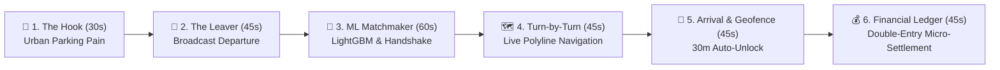

# 🚗 ParkLah — Smart Peer-to-Peer Parking Matchmaker & Urban Mobility Platform

[](https://reactnative.dev/)
[](https://nestjs.com/)
[](https://supabase.com/)
[](https://upstash.com/)
[](https://onnxruntime.ai/)
[](#)

> **ParkLah** is an AI-powered, peer-to-peer (P2P) parking handoff application designed for dense urban centers across Malaysia (such as Kuala Lumpur, Bangsar, and Mid Valley). By pairing drivers currently departing a parking stall (*Leavers*) with drivers actively cruising for a spot (*Searchers*), ParkLah eliminates 15–20 minutes of cruising time per trip, cuts urban carbon emissions, and rewards drivers with parking credits.

---

## 📑 Table of Contents
1. [🏆 The 3–5 Minute Pitch Demo Masterplan (Script & Step-by-Step)](#-the-35-minute-pitch-demo-masterplan)
2. [📱 Non-Technical Setup Guide (From Scratch)](#-non-technical-setup-guide-from-scratch)
   - [Step 1: Install Git & Node.js](#step-1-install-git--nodejs-npm)
   - [Step 2: Clone the Project Repository](#step-2-clone-the-project-repository)
   - [Step 3: Setup & Launch the Backend Server](#step-3-setup--launch-the-backend-server)
   - [Step 4: Setup & Launch the Mobile App (Frontend)](#step-4-setup--launch-the-mobile-app-frontend)
3. [📲 How to Run on Your Phone with Expo Go](#-how-to-run-on-your-phone-with-expo-go)
4. [🤖 Running the Automated Live Simulation Bot for Pitch Demos](#-running-the-automated-live-simulation-bot-for-pitch-demos)
5. [💡 Common Troubleshooting & FAQ](#-common-troubleshooting--faq)
6. [🏗️ Technical Architecture Highlights](#-technical-architecture-highlights)

---

## 🏆 The 3–5 Minute Pitch Demo Masterplan

This section is your exact speaking script and live phone demonstration choreography for pitching to judges, investors, or hackathon audiences.



### **Act 1: The Urban Pain Hook (0:00 – 0:30)**
* **Speaker:** *"Good morning/afternoon everyone. How many times have you circled Mid Valley or Bukit Bintang for 20 minutes, burning petrol and sanity just trying to find a single empty parking spot? In Malaysia alone, over 30% of downtown traffic congestion is caused strictly by drivers cruising for parking. Today, we're introducing **ParkLah** — the smart real-time parking exchange connecting drivers leaving a spot with drivers looking for one."*
* **Visual Action:** Open the ParkLah app on your phone. Show the sleek branded splash screen with the floating ParkLah logo and pulsating glow loading up into the app.
* **⚡ Instant Login Tip:** If you see the login screen, simply tap **"⚡ QUICK DEV LOGIN (BYPASS)"** — no typing or OTP required! You'll be logged in as a verified 5-star driver (`Dev Driver`) immediately.

---

### **Act 2: The Departure Broadcast (0:30 – 1:15)**
* **Speaker:** *"Imagine I am a driver finishing my coffee at Mid Valley and about to leave. Instead of pulling out and letting the spot go to random chance, I open ParkLah and monetize my departure."*
* **Visual Action:**
  1. Tap the **Leaver** tab (or the bottom navigation car icon).
  2. Tap the big turquoise action button: **"I'm Leaving"**.
  3. Show the departure options:
     - Select **⚡ Instant (0s)** for immediate pull-out, or **3 min / 5 min** countdown.
     - Choose vehicle details: e.g., *Silver Perodua Myvi (Plate #8892)*.
     - Select landmark chip: *"Basement 1, Pillar B-14"*.
  4. Tap **"Broadcast Spot"**.
* **Speaker:** *"The app immediately enters radar broadcast mode, transmitting my spot coordinates and ETA to the ParkLah spatial matching engine."*

---

### **Act 3: Intelligent ML Matchmaking (1:15 – 2:15)**
* **Speaker:** *"Now, switch roles to our incoming Searcher driver cruising nearby."*
* **Visual Action:**
  1. Switch to the **Searcher** tab on the phone (or a second phone / web browser).
  2. Point out the interactive hot-zone pins on the map (showing real-time occupancy probability and walking minutes).
  3. Search for or select **"Mid Valley Megamall"**.
  4. Show the **Distance Gatekeeper**: The app validates that the driver is within 3 km and under a 10-minute drive, unlocking the **"Start Matchmaking"** button.
  5. Tap **"Start Matchmaking"**.
  6. Within 2 to 5 seconds, an animated **Match Offer Modal** pops up on screen:
     - *“Parking Spot Found! 250m away • 3 min ETA”*
     - *“Driver: Ahmad (Silver Myvi • 8892)”*
     - *“Match Quality Score: 96%”*
     - *15-second countdown timer ticking down.*
* **Speaker:** *"Under the hood, ParkLah's **Pharos Filter** discarded vehicles driving in opposite directions, and our calibrated **LightGBM Machine Learning model** calculated a 96% probability of a successful peer handoff. The Searcher has a 15-second handshake window to lock in the bay."*
* **Visual Action:** Tap **"Accept Spot"**.

---

### **Act 4: Live Turn-by-Turn Navigation & Geofence Verification (2:15 – 3:00)**
* **Speaker:** *"The moment the spot is accepted, ParkLah snaps a dynamic turn-by-turn road polyline directly to the exact parking stall."*
* **Visual Action:**
  1. Show the vibrant road polyline tracking from the driver’s location straight to the parking stall.
  2. Show the floating **Navigation HUD**: Distance remaining, ETA, and target stall details.
  3. *(Optional)* Tap **"Launch External GPS"** to demonstrate instant 1-tap handoff to Google Maps, Waze, or Apple Maps for voice turn-by-turn while ParkLah monitors the geofence in the background!
* **Speaker:** *"To prevent fraud and handshake abandonment, ParkLah continuously monitors high-frequency GPS telemetry against our proprietary 30-meter PostGIS spatial geofence."*

---

### **Act 5: Arrival Verification & Financial Micro-Settlement (3:00 – 3:45)**
* **Speaker:** *"When the Searcher enters the 30-meter geofence bubble, the arrival verification modal automatically triggers."*
* **Visual Action:**
  1. The **Arrival Verification Prompt** slides up: *"You have arrived at your reserved bay! Confirm parking?"*
  2. Tap **"Parked Successfully 🎉"**.
  3. An alert confirms: *“Parked Successfully! Handover confirmed. 50 points settled.”*
  4. Tap the **Points** tab on the bottom navigation.
  5. Point out the live updated balance and immutable double-entry transaction record:
     - **Parking Bay Handover Fee:** `- 50 pts (RM 0.50)`
     - Show the leaver’s reward: `+ 25 pts (RM 0.25)`
     - Platform retained commission: `+ 25 pts (RM 0.25)`
* **Speaker:** *"Notice how the ledger updated instantly via WebSockets with zero manual refreshing. Furthermore, if another non-app car took the spot, tapping 'Spot Taken by Someone Else' waives 100% of the charge (RM 0.00) and automatically reroutes the driver to an AI-predicted fallback spot."*

---

### **Act 6: Business Model & Closing (3:45 – 4:00)**
* **Speaker:** *"ParkLah captures a 50% gross margin on every peer handoff transaction (RM 0.25 platform margin per match). With over 8 million vehicle trips daily across Greater Kuala Lumpur, capturing just 1% of cruising journeys translates to thousands of daily handoffs and a cleaner, smoother city. Thank you! We are now open for questions."*

---

## 📱 Non-Technical Setup Guide (From Scratch)

Follow these friendly step-by-step instructions. You do **not** need prior coding experience!

### Step 1: Install Git & Node.js (npm)

#### A. For Mac Users (Apple Silicon or Intel):
1. **Install Node.js (Version 20+ LTS):**
   - Open your web browser and go to [https://nodejs.org](https://nodejs.org).
   - Click the green button labelled **"LTS (Recommended For Most Users)"** to download the Mac installer (`.pkg`).
   - Double-click the downloaded file and follow the standard installation wizard (click *Continue*, *Agree*, *Install*).
2. **Verify Installation:**
   - Press `Cmd + Space` on your keyboard, type `Terminal`, and hit `Enter`.
   - In the terminal window, type:
     ```bash
     node -v
     npm -v
     ```
   - If you see versions like `v20.x.x` and `10.x.x`, you are ready!

#### B. For Windows Users:
1. **Install Git:**
   - Go to [https://git-scm.com/download/win](https://git-scm.com/download/win) and download the 64-bit installer.
   - Run the installer, keep clicking **"Next"** with default options, and finish.
2. **Install Node.js (Version 20+ LTS):**
   - Go to [https://nodejs.org](https://nodejs.org) and download the **Windows Installer (.msi)** under LTS.
   - Run the installer and ensure the checkbox *"Automatically install the necessary tools"* is checked.
3. **Verify Installation:**
   - Press the `Windows Key`, type `PowerShell`, and hit `Enter`.
   - Run:
     ```powershell
     node -v
     npm -v
     git --version
     ```

---

### Step 2: Clone the Project Repository

1. Open your terminal (Mac) or PowerShell (Windows).
2. Choose where you want to save the project (for example, your `Documents` folder):
   ```bash
   cd ~/Documents
   ```
3. Clone the repository:
   ```bash
   git clone https://github.com/yx-05/ParkLah.git
   ```
4. Navigate into the ParkLah folder:
   ```bash
   cd ParkLah
   ```

---

### Step 3: Setup & Launch the Backend Server

The backend runs on **NestJS** with **Supabase PostgreSQL** and **Upstash Redis**. Pre-configured development credentials are provided so you can run immediately!

1. Open your terminal in the repository root and enter the backend directory:
   ```bash
   cd backend
   ```
2. Install all dependencies (this takes ~30 seconds):
   ```bash
   npm install
   ```
3. Start the backend development server:
   ```bash
   npm run start:dev
   ```
4. **Success Check:**
   When you see the log:
   ```text
   [NestApplication] Nest application successfully started
   [Nest] LOG [OnnxMlMatchScoringAdapter] Loaded LightGBM ONNX matchmaker model
   ```
   🎉 Your backend is fully operational on `http://localhost:3000`!
   > **Important:** Leave this terminal window running. Do not close it.

---

### Step 4: Setup & Launch the Mobile App (Frontend)

1. Open a **new Terminal window / tab** (do not close the backend terminal).
2. Navigate to the frontend directory:
   ```bash
   cd ~/Documents/ParkLah/frontend/parklah
   ```
3. Install the app dependencies:
   ```bash
   npm install
   ```

4. **Configure your Local IP Address:**
   *Because physical phones on Expo Go cannot talk to "localhost" (which means the phone itself), we point the app to your computer's local Wi-Fi IP address.*
   
   - **Find your computer's IP address:**
     - **On Mac:** Run this command in your terminal:
       ```bash
       ipconfig getifaddr en0
       ```
       *(If it outputs nothing, try `ipconfig getifaddr en1`). Example output: `192.168.0.4`*
     - **On Windows:** In PowerShell, type `ipconfig` and look for **IPv4 Address** under your Wi-Fi adapter (e.g. `192.168.1.50`).

   - Open `frontend/parklah/.env` in any text editor (VS Code, TextEdit, Notepad), and update the first two lines with your IP:
     ```env
     EXPO_PUBLIC_API_BASE_URL=http://YOUR_LOCAL_IP:3000
     EXPO_PUBLIC_SOCKET_URL=http://YOUR_LOCAL_IP:3000
     ```
     *(Example: `EXPO_PUBLIC_API_BASE_URL=http://192.168.0.4:3000`)*

5. **Start the Expo Development Server:**
   ```bash
   npx expo start -c
   ```
   A large QR code will appear directly inside your terminal!

---

## 📲 How to Run on Your Phone with Expo Go

You can run ParkLah on your actual physical iPhone or Android device within 10 seconds without compiling native code!

### Step 1: Install the Free App
- **For iPhone:** Open the **App Store** and install **Expo Go**.
- **For Android:** Open the **Google Play Store** and install **Expo Go**.

### Step 2: Connect to the Same Wi-Fi
- Make sure your smartphone and your computer are connected to the **exact same Wi-Fi network**.
- *(If you are on a restricted university/office Wi-Fi that blocks local devices, see [Tunnel Mode](#tunnel-mode-for-campus-or-restricted-wi-fi) below).*

### Step 3: Scan the QR Code
- **On iPhone:**
  1. Open the default iOS **Camera app**.
  2. Point your camera at the QR code displayed in your terminal.
  3. A yellow banner will pop up saying **"Open in Expo Go"**. Tap it!
- **On Android:**
  1. Open the **Expo Go** app.
  2. Tap **"Scan QR code"**.
  3. Point your phone camera at the QR code in your terminal.

The app will bundle in a few seconds and launch the interactive ParkLah app on your phone!

> ⚡ **Zero-Friction Dev Login (No Typing / OTP Required):**
> When the app opens, you do **not** need to create an account, type passwords, or verify phone numbers. Simply tap the **"⚡ QUICK DEV LOGIN (BYPASS)"** button at the bottom of the form! You will be instantly logged in as a 5-star driver (`Dev Driver`) and taken straight to the parking dashboard.
> *(Pro Tip: If you set `EXPO_PUBLIC_DEV_AUTO_LOGIN=true` in `frontend/parklah/.env`, the app automatically logs in upon launch without clicking anything!)*

---

### 🌐 Alternative: Run in Web Browser
If you don't have your phone handy or want to project the app onto a big presentation screen:
1. In the terminal where Expo is running, simply press the letter **`w`** on your keyboard.
2. Expo will automatically open `http://localhost:8081` in your default browser.
3. In Chrome, press `F12` (or `Cmd + Option + I` on Mac), click the **Toggle Device Toolbar** icon (phone/tablet icon), and select **iPhone 14 Pro** for a mobile preview!

---

### 🚇 Tunnel Mode (For Campus or Restricted Wi-Fi)
If your phone says *"Could not connect to the server"* because of a guest/hotel/campus Wi-Fi firewall, launch Expo in tunnel mode:
```bash
npx expo start --tunnel
```
Expo will generate a secure public URL (via Cloudflare/Ngrok) that connects your phone to your computer over cellular data or different networks seamlessly!

---

## 🤖 Running the Automated Live Simulation Bot for Pitch Demos

During your pitch or demo, you might not have a second driver physically moving their car in the parking lot. We built an automated **Departure Simulation Bot** that broadcasts live coordinates so you can demonstrate the full matchmaking lifecycle reliably every single time!

### How to Trigger the Demo Match:
1. Ensure your backend and mobile app are running.
2. On your phone app, go to the **Searcher** tab, select **Mid Valley Megamall**, and tap **"Start Matchmaking"**.
3. Open a **third terminal tab**, navigate to `backend`, and run:
   ```bash
   cd ~/Documents/ParkLah/backend
   npm run simulate:leaver
   ```
4. **What happens behind the scenes:**
   - The bot queries Redis to detect your live phone session.
   - It simulates a driver (Ahmad in a Silver Myvi #8892) departing 250m ahead of you.
   - The **Match Offer Modal** immediately pops up on your phone!
   - You accept the offer, view the real-time polyline, and confirm arrival!

### How to Inspect Live System Status & Ledger:
At any point during the demo, run this command to inspect registered users, active Redis sessions, and the double-entry financial ledger:
```bash
cd ~/Documents/ParkLah/backend
npm run inspect
```
You will see clean console output showing driver balances (MYR), completed matches, and immutable transaction logs.

---

## 💡 Common Troubleshooting & FAQ

### 1. "Port 3000 is already in use"
* **Cause:** A previous instance of the backend was left running in the background.
* **Fix (Mac):** Run `lsof -ti :3000 | xargs kill -9` in your terminal, then rerun `npm run start:dev`.
* **Fix (Windows):** Run `Stop-Process -Id (Get-NetTCPConnection -LocalPort 3000).OwningProcess -Force` in PowerShell.

### 2. Expo phone screen says: "Network response timed out" or "Could not connect"
* **Cause 1:** Your phone and computer are on different Wi-Fi networks (e.g. phone is on 4G/5G). Make sure both are on the same Wi-Fi.
* **Cause 2:** The IP address in `frontend/parklah/.env` does not match your computer's current Wi-Fi IP. Check `ipconfig getifaddr en0` and update `.env`.
* **Instant Solution:** Use tunnel mode: `npx expo start --tunnel`.

### 3. How do I clear the Expo cache if something looks stuck?
* Stop Expo (`Ctrl + C`), then start with the clear flag:
  ```bash
  npx expo start -c
  ```

### 4. Running the Automated Test Suites
To verify that all 121 automated unit tests across frontend and backend pass:
```bash
# Run Backend Tests (83 tests)
cd ~/Documents/ParkLah/backend
npm test

# Run Frontend Tests (38 tests)
cd ~/Documents/ParkLah/frontend/parklah
npm test
```

---

## 🏗️ Technical Architecture Highlights

| Layer | Technology | Key Capabilities |
| :--- | :--- | :--- |
| **Mobile Frontend** | React Native (Expo SDK 54, React 19) | Universal iOS, Android, and Web rendering; Zustand state stores; Socket.io client; custom high-DPI Vector/Canvas overlays. |
| **API & Gateway** | NestJS 10 (TypeScript) | Modular Clean Architecture, Guards, DTO Class Validation, WebSocket Event Gateway. |
| **Spatial Database** | PostgreSQL 16 + PostGIS (Supabase) | Spatio-temporal `ST_DWithin`, `ST_Distance_Sphere`, GiST indexing, ACID financial transactions. |
| **Real-time Queue** | Upstash Redis 7 | Sub-second geospatial tracking (`GEOADD`, `GEORADIUS`), active searcher leases, dynamic TTL keys. |
| **Machine Learning** | LightGBM & ONNX Runtime Node | Pre-trained model (`parklah_matchmaker_v1.onnx`) evaluating multi-variate match quality (ETA, heading divergence, historical reliability). |
| **Financial Ledger** | Double-Entry Transaction Ledger | Idempotent micro-transactions: Searcher debit ($-\text{RM }0.50$), Leaver credit ($+\text{RM }0.25$), Platform commission ($+\text{RM }0.25$). |

---

<div align="center">
  <sub>Built with ❤️ for urban drivers across Malaysia. ParkLah © 2026. All rights reserved.</sub>
</div>
