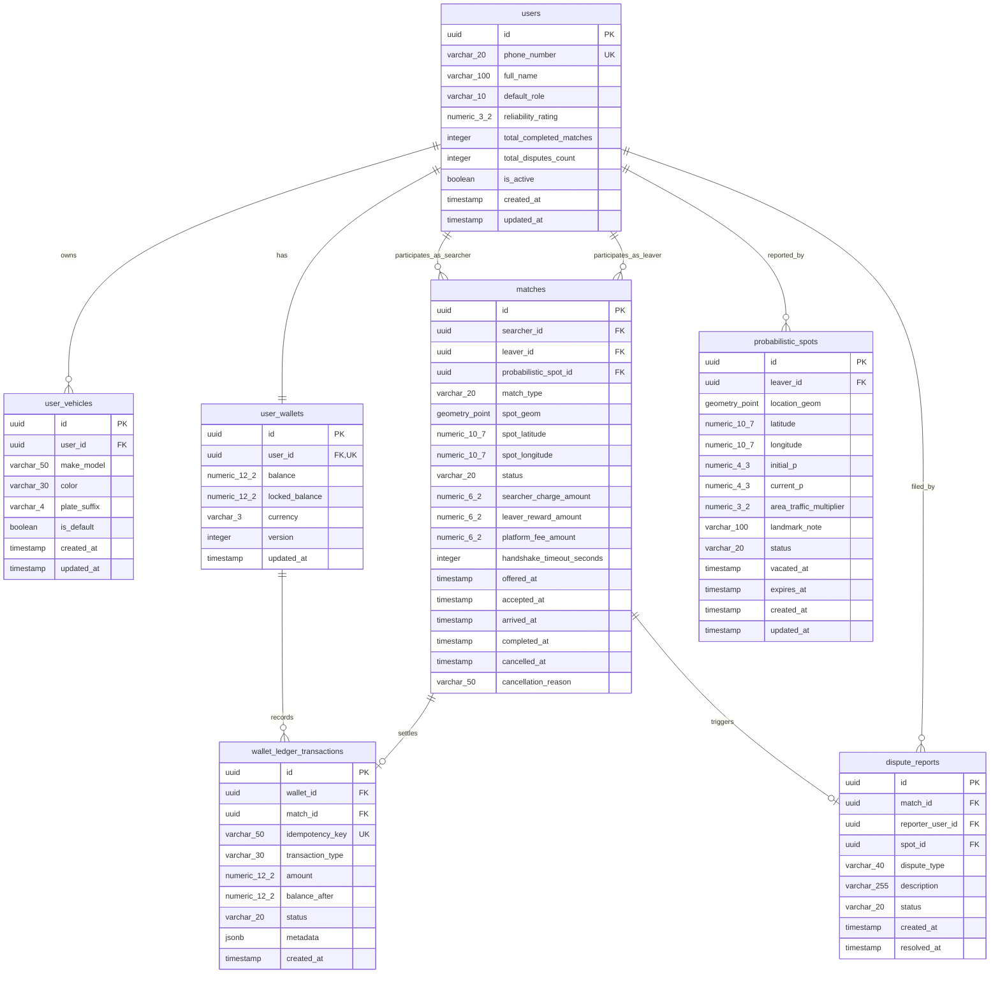

# Database Design Document
# Project: ParkLah (Smart P2P Parking Matchmaking Platform)

**Document Version:** 1.0.0  
**Target RDBMS:** PostgreSQL 16 with PostGIS 3.4 Spatial Extension  
**In-Memory Data Store:** Redis 7.x  
**Status:** Approved Database Schema & Indexing Specification  
**Last Updated:** 2026-08-30  

---

## 1. Overview & Objectives

The ParkLah persistence architecture employs a hybrid data strategy:
1. **Relational & Spatial Database (PostgreSQL 16 + PostGIS 3.4):** Authoritative persistent store for user identities, masked vehicle profiles, spatial probabilistic spot decay histories, match state audit logs, dispute cases, and ACID double-entry financial ledgers.
2. **In-Memory Geo Cache & Mutex Store (Redis 7.x):** High-frequency ephemeral data store for live searcher/leaver GPS telemetry (`GEOADD`/`GEORADIUS`), 15-second handshake distributed locks, JWT session revocation sets, and rate limiters.

---

## 2. Complete Entity-Relationship Diagram (ERD)



---

## 3. Detailed Table Specifications (PostgreSQL + PostGIS)

### 3.1 `users`
Stores user profile information, contact numbers, and aggregated reliability scores.

| Column | Type | Nullable | Constraints / Defaults | Description |
| :--- | :--- | :--- | :--- | :--- |
| `id` | `UUID` | No | `PRIMARY KEY DEFAULT uuid_generate_v4()` | Unique user identifier |
| `phone_number` | `VARCHAR(20)` | No | `UNIQUE` | E.164 Malaysian mobile number (`+601XXXXXXXX`) |
| `full_name` | `VARCHAR(100)` | No | | User display name |
| `default_role` | `VARCHAR(10)` | No | `DEFAULT 'SEARCHER' CHECK (IN ('SEARCHER', 'LEAVER'))` | Initial dashboard role |
| `reliability_rating`| `NUMERIC(3,2)`| No | `DEFAULT 5.00 CHECK (>=0.00 AND <=5.00)` | 5-star reliability rating |
| `total_completed_matches` | `INTEGER` | No | `DEFAULT 0 CHECK (>=0)` | Lifetime successful handoffs |
| `total_disputes_count` | `INTEGER` | No | `DEFAULT 0 CHECK (>=0)` | Lifetime dispute count |
| `is_active` | `BOOLEAN` | No | `DEFAULT TRUE` | Account status flag |
| `created_at` | `TIMESTAMPTZ` | No | `DEFAULT NOW()` | Account creation timestamp |
| `updated_at` | `TIMESTAMPTZ` | No | `DEFAULT NOW()` | Last update timestamp |

### 3.2 `user_vehicles`
Stores registered vehicles. Adheres to privacy masking by only recording the last 4 digits of the license plate.

| Column | Type | Nullable | Constraints / Defaults | Description |
| :--- | :--- | :--- | :--- | :--- |
| `id` | `UUID` | No | `PRIMARY KEY DEFAULT uuid_generate_v4()` | Vehicle identifier |
| `user_id` | `UUID` | No | `REFERENCES users(id) ON DELETE CASCADE` | Vehicle owner |
| `make_model` | `VARCHAR(50)` | No | | Car make & model (e.g., "Perodua Myvi") |
| `color` | `VARCHAR(30)` | No | | Car color (e.g., "Pearl White") |
| `plate_suffix`| `VARCHAR(4)` | No | `CHECK (LENGTH(plate_suffix) = 4)` | Last 4 digits of plate (e.g., "8892") |
| `is_default` | `BOOLEAN` | No | `DEFAULT FALSE` | Default vehicle flag |
| `created_at` | `TIMESTAMPTZ` | No | `DEFAULT NOW()` | Record creation timestamp |
| `updated_at` | `TIMESTAMPTZ` | No | `DEFAULT NOW()` | Last update timestamp |

### 3.3 `user_wallets`
Stores user balances and concurrency control versions for double-entry financial operations.

| Column | Type | Nullable | Constraints / Defaults | Description |
| :--- | :--- | :--- | :--- | :--- |
| `id` | `UUID` | No | `PRIMARY KEY DEFAULT uuid_generate_v4()` | Wallet identifier |
| `user_id` | `UUID` | No | `UNIQUE REFERENCES users(id) ON DELETE RESTRICT` | Account owner |
| `balance` | `NUMERIC(12,2)`| No | `DEFAULT 20.00 CHECK (balance >= 0.00)` | Available funds in MYR |
| `locked_balance`| `NUMERIC(12,2)`| No | `DEFAULT 0.00 CHECK (locked_balance >= 0.00)` | Funds held during active match |
| `currency` | `VARCHAR(3)` | No | `DEFAULT 'MYR'` | ISO currency code |
| `version` | `INTEGER` | No | `DEFAULT 1` | Optimistic concurrency lock version |
| `updated_at` | `TIMESTAMPTZ` | No | `DEFAULT NOW()` | Balance change timestamp |

### 3.4 `probabilistic_spots`
Stores vacated parking spots that did not find an immediate real-time match, with real-time decaying probability values.

| Column | Type | Nullable | Constraints / Defaults | Description |
| :--- | :--- | :--- | :--- | :--- |
| `id` | `UUID` | No | `PRIMARY KEY DEFAULT uuid_generate_v4()` | Probabilistic spot identifier |
| `leaver_id` | `UUID` | Yes | `REFERENCES users(id) ON DELETE SET NULL` | Departing user who vacated the spot |
| `location_geom`| `GEOMETRY(Point, 4326)` | No | Spatial Point (SRID 4326) | PostGIS spatial coordinate point |
| `latitude` | `NUMERIC(10,7)`| No | | Decimal latitude coordinate |
| `longitude`| `NUMERIC(10,7)`| No | | Decimal longitude coordinate |
| `initial_p`| `NUMERIC(4,3)` | No | `DEFAULT 0.950` | Initial confidence score ($P_0$) |
| `current_p`| `NUMERIC(4,3)` | No | `DEFAULT 0.950` | Real-time decayed probability score |
| `area_traffic_multiplier` | `NUMERIC(3,2)` | No | `DEFAULT 1.00` | Zone density modifier ($M_{\text{traffic}}$) |
| `landmark_note` | `VARCHAR(100)` | Yes | | Landmark description (e.g., "Pillar E-14") |
| `status` | `VARCHAR(20)` | No | `DEFAULT 'AVAILABLE' CHECK (IN ('AVAILABLE', 'RESERVED', 'OCCUPIED', 'EXPIRED'))` | Spot availability status |
| `vacated_at`| `TIMESTAMPTZ`| No | `DEFAULT NOW()` | Departure timestamp |
| `expires_at`| `TIMESTAMPTZ`| No | | Hard cutoff timestamp ($t = 15\text{ min}$) |
| `created_at`| `TIMESTAMPTZ`| No | `DEFAULT NOW()` | Ingestion timestamp |
| `updated_at`| `TIMESTAMPTZ`| No | `DEFAULT NOW()` | Last decay recalculation timestamp |

### 3.5 `matches`
Stores real-time and probabilistic matchmaking agreements, lifecycle events, and charges.

| Column | Type | Nullable | Constraints / Defaults | Description |
| :--- | :--- | :--- | :--- | :--- |
| `id` | `UUID` | No | `PRIMARY KEY DEFAULT uuid_generate_v4()` | Match agreement identifier |
| `searcher_id` | `UUID` | No | `REFERENCES users(id) ON DELETE RESTRICT` | Arriving driver |
| `leaver_id` | `UUID` | Yes | `REFERENCES users(id) ON DELETE SET NULL` | Departing driver (if P2P) |
| `probabilistic_spot_id` | `UUID` | Yes | `REFERENCES probabilistic_spots(id) ON DELETE SET NULL` | Matched DB spot (if DB fallback) |
| `match_type` | `VARCHAR(20)` | No | `CHECK (IN ('REAL_TIME_P2P', 'PROBABILISTIC_DB'))` | Match category |
| `spot_geom` | `GEOMETRY(Point, 4326)` | No | Spatial Point (SRID 4326) | Target parking stall coordinate |
| `spot_latitude` | `NUMERIC(10,7)`| No | | Latitude coordinate |
| `spot_longitude`| `NUMERIC(10,7)`| No | | Longitude coordinate |
| `status` | `VARCHAR(20)` | No | `CHECK (IN ('OFFERED', 'ACCEPTED', 'EN_ROUTE', 'ARRIVED', 'COMPLETED', 'FAILED_SPOT_TAKEN', 'CANCELLED_SEARCHER', 'CANCELLED_LEAVER', 'TIMEOUT'))` | State machine status |
| `searcher_charge_amount` | `NUMERIC(6,2)`| No | `DEFAULT 0.50` | Searcher fee (RM 0.50 or RM 0.00) |
| `leaver_reward_amount` | `NUMERIC(6,2)`| No | `DEFAULT 0.25` | Leaver reward (RM 0.25) |
| `platform_fee_amount` | `NUMERIC(6,2)`| No | `DEFAULT 0.25` | Platform revenue (RM 0.25) |
| `handshake_timeout_seconds` | `INTEGER` | No | `DEFAULT 15` | Handshake response timeout |
| `offered_at` | `TIMESTAMPTZ` | No | `DEFAULT NOW()` | Offer creation timestamp |
| `accepted_at`| `TIMESTAMPTZ` | Yes | | Acceptance timestamp |
| `arrived_at` | `TIMESTAMPTZ` | Yes | | Geofenced arrival timestamp |
| `completed_at`| `TIMESTAMPTZ`| Yes | | Handover verification timestamp |
| `cancelled_at`| `TIMESTAMPTZ`| Yes | | Abort / cancellation timestamp |
| `cancellation_reason` | `VARCHAR(50)` | Yes | | Reason code for cancellation |

### 3.6 `wallet_ledger_transactions`
Immutable double-entry ledger tracking all financial balance movements.

| Column | Type | Nullable | Constraints / Defaults | Description |
| :--- | :--- | :--- | :--- | :--- |
| `id` | `UUID` | No | `PRIMARY KEY DEFAULT uuid_generate_v4()` | Transaction ledger entry ID |
| `wallet_id` | `UUID` | No | `REFERENCES user_wallets(id) ON DELETE RESTRICT` | Target wallet |
| `match_id` | `UUID` | Yes | `REFERENCES matches(id) ON DELETE SET NULL` | Associated match (if applicable) |
| `idempotency_key` | `VARCHAR(50)` | No | `UNIQUE` | Unique transaction idempotency key |
| `transaction_type` | `VARCHAR(30)` | No | `CHECK (IN ('MOCK_TOPUP', 'MOCK_CASHOUT', 'GATEWAY_TOPUP', 'PAYOUT_CASHOUT', 'SEARCHER_HANDOFF_FEE', 'LEAVER_HANDOFF_REWARD', 'PLATFORM_COMMISSION', 'DISPUTE_REFUND'))` | Financial transaction classification |
| `amount` | `NUMERIC(12,2)`| No | | Debit (negative) or Credit (positive) |
| `balance_after`| `NUMERIC(12,2)`| No | `CHECK (balance_after >= 0.00)` | Resulting wallet balance |
| `status` | `VARCHAR(20)` | No | `DEFAULT 'COMPLETED' CHECK (IN ('PENDING', 'COMPLETED', 'FAILED', 'REVERSED'))` | Transaction status |
| `metadata` | `JSONB` | Yes | `DEFAULT '{}'::jsonb` | Additional diagnostic metadata |
| `created_at` | `TIMESTAMPTZ` | No | `DEFAULT NOW()` | Execution timestamp |

---

## 4. Redis Spatial & In-Memory Key Schema

| Key Format | Data Structure | Fields / Value Schema | Expiration (TTL) | Purpose |
| :--- | :--- | :--- | :--- | :--- |
| `geo:searchers:active` | `GEO / ZSET` | Member: `searcher_uuid`, Coord: `(lng, lat)` | 60s (heartbeat refreshed) | High-speed spatial search for active searchers |
| `geo:leavers:active` | `GEO / ZSET` | Member: `leaver_uuid`, Coord: `(lng, lat)` | 300s (departure window) | Live departing drivers index |
| `searcher:state:{id}` | `HASH` | `destLat`, `destLng`, `radiusM`, `etaSec`, `speed`, `socketId` | 600s | Telemetry and active search state |
| `leaver:state:{id}` | `HASH` | `spotLat`, `spotLng`, `vehicleId`, `note`, `countdownSec` | 300s | Broadcast parameters and departure countdown |
| `lock:spot:{spotId}` | `STRING` | `{searcherId}` | 15s (`NX`, `EX 15`) | Mutex lock during 15s match offer handshake |
| `lock:wallet:{userId}` | `STRING` | `"1"` | 5s (`NX`, `EX 5`) | Lock preventing concurrent balance mutations |

---

## 5. SQL Indexes & Performance Optimization

```sql
-- Spatial Queries
CREATE INDEX idx_probabilistic_spots_geom ON probabilistic_spots USING GIST(location_geom);

-- Status & Filter Performance
CREATE INDEX idx_probabilistic_spots_status_p ON probabilistic_spots(status, current_p DESC);
CREATE INDEX idx_probabilistic_spots_expires ON probabilistic_spots(expires_at) WHERE status = 'AVAILABLE';

-- Foreign Key Lookups
CREATE INDEX idx_user_vehicles_user_id ON user_vehicles(user_id);
CREATE INDEX idx_user_wallets_user_id ON user_wallets(user_id);
CREATE INDEX idx_matches_searcher_id ON matches(searcher_id);
CREATE INDEX idx_matches_leaver_id ON matches(leaver_id);
CREATE INDEX idx_matches_status ON matches(status);
CREATE INDEX idx_wallet_ledger_wallet_id ON wallet_ledger_transactions(wallet_id);
CREATE INDEX idx_wallet_ledger_match_id ON wallet_ledger_transactions(match_id);
```
