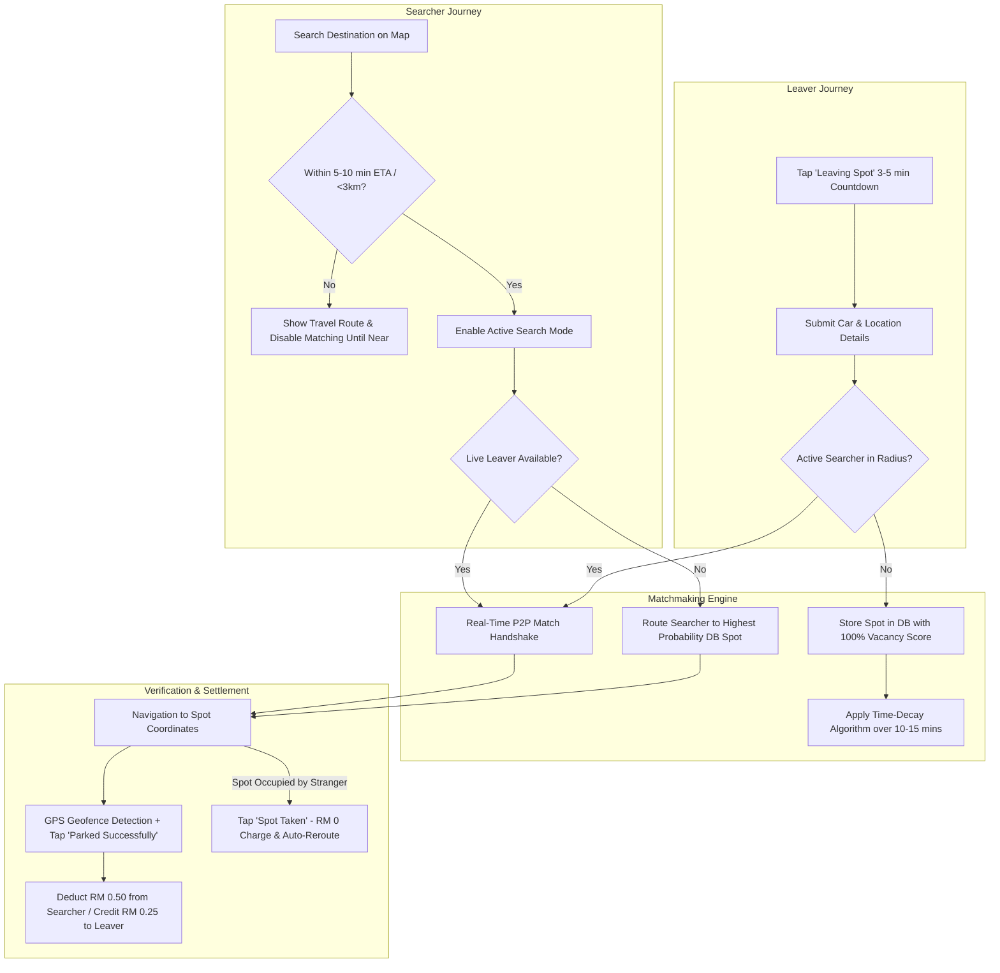
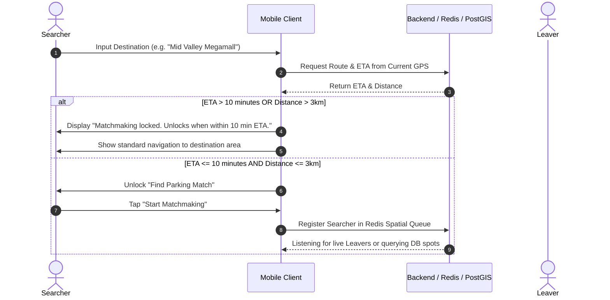
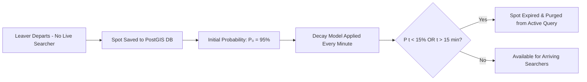
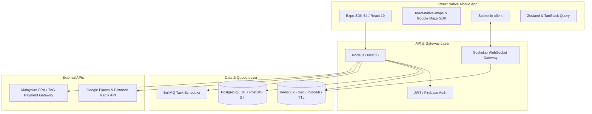

# Product Requirements Document (PRD)
# Project: ParkLah (Smart P2P Parking Matchmaking Mobile App)

**Document Version:** 1.0.0  
**Target Platform:** iOS & Android (React Native + Expo)  
**Target Market:** Malaysia (Currency: RM - Malaysian Ringgit)  
**Status:** Approved Requirements  
**Last Updated:** 2026-08-30  

---

## 1. Executive Summary & Vision

### 1.1 Problem Statement
Urban drivers in high-density areas (commercial hubs, transit stations, universities, shopping districts) spend an average of 15–25 minutes circling blocks looking for vacant public parking spots. This leads to:
- Excessive fuel consumption and vehicle wear.
- Increased localized traffic congestion and carbon emissions.
- Severe driver stress, lost productivity, and parking disputes.

### 1.2 The ParkLah Solution
**ParkLah** is a crowd-powered, peer-to-peer (P2P) parking matchmaking mobile app that bridges the gap between drivers leaving a parking spot (**Leavers**) and drivers actively searching for one (**Searchers**). 

By creating a direct matchmaking exchange combined with an intelligent **Probabilistic Vacancy Database** for unmatched vacant spots, ParkLah ensures that parking turnover is captured in real-time, eliminating blind cruising.

### 1.3 Core Economics & Incentive Model
- **Searcher Cost:** RM 0.50 per successful parking match.
- **Leaver Reward:** RM 0.25 credited into their in-app wallet per successful handoff.
- **ParkLah Platform Fee:** RM 0.25 gross margin per transaction.

---

## 2. Key Personas & Terminology

| Term / Persona | Definition |
| :--- | :--- |
| **Searcher** | A driver actively driving toward a chosen destination seeking an available parking spot. |
| **Leaver** | A parked driver who intends to vacate their parking spot within the next 3–5 minutes. |
| **Real-Time Match** | Direct P2P synchronization where a live Leaver is paired with an active Searcher within proximity. |
| **Probabilistic Spot** | A parking spot vacated by a Leaver that had no immediate real-time match. The spot is logged into the database with a decaying probability score over a 10–15 minute lifespan. |
| **Destination Radius** | The geographical boundary around the Searcher's destination where matchmaking is active (typically 500m – 1.5km). |
| **Distance Gatekeeper** | An algorithm constraint that prevents Searchers from matchmaking if their travel ETA is > 10 minutes or distance is > 3 km from the destination. |

---

## 3. High-Level System Architecture & Flow

---

## 4. Detailed Feature & Functional Requirements

### 4.1 User Authentication & Vehicle Profiling
- **FR-1.1 Mobile Number OTP:** Seamless registration and login using Malaysian mobile numbers (`+60`).
- **FR-1.2 Vehicle Profile:** Users store their primary vehicle details for easy recognition:
  - Car Make & Model (e.g., *Perodua Myvi*, *Honda City*, *Toyota Yaris*).
  - Car Color (e.g., *Pearl White*, *Dark Metallic Grey*).
  - License Plate Suffix (Last 4 digits only, e.g., `8892` to protect privacy).
- **FR-1.3 Role Switching:** Any user can seamlessly act as a **Searcher** or a **Leaver** from the main dashboard.

---

### 4.2 Searcher Experience & Distance Gatekeeper

- **FR-2.1 Destination Search:** Auto-complete search bar powered by Google Places API.
- **FR-2.2 Distance Gatekeeper Logic:**
  - Prevents premature matchmaking when Searchers are too far away.
  - **Threshold:** Searcher must have an Estimated Travel Time (ETA) $\le 10\text{ minutes}$ AND distance $\le 3.0\text{ km}$ from destination.
  - If beyond the threshold, app displays a travel route on the map and automatically unlocks the "Matchmaking" state when the user crosses the geofence threshold.
- **FR-2.3 Active Search Screen:** Clean map interface showing Searcher's live position, destination pin, search radius circle, and real-time status pulses.
- **FR-2.4 Route Polyline & External Navigation Support:**
  - **In-App Polyline Rendering:** Displays a real-time turn-by-turn road route on the map (`react-native-maps-directions`) from the Searcher's live GPS to the destination / matched parking stall.
  - **Dynamic Rerouting:** Automatically recalculates and snaps the navigation path directly to the Leaver's exact parking stall coordinates upon matchmaking confirmation.
  - **External App Quick-Launch (Optional):** Provides a 1-tap shortcut for Searchers to launch the target coordinates in **Waze**, **Google Maps**, or **Apple Maps** for full voice-guided navigation while ParkLah operates in the background to handle geofenced arrival verification.

---

### 4.3 Leaver Experience & Immediate Departure Broadcast
- **FR-3.1 Leaving Trigger:** Leaver taps the prominent **"I'm Leaving"** action button on their dashboard.
- **FR-3.2 Departure Countdown:** Standard immediate departure window of **3 to 5 minutes** (e.g., walking to vehicle / starting engine).
- **FR-3.3 Spot Details Submission:**
  - GPS Coordinates captured automatically with high accuracy.
  - Selected vehicle (Make, Color, Plate last 4 digits).
  - Optional Quick Note / Landmark: Pre-defined chips (e.g., *"Near Entrance"*, *"Basement 1"*, *"Facing Main Road"*, *"Lot #124"*).
- **FR-3.4 Departure Status Screen:** Displays a live countdown timer and search radar showing incoming Searcher ETA once matched.

---

### 4.4 Real-Time P2P Matchmaking Engine
- **FR-4.1 Geospatial Pairing:**
  - When a Leaver announces departure, the backend spatial engine queries active Searchers whose destination radius encompasses the Leaver's spot.
  - Matches are prioritized by:
    1. **ETA Alignment:** Searcher ETA matches Leaver departure countdown ($\Delta t \approx 0$).
    2. **Proximity:** Closest driving distance to the spot.
    3. **User Reliability Rating:** Higher rated Searchers prioritized.
- **FR-4.2 Real-time Notification & Handshake:**
  - Searcher receives immediate popup: *"Match Found! [Car Model] is leaving in 3 mins."*
  - Searcher has 15 seconds to accept (or auto-accepted if in background drive mode).
  - Upon acceptance, navigation polyline updates directly to the Leaver's exact parking coordinates.
  - Leaver screen updates to: *"Searcher matched! [Car Model, Color] arriving in ~4 mins."*

---

### 4.5 Probabilistic Vacancy Fallback Engine (Database Spots)

When a Leaver announces departure but **no real-time Searcher is immediately matched**, the system does not discard the information:

- **FR-5.1 Spot Persistence:** Spot coordinates, timestamp, and metadata are saved to the spatial database.
- **FR-5.2 Decay Algorithm:**
  The probability $P(t)$ of the parking spot remaining unoccupied at time $t$ (minutes after Leaver's departure) is calculated using a time-decay function:
  $$P(t) = P_0 \cdot e^{-\lambda t} \cdot M_{\text{traffic}}$$
  - $P_0$: Initial vacancy confidence score ($0.95$).
  - $\lambda$: Decay rate constant ($0.15$), calibrated so probability drops below $20\%$ after $10\text{–}12\text{ minutes}$.
  - $M_{\text{traffic}}$: Area density modifier (e.g., $0.85$ for high-turnover peak zones, $1.0$ for regular zones).
  - **Lifespan Cutoff:** Absolute expiration at $15\text{ minutes}$, after which the record is marked inactive.
- **FR-5.3 Fallback Routing for Searchers:**
  - If a Searcher reaches their destination zone with no live Leaver available, the app queries the database for active spots within $500\text{m}$.
  - Searcher is directed to the candidate spot with the **highest remaining vacancy probability score**.
  - Map displays probability indicator (e.g., *"High Chance - Vacated 3 mins ago"*).

---

### 4.6 Handover Verification & Anti-Abuse Safeguards
To prevent fraudulent claims or unfair charges:

- **FR-6.1 Dual-Verification Mechanism:**
  1. **Automated Geofencing:** The app monitors the Searcher's GPS. When the device is within a **$30\text{m}$ radius** of the spot and driving speed drops to $0\text{ km/h}$ for $>15\text{ seconds}$, an arrival event is registered.
  2. **Manual Confirmation:** Searcher taps the **"Parked Successfully"** confirmation button on screen.
- **FR-6.2 Settlement Execution:**
  - Once verified, the backend executes the financial ledger transaction:
    - Searcher wallet: $-\text{RM }0.50$
    - Leaver wallet: $+\text{RM }0.25$
    - Platform balance: $+\text{RM }0.25$
- **FR-6.3 "Spot Taken" Exception Handling:**
  - If another non-app vehicle took the spot before the Searcher arrived, the Searcher taps **"Spot Taken by Someone Else"**.
  - **Zero Charge:** Searcher is charged $\text{RM }0.00$.
  - **Immediate Fallback:** System immediately reroutes the Searcher to the next highest-probability spot or resets to active live search.
  - **DB Invalidation:** The taken spot is instantly marked as `OCCUPIED` in the database to prevent routing further users to it.
- **FR-6.4 Abuse & Dispute Management:**
  - Users with anomalous cancellation rates or false reports are flagged for review and temporary cooldown.

---

### 4.7 In-App Wallet & Micro-Transactions (MVP & Production)
- **FR-7.1 Mock Wallet (Phase 1 MVP):**
  - Simulated wallet balance with preloaded test credits (e.g., $\text{RM }20.00$).
  - Simulated Top-up and Cash-out buttons with instantaneous ledger updates.
- **FR-7.2 Production Wallet Architecture (Phase 2):**
  - Integration with Malaysian Payment Gateways (e.g., Curlec / Razer Merchant Services / Stripe) supporting:
    - **FPX Online Banking** (Maybank2u, CIMB Clicks, Public Bank, etc.)
    - **Touch 'n Go eWallet & DuitNow QR**
    - **Debit/Credit Cards**
  - Minimum top-up threshold: $\text{RM }5.00$ / $\text{RM }10.00$.
  - Leaver payout / withdrawal to user bank account via DuitNow Instant Transfer (Min balance $\text{RM }10.00$).

---

## 5. Technology Stack Specification

### 5.1 Frontend (Mobile App)
| Component | Technology / Library | Purpose |
| :--- | :--- | :--- |
| **Framework** | **React Native (Expo SDK 54)** | Cross-platform native mobile app (iOS & Android) |
| **Language** | **TypeScript (~5.9)** | Strict type safety and maintainability |
| **Routing** | `expo-router` (v6) | File-based navigation and deep linking |
| **Styling & Design** | `global.css` + `Lexend` Typography | Follows the "Aegean Drift" high-contrast modern design |
| **Mapping & Routing** | `react-native-maps` | Map rendering, markers, route polylines, geofences |
| **Location Tracking** | `expo-location` | Foreground high-accuracy GPS coordinates & heading |
| **State Management** | `zustand` + `@tanstack/react-query` | Global app state & server cache synchronization |
| **Real-time Client** | `socket.io-client` | Live P2P matching notifications, driver ETA, chat |
| **Secure Storage** | `expo-secure-store` | Encrypted JWT token and authentication storage |
| **External Nav Linking** | `react-native-map-link` / Deep Linking | 1-tap shortcut to launch destination in Waze, Google Maps, or Apple Maps |

### 5.2 Backend API & Real-time Services
| Component | Technology | Purpose |
| :--- | :--- | :--- |
| **Runtime & Language** | **Node.js (v20+ LTS) with TypeScript** | High-performance asynchronous API services |
| **Framework** | **NestJS** | Modular, enterprise TypeScript REST API architecture, Dependency Injection, and middleware |
| **Real-Time Engine** | **Socket.io + Redis Adapter** | Scalable bi-directional WebSocket communication |
| **Spatial Database** | **PostgreSQL (v16+) with PostGIS (v3.4+)** | Geospatial queries (`ST_DWithin`, `ST_Distance_Sphere`, spatial indexing) |
| **In-Memory Store & Cache** | **Redis (v7.x)** | Real-time queue, geospatial indexing (`GEOADD`/`GEORADIUS`), spot TTL |
| **Background Jobs** | **BullMQ / node-cron** | Probabilistic spot decay computation & expired spot purging |
| **Authentication** | **JWT + SMS OTP Provider** | Secure mobile authentication |

### 5.3 External Cloud & Third-Party Integrations
- **Google Maps Platform:**
  - *Places API (New):* Destination search & auto-complete.
  - *Directions API & Distance Matrix API:* Real-time route polylines and traffic-aware ETA calculation.
- **Payment Processing (Phase 2):** Curlec / Razer Merchant Services (FPX, Touch 'n Go eWallet).
- **Push Notifications:** Firebase Cloud Messaging (FCM) & Apple Push Notification service (APNs).
- **Hosting / Infrastructure:** AWS (ECS Fargate, RDS PostgreSQL with PostGIS, ElastiCache Redis) or Render / Railway for MVP.

---

## 6. Non-Functional Requirements (NFRs)

### 6.1 Performance & Latency
- **Real-Time Matchmaking Latency:** Pair matching and notification dispatch must complete in $\le 1.5\text{ seconds}$ from Leaver trigger.
- **Location Polling Rate:** Active Searchers transmit GPS updates every $3\text{ seconds}$ while navigating.
- **API Response Times:** 95th percentile ($P_{95}$) response time for REST endpoints $\le 200\text{ms}$.

### 6.2 Geospatial Accuracy
- **GPS Accuracy Threshold:** Geofence trigger requires GPS horizontal accuracy $\le 15\text{ meters}$.
- **Geofence Radius:** Arrival prompt activates within $30\text{ meters}$ radius of the target spot.

### 6.3 Security & Privacy
- **Anonymized Vehicle Data:** Only car model, color, and the **last 4 digits of the license plate** are visible to the counterpart. Full plates are never exposed.
- **Data Encryption:** All client-server traffic encrypted via TLS 1.3. Location histories anonymized after 7 days.
- **Financial Compliance:** Payment transactions follow Bank Negara Malaysia (BNM) PCI-DSS standards for e-money.

### 6.4 Battery & Network Optimization
- Adaptive GPS tracking: Uses low-power passive location when idle; switches to high-accuracy GPS only during active search or departure navigation.

---

## 7. Edge Cases & Resilience Strategy

| Scenario / Edge Case | System Handling Strategy |
| :--- | :--- |
| **Searcher cancels route mid-way** | Spot is immediately returned to the active queue or saved into the Probabilistic DB. Searcher is charged RM 0.00. |
| **Leaver cancels departure** | Match is revoked. Searcher is instantly notified with apologies and routed to the next highest-probability spot. Leaver incurs no penalty if cancelled $>2$ mins before ETA. |
| **Searcher arrives, spot taken by stranger** | Searcher taps *"Spot Taken"*. No charge is made. Spot is flagged occupied in DB. Searcher is immediately offered next best available spot. |
| **GPS signal lost in basement / tunnel** | App falls back to last known coordinates and prompts Searcher with the Leaver's optional Landmark Note (e.g. *"Basement 2, Pillar E-14"*). |
| **Both drivers arrive at same DB spot** | First driver to complete geofenced arrival claim secures the spot; second driver is automatically diverted to an alternate spot. |

---

## 8. Implementation Roadmap

### Phase 1: MVP (Core Engine & Simulated Sandbox)
- [x] Product Requirements Definition (PRD) & Architecture Alignment.
- [ ] React Native (Expo) core UI flows: Destination Search, Active Radar, Departure Broadcast.
- [ ] Node.js + PostGIS backend with Spatial Matchmaking Engine.
- [ ] Redis live matchmaking queue & mathematical decay cron worker.
- [ ] Mock Wallet (Top-up, RM 0.50 deduction, RM 0.25 credit).
- [ ] Dual-verification arrival flow (Geofence + Manual Button).

### Phase 2: Production Readiness & Payments
- [ ] Malaysian Payment Gateway integration (Touch 'n Go eWallet, FPX).
- [ ] Push notifications (FCM / APNs) for background alert handling.
- [ ] User Reputation & Rating system.
- [ ] Advanced traffic-density decay multipliers.

### Phase 3: Expansion & AI Analytics
- [ ] Predictive vacancy modeling based on historical peak parking hours.
- [ ] Mall / Commercial parking barrier system API integrations.
