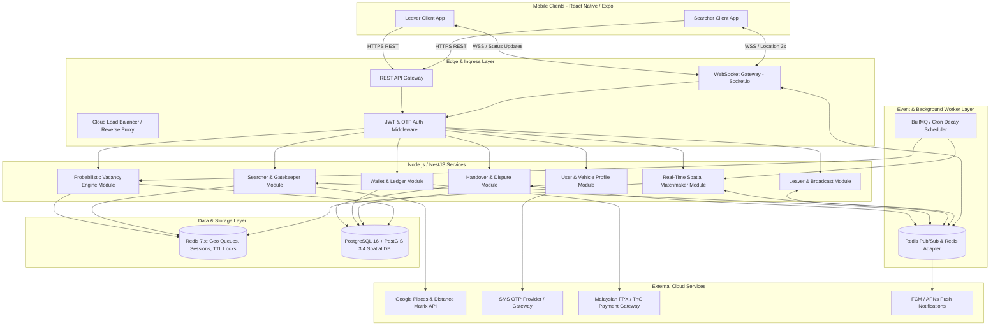
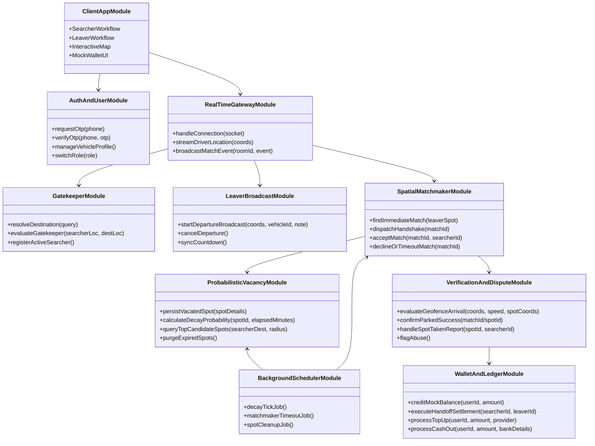
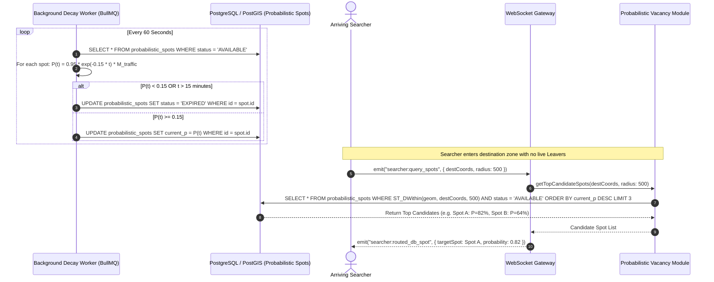
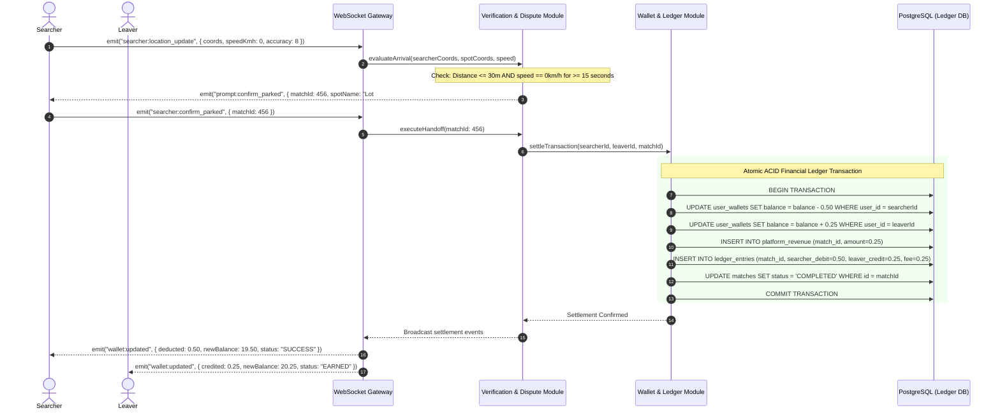
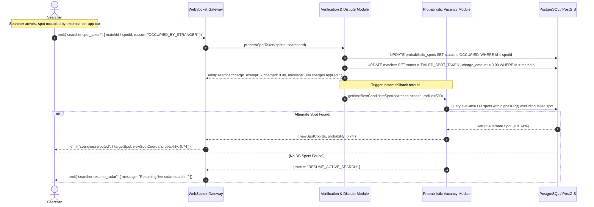
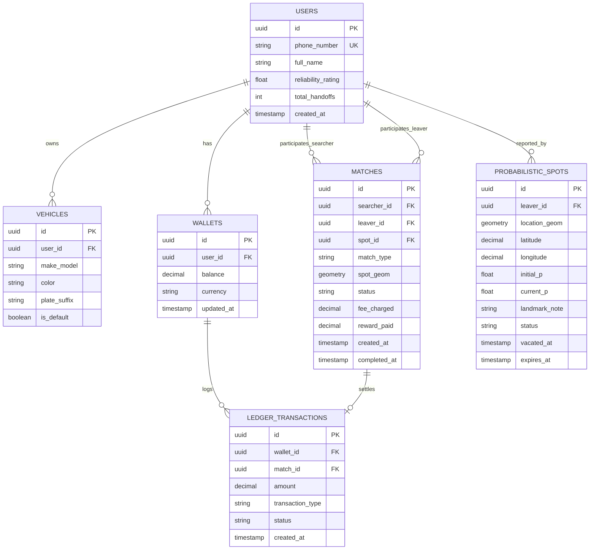
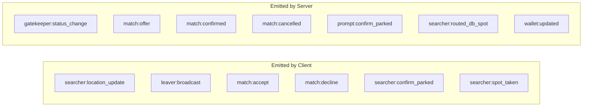

# High-Level Design (HLD) Document
# Project: ParkLah (Smart P2P Parking Matchmaking Platform)

**Document Version:** 1.0.0  
**Target System:** Mobile Client (iOS / Android - React Native Expo) & Distributed Cloud Backend (Node.js/NestJS, PostgreSQL + PostGIS, Redis, Socket.io)  
**Input PRD:** `planning/01_prd.md`  
**Status:** Approved Architecture  
**Last Updated:** 2026-08-30  

---

## 1. Executive Summary & Architecture Objectives

### 1.1 Purpose
This High-Level Design (HLD) document outlines the architectural blueprint, module decomposition, component interactions, data strategies, and communication protocols for **ParkLah**. The system enables real-time peer-to-peer (P2P) parking spot matchmaking and a mathematical probabilistic fallback mechanism for parking turnover in high-density urban environments in Malaysia.

### 1.2 Architectural Principles & Goals
1. **Sub-Second Real-Time Responsiveness:** Matchmaking matching latency $\le 1.5\text{s}$ and driver-to-driver state synchronization with $<200\text{ms}$ socket latency.
2. **Geospatial Precision & Efficiency:** High-speed spatial indexing leveraging Redis `GEO` commands for hot matchmaking queues and PostgreSQL `PostGIS` (`ST_DWithin`, GiST indices) for persistent spatial queries.
3. **Decoupled Modular Architecture:** Clear boundary isolation between real-time spatial matchmaking, mathematical decay background workers, transactional wallet accounting, and edge-facing gateways.
4. **Idempotency & Financial Integrity:** Double-entry ledger architecture ensuring zero double-spends and transactional ACID safety during peer micro-settlements (RM 0.50 / RM 0.25).
5. **Resilient Edge Fault Handling:** Graceful fallback when P2P matches are unavailable, spots are taken by non-app drivers, or GPS accuracy drops in covered environments.

---

## 2. System Architecture Overview



---

## 3. System Decomposition & Module Definitions

The ParkLah platform is decomposed into **10 core subsystems/modules**, each encapsulating a dedicated domain responsibility:



### Module 1: Mobile Client Application Subsystem (`ClientAppModule`)
- **Technology:** React Native (Expo SDK 54, React 19, TypeScript), `react-native-maps`, `expo-location`, `zustand`, `socket.io-client`.
- **Responsibilities:**
  - Dynamic role switching (Searcher $\leftrightarrow$ Leaver) on unified map dashboard.
  - High-accuracy foreground GPS tracking (adaptive intervals: 3s during active search/navigation, passive when idle).
  - Floating UI layout ("Aegean Drift" design system) with responsive status countdowns and visual radars.
  - Socket client state synchronization for real-time match invites and reroutes.

### Module 2: Authentication & User Management Subsystem (`AuthAndUserModule`)
- **Responsibilities:**
  - Malaysian phone number OTP authentication (`+60`).
  - JWT token generation, refresh rotation, and revocation.
  - Vehicle Profile Management: Make, Model, Color, and License Plate Masking (storing only last 4 digits for privacy compliance).
  - User reliability scoring & ratings aggregation.

### Module 3: Searcher & Distance Gatekeeper Subsystem (`GatekeeperModule`)
- **Responsibilities:**
  - Destination search & auto-complete integration with Google Places API.
  - **Distance Gatekeeper Rule Enforcement:** Validates if Searcher is within $\text{ETA} \le 10\text{ min}$ AND $\text{Distance} \le 3.0\text{ km}$ from the destination using Google Distance Matrix API.
  - If locked: streams passive travel navigation polyline until the threshold geofence is crossed.
  - If unlocked: transitions Searcher into the Active Searcher pool and registers coordinates in Redis Spatial Index (`GEOADD searchers:active`).

### Module 4: Leaver & Departure Broadcast Subsystem (`LeaverBroadcastModule`)
- **Responsibilities:**
  - Captures Leaver departure intent with a 3–5 minute countdown timer.
  - Records high-accuracy GPS coordinates, vehicle profile, and contextual landmark chips (e.g., *"Near Main Entrance"*, *"Basement 1, Pillar C"*).
  - Triggers real-time matching dispatch upon broadcast.
  - Provides departure cancellation handling with grace period logic.

### Module 5: Real-Time Spatial Matchmaker Subsystem (`SpatialMatchmakerModule`)
- **Responsibilities:**
  - Geospatial pairing between active Leavers and active Searchers within target destination radius ($500\text{m} - 1.5\text{km}$).
  - **Multi-Factor Match Ranking Algorithm:**
    $$\text{Score} = w_1 \cdot (1 - \frac{|\text{ETA}_{\text{searcher}} - t_{\text{leave}}|}{\text{Threshold}}) + w_2 \cdot (1 - \frac{d}{d_{\max}}) + w_3 \cdot \text{Rating}_{\text{norm}}$$
  - 15-second mutual handshake state machine (Offer $\rightarrow$ Accept / Reject / Timeout).
  - Seamless navigation polyline routing upon match acceptance.

### Module 6: Probabilistic Vacancy & Decay Subsystem (`ProbabilisticVacancyModule`)
- **Responsibilities:**
  - Ingestion of unmatched vacated parking spots into PostgreSQL `PostGIS` database with initial confidence score $P_0 = 95\%$.
  - Continuous mathematical time-decay computation:
    $$P(t) = P_0 \cdot e^{-\lambda t} \cdot M_{\text{traffic}}$$
    - $P_0 = 0.95$, $\lambda = 0.15$, $M_{\text{traffic}} \in [0.80, 1.00]$, Hard TTL $= 15\text{ minutes}$.
  - Spatial candidate lookup: routes arriving Searchers to the highest-probability spot within $500\text{m}$.
  - Real-time invalidation when spots are occupied or expired.

### Module 7: Verification, Handover & Dispute Subsystem (`VerificationAndDisputeModule`)
- **Responsibilities:**
  - **Dual-Verification Arrival Detection:**
    1. Geofencing check: Searcher coordinates within $\le 30\text{m}$ of spot with vehicle speed $= 0\text{ km/h}$ for $> 15\text{ seconds}$.
    2. Explicit user confirmation: User taps "Parked Successfully".
  - **"Spot Taken" Exception Handling:**
    - Zero charge to Searcher ($\text{RM }0.00$).
    - Instant invalidation of the target spot in the spatial database (`status = 'OCCUPIED'`).
    - Automated instant rerouting to the next best candidate spot.
  - Dispute resolution and abuse detection (flagging excessive cancellations).

### Module 8: In-App Wallet & Micro-Transactions Subsystem (`WalletAndLedgerModule`)
- **Responsibilities:**
  - Phase 1 MVP: Double-entry simulated ledger with preloaded $\text{RM }20.00$ test balance, simulated top-up and cash-out.
  - Phase 2: Payment gateway integration (Curlec / TnG eWallet / DuitNow / FPX).
  - Atomically isolated transactional settlements:
    - Searcher deduction: $-\text{RM }0.50$
    - Leaver reward: $+\text{RM }0.25$
    - Platform gross fee: $+\text{RM }0.25$
  - Account balance locking to prevent overdraft during concurrent matches.

### Module 9: Real-Time Gateway & WebSocket Subsystem (`RealTimeGatewayModule`)
- **Responsibilities:**
  - Persistent duplex WebSocket connections (Socket.io) backed by Redis Pub/Sub for horizontal scaling.
  - Room-based channel isolation: `searcher:{id}`, `leaver:{id}`, `match:{matchId}`.
  - High-frequency (3s) telemetry streaming and event broadcasting.

### Module 10: Asynchronous Task & Decay Scheduler Subsystem (`BackgroundSchedulerModule`)
- **Responsibilities:**
  - BullMQ / Cron scheduler running 60-second recurring decay updates on probabilistic spots.
  - Spot lifespan expiration cleanup ($t > 15\text{ min}$ or $P(t) < 15\%$).
  - Match handshake timeout sweeps (15s timer expiration).

---

## 4. Module Relationship & Dependency Matrix

### 4.1 Relationship Interaction Table

| Source Module | Target Module | Interaction Type | Protocol / Mechanism | Data Exchanged |
| :--- | :--- | :--- | :--- | :--- |
| `ClientAppModule` | `RealTimeGatewayModule` | Bi-directional Streaming | WebSocket (Socket.io) | GPS coordinates, room events, match handshakes |
| `ClientAppModule` | `GatekeeperModule` | Request-Response | HTTPS REST | Destination query, route ETA validation |
| `GatekeeperModule` | `SpatialMatchmakerModule` | Internal Event / In-Memory | NestJS Service Call / Redis GEO | Registered active searcher with destination radius |
| `LeaverBroadcastModule` | `SpatialMatchmakerModule` | Internal Event / In-Memory | NestJS Service Call / Redis PubSub | Spot departure coordinates, countdown, car info |
| `SpatialMatchmakerModule` | `ProbabilisticVacancyModule` | Fallback Invocation | Async Job / DB Write | Unmatched vacated spot data for persistence & decay |
| `SpatialMatchmakerModule` | `RealTimeGatewayModule` | Event Dispatch | Redis Pub/Sub $\rightarrow$ Socket.io | Match offer, acceptance status, driver ETAs |
| `VerificationAndDisputeModule`| `WalletAndLedgerModule` | Transaction Execution | ACID Database Transaction | Searcher ID, Leaver ID, match reference, RM 0.50 / RM 0.25 split |
| `VerificationAndDisputeModule`| `ProbabilisticVacancyModule` | State Invalidation | DB Update / Redis Invalidate | Spot marked `OCCUPIED`, trigger candidate reroute |
| `BackgroundSchedulerModule` | `ProbabilisticVacancyModule` | Batch Worker | BullMQ Job (60s tick) | Re-calculate $P(t)$, purge expired spots |
| `WalletAndLedgerModule` | External Payment Gateway | Payment & Payout | HTTPS Webhook / REST | FPX / TnG top-up, DuitNow bank withdrawal |

---

## 5. End-to-End Core Data & Control Flows

### 5.1 Flow 1: Destination Search & Distance Gatekeeper Flow

```mermaid
sequenceDiagram
    autonumber
    actor S as Searcher (Mobile App)
    participant GW as API Gateway / Gatekeeper Module
    participant GM as Google Maps API
    participant R as Redis (Spatial Store)

    S->>GW: POST /api/v1/searcher/destination { query: "Pavilion KL", currentCoords }
    GW->>GM: Places API (Resolve Place Details & Lat/Lng)
    GM-->>GW: Place Coordinates
    GW->>GM: Distance Matrix API (Origin -> Destination)
    GM-->>GW: { distanceKm: 4.8, durationMin: 18 }

    alt Distance > 3.0km OR ETA > 10 min
        GW-->>S: { status: "LOCKED", etaMin: 18, distanceKm: 4.8, unlockThreshold: "3.0km / 10min" }
        S->>S: Render travel route polyline; Poll location passively
    else Distance <= 3.0km AND ETA <= 10 min
        GW-->>S: { status: "UNLOCKED", etaMin: 8, distanceKm: 2.1 }
        S->>GW: POST /api/v1/searcher/start-matchmaking { destCoords, radiusMeters: 1000 }
        GW->>R: GEOADD searchers:active {lng} {lat} {searcherId}
        GW-->>S: { searchMode: "ACTIVE", socketRoom: "searcher:123" }
    end
```

---

### 5.2 Flow 2: Real-Time P2P Matchmaking & Handshake Flow

```mermaid
sequenceDiagram
    autonumber
    actor L as Leaver
    actor S as Searcher
    participant WS as WebSocket Gateway
    participant MM as Spatial Matchmaker
    participant R as Redis GEO & Cache
    participant DB as PostgreSQL / PostGIS

    L->>WS: emit("leaver:broadcast", { coords, countdownSec: 240, vehicleId, note })
    WS->>MM: processDepartureBroadcast(leaverPayload)
    MM->>R: GEORADIUS / Spatial Search for Active Searchers (Radius 1.0km)
    
    alt Active Searcher Found in Proximity
        MM->>MM: Compute Match Score (ETA sync + distance + rating)
        MM->>R: SET match:temp:456 { leaverId, searcherId, status: "OFFERED" } EX 15
        MM->>WS: broadcastTo("searcher:S1", "match:offer", { matchId: 456, car: "Myvi (White, 8892)", eta: 4 })
        MM->>WS: broadcastTo("leaver:L1", "match:pending", { searcherCar: "Honda City (Grey, 1234)" })
        
        alt Searcher Accepts within 15 seconds
            S->>WS: emit("match:accept", { matchId: 456 })
            WS->>MM: confirmMatch(matchId: 456)
            MM->>DB: INSERT INTO matches (leaver_id, searcher_id, spot_coords, status='ACTIVE')
            MM->>WS: broadcastTo("searcher:S1", "match:confirmed", { spotCoords, routePolyline })
            MM->>WS: broadcastTo("leaver:L1", "match:confirmed", { searcherETA: 3 })
        else 15s Timeout or Declined
            S->>WS: emit("match:decline", { matchId: 456 }) or Timeout Triggered
            MM->>R: Remove temp lock; Try next best searcher
        end
    else No Live Searcher Available
        MM->>DB: INSERT INTO probabilistic_spots (coords, initial_p=0.95, status='AVAILABLE')
        MM-->>L: Broadcast acknowledged; Spot saved to vacancy database
    end
```

---

### 5.3 Flow 3: Probabilistic Vacancy Fallback & Time-Decay Engine



---

### 5.4 Flow 4: Geofence Arrival, Dual Verification & Transaction Settlement



---

### 5.5 Flow 5: "Spot Taken" Exception Handling & Dynamic Rerouting



---

## 6. High-Level Data Model & Storage Strategy

### 6.1 Relational & Spatial Database Schema (PostgreSQL 16 + PostGIS 3.4)



### 6.2 Spatial Indexing & In-Memory Redis Strategy

| Redis Key / Structure | Type | Data Content & Schema | TTL / Lifespan | Purpose |
| :--- | :--- | :--- | :--- | :--- |
| `searchers:active:geo` | `GEO` | Coordinates `(lng, lat, searcher_id)` | 60s (Refreshed on heartbeat) | Real-time geospatial proximity lookup for incoming leavers. |
| `searcher:dest:{id}` | `HASH` | `{ destLat, destLng, radiusMeters, etaMin }` | 10 mins | Stores Searcher destination context for matchmaking pairing. |
| `leavers:broadcast:geo`| `GEO` | Coordinates `(lng, lat, leaver_id)` | 5 mins | Active leaver spatial index. |
| `match:temp:{matchId}` | `STRING` | Serialized match payload & handshake state | 15 seconds | Atomic lock during 15s handshake to prevent double-matching. |
| `session:user:{id}` | `STRING` | JWT claims, active socket ID, active role | 7 days | Fast session authentication & socket ID resolution. |

---

## 7. Real-Time Protocol & API Interface Contracts

### 7.1 WebSocket Events Catalog (Socket.io)



| Event Name | Direction | Payload Schema | Description |
| :--- | :--- | :--- | :--- |
| `searcher:location_update` | C $\rightarrow$ S | `{ lat: float, lng: float, heading: float, speed: float, accuracy: float }` | High-frequency Searcher telemetry (every 3s). |
| `leaver:broadcast` | C $\rightarrow$ S | `{ lat: float, lng: float, countdownSec: int, vehicleId: string, note?: string }` | Departure announcement by Leaver. |
| `match:offer` | S $\rightarrow$ C | `{ matchId: string, vehicleInfo: string, departureEtaMin: int, timeoutSec: 15 }` | Match proposal sent to candidate Searcher. |
| `match:accept` | C $\rightarrow$ S | `{ matchId: string }` | Searcher accepts the match handshake. |
| `match:confirmed` | S $\rightarrow$ C | `{ matchId: string, spotCoords: LatLng, polyline: string, counterPartEta: int }` | Finalized handshake; initiates driving route. |
| `prompt:confirm_parked` | S $\rightarrow$ C | `{ matchId: string, spotCoords: LatLng }` | Geofence triggered; triggers confirmation UI. |
| `searcher:confirm_parked` | C $\rightarrow$ S | `{ matchId: string }` | Searcher confirms successful parking. |
| `searcher:spot_taken` | C $\rightarrow$ S | `{ matchId?: string, spotId: string, reason: string }` | Exception: spot taken by 3rd party. |
| `searcher:routed_db_spot`| S $\rightarrow$ C | `{ spotId: string, spotCoords: LatLng, probability: float, note?: string }` | Directs Searcher to top probabilistic DB spot. |

### 7.2 Core REST API Endpoints

| HTTP Method | Route Endpoint | Module | Description |
| :--- | :--- | :--- | :--- |
| `POST` | `/api/v1/auth/otp/request` | `AuthAndUserModule` | Send SMS verification OTP to `+60` phone number. |
| `POST` | `/api/v1/auth/otp/verify` | `AuthAndUserModule` | Validate OTP code and return JWT access/refresh tokens. |
| `GET / POST` | `/api/v1/user/vehicles` | `AuthAndUserModule` | Retrieve and create vehicle profiles (masked plate suffix). |
| `POST` | `/api/v1/searcher/destination`| `GatekeeperModule` | Query Google Places, compute ETA and evaluate Gatekeeper status. |
| `POST` | `/api/v1/searcher/start` | `GatekeeperModule` | Register active searcher in spatial queue. |
| `GET` | `/api/v1/wallet/balance` | `WalletAndLedgerModule` | Get current balance and transaction history. |
| `POST` | `/api/v1/wallet/mock/topup` | `WalletAndLedgerModule` | Simulate wallet top-up (Phase 1 MVP). |
| `POST` | `/api/v1/wallet/mock/cashout` | `WalletAndLedgerModule` | Simulate payout to user bank account. |

---

## 8. Non-Functional & Resilience Architecture

### 8.1 Concurrency & Race Condition Safeguards
- **15-Second Match Handshake Lock:** When a match offer is dispatched to a Searcher, a distributed Redis mutex key `lock:spot:{spotId}` is set with a 15-second TTL. If another Searcher is nearby, they cannot be offered the same spot until the lock expires or is declined.
- **First-to-Claim DB Spot Arrival:** When multiple drivers navigate to the same probabilistic spot, the first driver whose geofence verification confirms "Parked Successfully" acquires the database record. The backend atomically flags `status = 'OCCUPIED'` and triggers an automatic reroute socket event for any other inbound drivers.

### 8.2 Low-Latency Geospatial Indexing
- **Redis `GEO` In-Memory Indexing:** Used for active Searchers and live Leavers within the transient 3–5 minute window. Executes in $\mathcal{O}(N + \log M)$ time ($<5\text{ms}$).
- **PostGIS GiST Indexing (`geom`):** The `probabilistic_spots` table is indexed via `CREATE INDEX idx_spots_geom ON probabilistic_spots USING GIST (location_geom)`. Spatial filtering with `ST_DWithin` achieves sub-10ms queries across 100,000+ spot records.

### 8.3 Battery & Mobile Device Optimization
- **Adaptive GPS Telemetry:**
  - *Idle / Dashboard Mode:* Low-power passive GPS (updates every 30–60s or on significant motion).
  - *Travel Gatekeeper Mode:* Medium accuracy navigation updates (every 10s).
  - *Active Search / Handshake Navigation Mode:* High accuracy GPS ($3\text{s}$ interval, horizontal accuracy threshold $\le 15\text{m}$).

### 8.4 Security, Privacy & BNM Regulatory Compliance
- **Plate Privacy Masking:** Backend and Client strictly enforce the 4-digit rule: only car model, color, and last 4 digits (e.g., `8892`) are ever returned to peer clients.
- **Ephemeral Telemetry:** Searcher and Leaver location breadcrumbs are stored purely in memory (Redis) during active matchmaking and completely purged 7 days post-transaction from analytical logs.
- **Double-Entry Financial Ledger:** All wallet balance changes require balancing entries in `ledger_transactions` wrapped inside PostgreSQL serializable transactions.

---

## 9. Technology Stack Mapping & Implementation Reference

| Layer | Component | Selected Technology | Version / Specification |
| :--- | :--- | :--- | :--- |
| **Mobile Client** | Core Mobile Framework | React Native (Expo) | SDK 54 / React 19 / TypeScript 5.9 |
| **Mobile Client** | Navigation & Routing | `expo-router` | v6 (File-based navigation) |
| **Mobile Client** | Mapping & Geolocation | `react-native-maps`, `expo-location` | Google Maps SDK for iOS & Android |
| **Mobile Client** | Design System & Styling | Tailwind / NativeWind + `global.css` | "Aegean Drift" High-Contrast Palette |
| **Mobile Client** | State & Data Cache | `zustand` + `@tanstack/react-query` | Global stores + optimistic server caches |
| **Mobile Client** | Real-Time Transport | `socket.io-client` | v4.x WebSockets |
| **Backend API** | Application Runtime | Node.js with TypeScript | v20+ LTS |
| **Backend API** | API Framework | NestJS / Express.js | Modular Controller / Service architecture |
| **Backend Real-Time**| WebSocket Gateway | Socket.io + `@socket.io/redis-adapter` | Clustered multi-instance duplex gateway |
| **Data Layer** | Relational & Spatial DB | PostgreSQL + PostGIS | PostgreSQL 16 / PostGIS 3.4 |
| **Data Layer** | In-Memory & Geo Cache | Redis | v7.x (GEO commands, Pub/Sub, TTL locks) |
| **Worker Layer** | Task Scheduler | BullMQ / node-cron | Mathematical decay engine & cleanup jobs |
| **External APIs** | Geocoding & Routing | Google Maps Platform | Places API (New), Distance Matrix API |
| **External APIs** | Payments (Phase 2) | Malaysian Payment Gateway | FPX, Touch 'n Go eWallet, DuitNow QR |

---

## 10. Summary & Traceability to PRD

| PRD Section / Requirement | HLD Module / Component | Architectural Solution |
| :--- | :--- | :--- |
| **FR-1: Auth & Vehicle Profiling** | `AuthAndUserModule` | Malaysian SMS OTP, JWT tokens, last 4 digits plate masking. |
| **FR-2: Distance Gatekeeper** | `GatekeeperModule` | Google Distance Matrix evaluation ($\le 10\text{min}, \le 3\text{km}$), locked/unlocked state. |
| **FR-3: Leaver Departure Broadcast** | `LeaverBroadcastModule` | 3–5 min countdown, high-accuracy GPS capture, landmark notes. |
| **FR-4: Real-Time P2P Matchmaking** | `SpatialMatchmakerModule` | Redis Geo query, multi-factor ETA/proximity score, 15s handshake state machine. |
| **FR-5: Probabilistic Vacancy Engine**| `ProbabilisticVacancyModule` | Exponential decay worker ($P_0=0.95, \lambda=0.15$), PostGIS spatial candidate routing. |
| **FR-6: Handover Verification** | `VerificationAndDisputeModule`| Dual verification (30m radius + 15s speed=0 stop + manual button), "Spot Taken" reroute. |
| **FR-7: In-App Wallet & Payments** | `WalletAndLedgerModule` | ACID double-entry ledger, RM 0.50 / RM 0.25 settlement, simulated & production payment gateways. |
| **NFR-6.1 - 6.4: Latency, Accuracy, Sec**| Core Architecture & Infra | Sub-second WebSocket dispatch, Redis in-memory cache, TLS 1.3, ephemeral location TTLs. |
