# Detailed Design Document (DDD)
# Project: ParkLah (Smart P2P Parking Matchmaking Platform)

**Document Version:** 1.0.0  
**Target System:** Mobile Client (React Native / Expo SDK 54) & Backend Services (Node.js / NestJS, PostgreSQL 16 + PostGIS 3.4, Redis 7.x, Socket.io, BullMQ)  
**Input Documents:**  
- Product Requirements Document: `backend/planning/01_prd.md`  
- High-Level Design: `backend/planning/02_high-level-design.md`  
**Status:** Approved Technical Design Specification  
**Last Updated:** 2026-08-30  

---

## 1. Introduction & Design Principles

### 1.1 Purpose
This Detailed Design Document (DDD) provides an exhaustive, component-level technical specification for the **ParkLah** platform. It translates the functional requirements from `01_prd.md` and the structural architecture from `02_high-level-design.md` into concrete, implementable software blueprints: class structures, data transfer objects (DTOs), database schemas, algorithmic formulations, state machines, API contracts, and unit/integration test specifications.

### 1.2 Core Design Principles
1. **Module Independence & Isolation (Clean / Hexagonal Architecture):**  
   Every module operates as an autonomous bounded context. Dependencies across modules are strictly inverted via abstract interfaces (Ports) and event-driven messaging (Pub/Sub). No module directly mutates the internal persistence tables of another module.
2. **Independent Testability (Test-First Design):**  
   Every module can be instantiated and tested in 100% isolation using Mock Adapters and in-memory test doubles without requiring live external services (Google Maps, SMS Gateways, Payment Providers) or cross-module database foreign key dependencies in unit suites.
3. **Deterministic Concurrency & ACID Settlement:**  
   Distributed state mutations (matchmaking locks, double-entry financial debits/credits, spot occupation race conditions) are guarded by Redis distributed locks (`Redlock`), database unique constraints, and PostgreSQL serializable transactions.
4. **Geospatial Real-Time Efficiency:**  
   Sub-second spatial matching achieved through multi-tier indexing: Redis `GEO` commands for in-flight volatile positions and PostGIS `GiST` spatial indexing (`ST_DWithin`) for persistent probabilistic decay analysis.
5. **Strict Type Safety & Contract Validation:**  
   End-to-end type safety using TypeScript 5.x, runtime validation using `class-validator` / `zod`, and OpenAPI (Swagger) schema generation.

---

## 2. Global Architecture & Cross-Cutting Concerns

### 2.1 Layered Hexagonal / Clean Architecture Pattern

Each backend module follows a standard 4-layer Hexagonal Architecture:

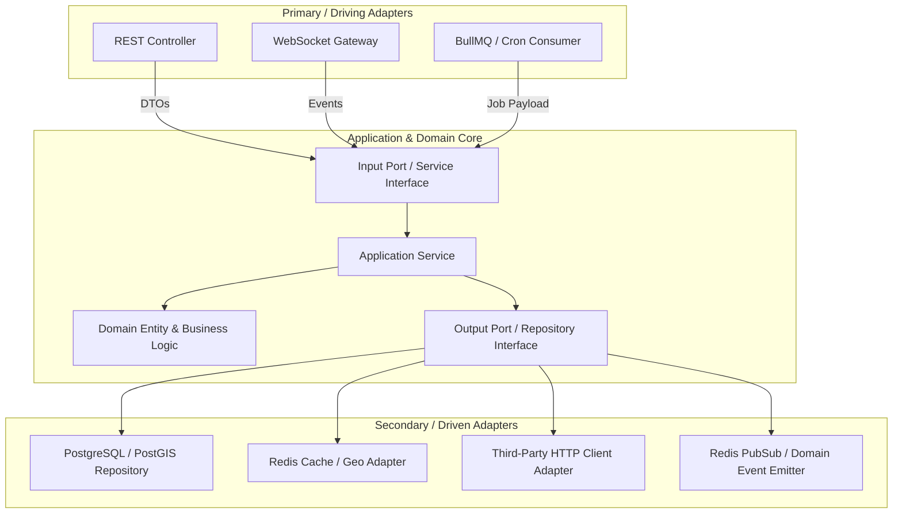

### 2.2 Global Error Handling & Response Standards (RFC 7807)

All API responses follow the standard JSON envelope format:

#### Success Response Envelope
```typescript
export interface ApiResponse<T> {
  success: true;
  statusCode: number;
  data: T;
  meta?: {
    page?: number;
    limit?: number;
    total?: number;
    timestamp: string;
  };
}
```

#### Error Response Envelope (RFC 7807 Problem Details)
```typescript
export interface ApiErrorResponse {
  success: false;
  statusCode: number;
  errorCode: string;       // e.g., "GATEKEEPER_DISTANCE_EXCEEDED", "INSUFFICIENT_FUNDS"
  message: string;         // Human-readable summary
  details?: Array<{        // Field-level validation breakdown
    field: string;
    issue: string;
  }>;
  timestamp: string;
  path: string;
}
```

### 2.3 Global Exception Hierarchy

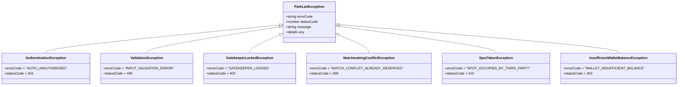

---

## 3. Database Schema & Data Dictionary (PostgreSQL 16 + PostGIS 3.4)

### 3.1 Complete Relational & Spatial Entity-Relationship Diagram

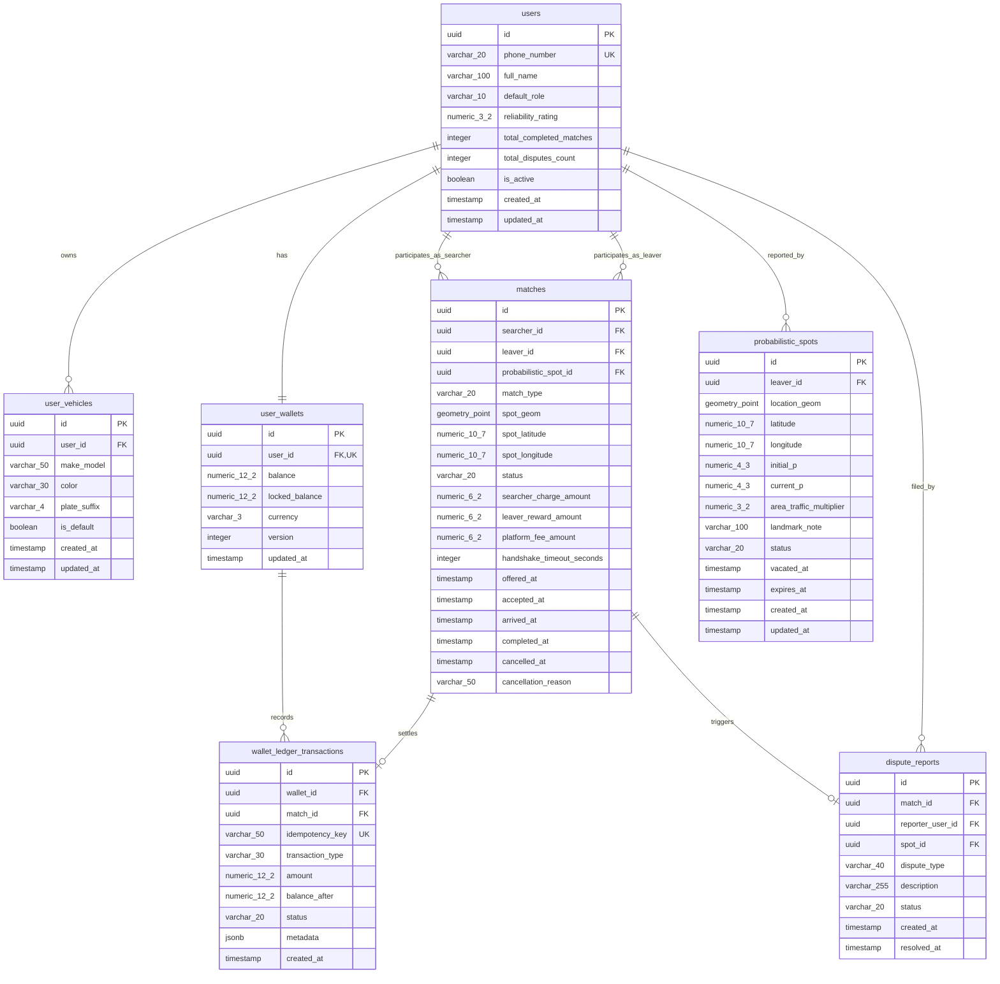

### 3.2 SQL DDL Migration & Indexing Specifications

```sql
-- Enable PostGIS & UUID extensions
CREATE EXTENSION IF NOT EXISTS "uuid-ossp";
CREATE EXTENSION IF NOT EXISTS "postgis";

-- 1. Users Table
CREATE TABLE users (
    id UUID PRIMARY KEY DEFAULT uuid_generate_v4(),
    phone_number VARCHAR(20) NOT NULL UNIQUE,
    full_name VARCHAR(100) NOT NULL,
    default_role VARCHAR(10) NOT NULL DEFAULT 'SEARCHER' CHECK (default_role IN ('SEARCHER', 'LEAVER')),
    reliability_rating NUMERIC(3, 2) NOT NULL DEFAULT 5.00 CHECK (reliability_rating >= 0.00 AND reliability_rating <= 5.00),
    total_completed_matches INTEGER NOT NULL DEFAULT 0 CHECK (total_completed_matches >= 0),
    total_disputes_count INTEGER NOT NULL DEFAULT 0 CHECK (total_disputes_count >= 0),
    is_active BOOLEAN NOT NULL DEFAULT TRUE,
    created_at TIMESTAMPTZ NOT NULL DEFAULT NOW(),
    updated_at TIMESTAMPTZ NOT NULL DEFAULT NOW()
);
CREATE INDEX idx_users_phone ON users(phone_number);

-- 2. User Vehicles Table
CREATE TABLE user_vehicles (
    id UUID PRIMARY KEY DEFAULT uuid_generate_v4(),
    user_id UUID NOT NULL REFERENCES users(id) ON DELETE CASCADE,
    make_model VARCHAR(50) NOT NULL,
    color VARCHAR(30) NOT NULL,
    plate_suffix VARCHAR(4) NOT NULL,
    is_default BOOLEAN NOT NULL DEFAULT FALSE,
    created_at TIMESTAMPTZ NOT NULL DEFAULT NOW(),
    updated_at TIMESTAMPTZ NOT NULL DEFAULT NOW()
);
CREATE INDEX idx_user_vehicles_user_id ON user_vehicles(user_id);

-- 3. User Wallets Table (with Optimistic Lock Version)
CREATE TABLE user_wallets (
    id UUID PRIMARY KEY DEFAULT uuid_generate_v4(),
    user_id UUID NOT NULL UNIQUE REFERENCES users(id) ON DELETE RESTRICT,
    balance NUMERIC(12, 2) NOT NULL DEFAULT 20.00 CHECK (balance >= 0.00),
    locked_balance NUMERIC(12, 2) NOT NULL DEFAULT 0.00 CHECK (locked_balance >= 0.00),
    currency VARCHAR(3) NOT NULL DEFAULT 'MYR',
    version INTEGER NOT NULL DEFAULT 1,
    updated_at TIMESTAMPTZ NOT NULL DEFAULT NOW()
);
CREATE INDEX idx_user_wallets_user_id ON user_wallets(user_id);

-- 4. Probabilistic Spots Table
CREATE TABLE probabilistic_spots (
    id UUID PRIMARY KEY DEFAULT uuid_generate_v4(),
    leaver_id UUID REFERENCES users(id) ON DELETE SET NULL,
    location_geom GEOMETRY(Point, 4326) NOT NULL,
    latitude NUMERIC(10, 7) NOT NULL,
    longitude NUMERIC(10, 7) NOT NULL,
    initial_p NUMERIC(4, 3) NOT NULL DEFAULT 0.950,
    current_p NUMERIC(4, 3) NOT NULL DEFAULT 0.950,
    area_traffic_multiplier NUMERIC(3, 2) NOT NULL DEFAULT 1.00,
    landmark_note VARCHAR(100),
    status VARCHAR(20) NOT NULL DEFAULT 'AVAILABLE' 
        CHECK (status IN ('AVAILABLE', 'RESERVED', 'OCCUPIED', 'EXPIRED')),
    vacated_at TIMESTAMPTZ NOT NULL DEFAULT NOW(),
    expires_at TIMESTAMPTZ NOT NULL,
    created_at TIMESTAMPTZ NOT NULL DEFAULT NOW(),
    updated_at TIMESTAMPTZ NOT NULL DEFAULT NOW()
);
-- GiST Spatial Index for ultra-fast spatial search (ST_DWithin)
CREATE INDEX idx_probabilistic_spots_geom ON probabilistic_spots USING GIST(location_geom);
CREATE INDEX idx_probabilistic_spots_status_p ON probabilistic_spots(status, current_p DESC);
CREATE INDEX idx_probabilistic_spots_expires ON probabilistic_spots(expires_at) WHERE status = 'AVAILABLE';

-- 5. Matches Table
CREATE TABLE matches (
    id UUID PRIMARY KEY DEFAULT uuid_generate_v4(),
    searcher_id UUID NOT NULL REFERENCES users(id) ON DELETE RESTRICT,
    leaver_id UUID REFERENCES users(id) ON DELETE SET NULL,
    probabilistic_spot_id UUID REFERENCES probabilistic_spots(id) ON DELETE SET NULL,
    match_type VARCHAR(20) NOT NULL CHECK (match_type IN ('REAL_TIME_P2P', 'PROBABILISTIC_DB')),
    spot_geom GEOMETRY(Point, 4326) NOT NULL,
    spot_latitude NUMERIC(10, 7) NOT NULL,
    spot_longitude NUMERIC(10, 7) NOT NULL,
    status VARCHAR(20) NOT NULL DEFAULT 'OFFERED' 
        CHECK (status IN ('OFFERED', 'ACCEPTED', 'EN_ROUTE', 'ARRIVED', 'COMPLETED', 'FAILED_SPOT_TAKEN', 'CANCELLED_SEARCHER', 'CANCELLED_LEAVER', 'TIMEOUT')),
    searcher_charge_amount NUMERIC(6, 2) NOT NULL DEFAULT 0.50,
    leaver_reward_amount NUMERIC(6, 2) NOT NULL DEFAULT 0.25,
    platform_fee_amount NUMERIC(6, 2) NOT NULL DEFAULT 0.25,
    handshake_timeout_seconds INTEGER NOT NULL DEFAULT 15,
    offered_at TIMESTAMPTZ NOT NULL DEFAULT NOW(),
    accepted_at TIMESTAMPTZ,
    arrived_at TIMESTAMPTZ,
    completed_at TIMESTAMPTZ,
    cancelled_at TIMESTAMPTZ,
    cancellation_reason VARCHAR(50)
);
CREATE INDEX idx_matches_searcher_id ON matches(searcher_id);
CREATE INDEX idx_matches_leaver_id ON matches(leaver_id);
CREATE INDEX idx_matches_status ON matches(status);

-- 6. Double-Entry Wallet Ledger Transactions
CREATE TABLE wallet_ledger_transactions (
    id UUID PRIMARY KEY DEFAULT uuid_generate_v4(),
    wallet_id UUID NOT NULL REFERENCES user_wallets(id) ON DELETE RESTRICT,
    match_id UUID REFERENCES matches(id) ON DELETE SET NULL,
    idempotency_key VARCHAR(50) NOT NULL UNIQUE,
    transaction_type VARCHAR(30) NOT NULL 
        CHECK (transaction_type IN ('MOCK_TOPUP', 'MOCK_CASHOUT', 'GATEWAY_TOPUP', 'PAYOUT_CASHOUT', 'SEARCHER_HANDOFF_FEE', 'LEAVER_HANDOFF_REWARD', 'PLATFORM_COMMISSION', 'DISPUTE_REFUND')),
    amount NUMERIC(12, 2) NOT NULL, -- Positive for credit, negative for debit
    balance_after NUMERIC(12, 2) NOT NULL CHECK (balance_after >= 0.00),
    status VARCHAR(20) NOT NULL DEFAULT 'COMPLETED' CHECK (status IN ('PENDING', 'COMPLETED', 'FAILED', 'REVERSED')),
    metadata JSONB DEFAULT '{}'::jsonb,
    created_at TIMESTAMPTZ NOT NULL DEFAULT NOW()
);
CREATE INDEX idx_wallet_ledger_wallet_id ON wallet_ledger_transactions(wallet_id);
CREATE INDEX idx_wallet_ledger_match_id ON wallet_ledger_transactions(match_id);

-- 7. Dispute Reports Table
CREATE TABLE dispute_reports (
    id UUID PRIMARY KEY DEFAULT uuid_generate_v4(),
    match_id UUID NOT NULL REFERENCES matches(id) ON DELETE RESTRICT,
    reporter_user_id UUID NOT NULL REFERENCES users(id) ON DELETE RESTRICT,
    spot_id UUID REFERENCES probabilistic_spots(id) ON DELETE SET NULL,
    dispute_type VARCHAR(40) NOT NULL CHECK (dispute_type IN ('SPOT_TAKEN_BY_STRANGER', 'LEAVER_DID_NOT_LEAVE', 'WRONG_LOCATION', 'SEARCHER_NO_SHOW')),
    description VARCHAR(255),
    status VARCHAR(20) NOT NULL DEFAULT 'PENDING' CHECK (status IN ('PENDING', 'AUTO_RESOLVED', 'MANUAL_REVIEW', 'REJECTED')),
    created_at TIMESTAMPTZ NOT NULL DEFAULT NOW(),
    resolved_at TIMESTAMPTZ
);
CREATE INDEX idx_dispute_reports_match_id ON dispute_reports(match_id);
```

---

## 4. Redis Key Space & Data Structures

| Key Pattern | Redis Type | Value / Sub-Fields | TTL Policy | Description |
| :--- | :--- | :--- | :--- | :--- |
| `geo:searchers:active` | `GEO` / `ZSET` | Member: `{searcherId}`, Score: Longitude/Latitude | 60 seconds (Extended on heartbeat) | Active searchers within destination zones. |
| `geo:leavers:active` | `GEO` / `ZSET` | Member: `{leaverId}`, Score: Longitude/Latitude | 300 seconds (5 min departure window) | Active leavers announcing departure. |
| `searcher:state:{searcherId}` | `HASH` | `destLat`, `destLng`, `destName`, `radiusM`, `etaSec`, `speed`, `socketId`, `lastSeen` | 600 seconds | Active telemetry and search parameters. |
| `leaver:state:{leaverId}` | `HASH` | `spotLat`, `spotLng`, `vehicleId`, `note`, `countdownSec`, `socketId` | 300 seconds | Leaver departure payload and countdown state. |
| `lock:spot:{spotId}` | `STRING` | `{searcherId}` | 15 seconds (NX, EX 15) | Distributed mutex lock during match handshake. |
| `lock:wallet:{userId}` | `STRING` | `1` | 5 seconds (NX, EX 5) | Lock preventing concurrent balance mutations. |
| `session:token:{userId}` | `STRING` | `{jwtJti, role, deviceId}` | 604,800 seconds (7 days) | Active user session claims for instant token revocation. |
| `ratelimit:otp:{phone}` | `STRING` | Counter integer | 60 seconds (1 req / min) | Rate limiter for SMS OTP requests. |

---

## 5. In-Detail Subsystem & Module Specifications

The system is decomposed into **10 independent modules**. Each module is fully specified below with its domain models, class/interface definitions, algorithmic logic, DTOs, API/Socket contracts, decoupling mechanisms, and test matrices.

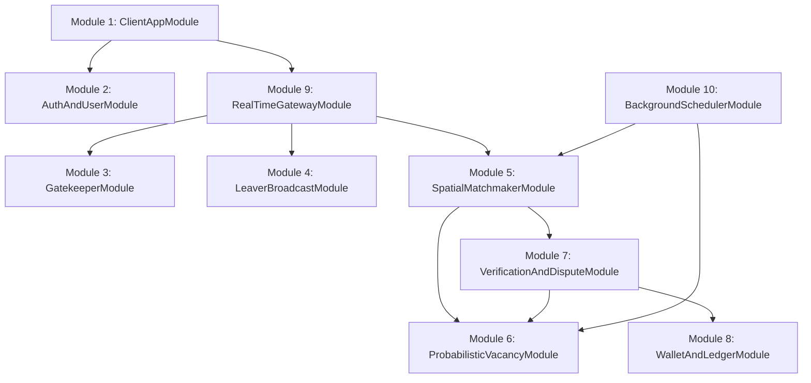

---

### 5.1 Module 1: Mobile Client Application Subsystem (`ClientAppModule`)

#### 5.1.1 Purpose & Bounded Context
Provides the cross-platform React Native (Expo) frontend interface. It is responsible for location telemetry capture, interactive mapping, UI status state machines, and real-time socket communications for both Searchers and Leavers.

#### 5.1.2 Internal Class & State Management Architecture

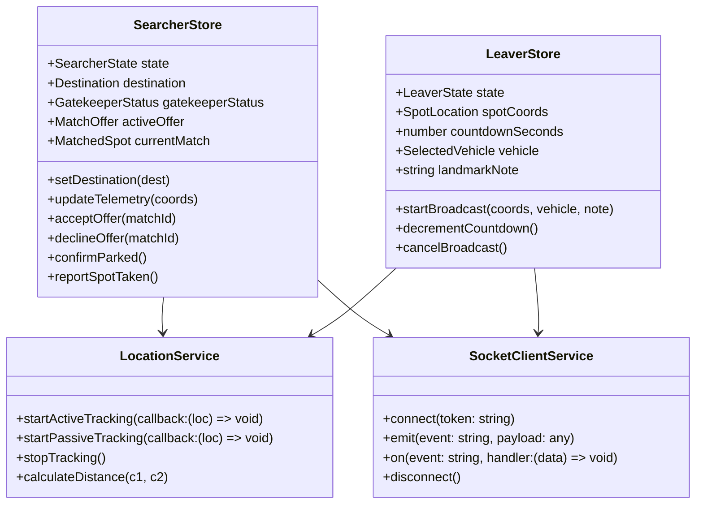

#### 5.1.3 Data Transfer Objects & Interfaces
```typescript
export interface LocationCoordinates {
  latitude: number;
  longitude: number;
  altitude?: number;
  accuracy: number;     // in meters
  heading: number;      // in degrees (0-360)
  speed: number;        // in meters/second
  timestamp: number;
}

export type SearcherState = 
  | 'IDLE' 
  | 'DESTINATION_SET' 
  | 'GATEKEEPER_LOCKED' 
  | 'ACTIVE_RADAR_SEARCH' 
  | 'MATCH_OFFERED' 
  | 'NAVIGATING_TO_SPOT' 
  | 'ARRIVED_PROMPT' 
  | 'PARKED_SUCCESS';

export type LeaverState = 
  | 'IDLE' 
  | 'BROADCASTING_COUNTDOWN' 
  | 'SEARCHER_MATCHED' 
  | 'HANDOFF_COMPLETED' 
  | 'CANCELLED';
```

#### 5.1.4 Client State Machine & Detailed Logic
- **Adaptive Location Polling:**
  - `IDLE`: Location tracking paused or passive (60s interval).
  - `GATEKEEPER_LOCKED`: Medium-power tracking (10s interval).
  - `ACTIVE_RADAR_SEARCH` / `NAVIGATING_TO_SPOT`: High-accuracy tracking (3s interval, `accuracy <= 15m`).
- **External Navigation Integration:**
  - Includes deep linking to Waze (`waze://?ll=lat,lng&navigate=yes`), Google Maps (`comgooglemaps://?daddr=lat,lng&directionsmode=driving`), and Apple Maps (`maps://?daddr=lat,lng`).

#### 5.1.5 Independent Testing Specification
- **Unit Testing:** Zustand store reducers tested using `@testing-library/react-native` and Vitest/Jest.
- **Mocking:** `expo-location` and `socket.io-client` mocked via Jest factory functions.

---

### 5.2 Module 2: Authentication & User Management Subsystem (`AuthAndUserModule`)

#### 5.2.1 Purpose & Bounded Context
Handles user registration and authentication via Malaysian phone numbers (`+60`), JWT lifecycle management, vehicle profiles, and driver reliability rating aggregation.

#### 5.2.2 Class & Interface Architecture (Ports & Adapters)

```mermaid
classDiagram
    class IAuthService {
        <<interface>>
        +requestOtp(dto: RequestOtpDto): Promise~OtpResponseDto~
        +verifyOtp(dto: VerifyOtpDto): Promise~AuthTokensDto~
        +refreshToken(refreshToken: string): Promise~AuthTokensDto~
    }
    class IUserService {
        <<interface>>
        +getUserProfile(userId: string): Promise~UserProfileDto~
        +updateDefaultRole(userId: string, role: string): Promise~void~
        +adjustRating(userId: string, delta: number): Promise~void~
    }
    class IVehicleService {
        <<interface>>
        +addVehicle(userId: string, dto: CreateVehicleDto): Promise~VehicleDto~
        +getUserVehicles(userId: string): Promise~VehicleDto[]~
        +setDefaultVehicle(userId: string, vehicleId: string): Promise~void~
    }
    class ISmsGatewayPort {
        <<interface>>
        +sendSms(phoneNumber: string, message: string): Promise~boolean~
    }
    class IUserRepositoryPort {
        <<interface>>
        +findByPhone(phone: string): Promise~UserEntity~
        +findById(id: string): Promise~UserEntity~
        +create(user: Partial~UserEntity~): Promise~UserEntity~
        +update(id: string, update: Partial~UserEntity~): Promise~void~
    }

    AuthService ..|> IAuthService
    UserService ..|> IUserService
    VehicleService ..|> IVehicleService
    AuthService --> ISmsGatewayPort
    AuthService --> IUserRepositoryPort
```

#### 5.2.3 Data Transfer Objects & Validation Rules
```typescript
import { IsPhoneNumber, IsString, Length, Matches, IsNotEmpty } from 'class-validator';

export class RequestOtpDto {
  @IsNotEmpty()
  @Matches(/^\+601[0-9]{8,9}$/, { message: 'Must be a valid Malaysian phone number (+601XXXXXXXX)' })
  phoneNumber: string;
}

export class VerifyOtpDto {
  @IsNotEmpty()
  @Matches(/^\+601[0-9]{8,9}$/, { message: 'Must be a valid Malaysian phone number' })
  phoneNumber: string;

  @IsString()
  @Length(6, 6, { message: 'OTP must be exactly 6 digits' })
  @Matches(/^[0-9]{6}$/, { message: 'OTP must contain only numbers' })
  otpCode: string;
}

export class CreateVehicleDto {
  @IsString()
  @IsNotEmpty()
  makeModel: string; // e.g. "Perodua Myvi"

  @IsString()
  @IsNotEmpty()
  color: string;     // e.g. "Pearl White"

  @IsString()
  @Length(4, 4, { message: 'Only last 4 digits of license plate required' })
  @Matches(/^[0-9]{4}$/, { message: 'Plate suffix must be 4 digits' })
  plateSuffix: string;
}
```

#### 5.2.4 REST API Contracts

| HTTP Verb | Path | Request Body | Response (200 OK) | Error Codes |
| :--- | :--- | :--- | :--- | :--- |
| `POST` | `/api/v1/auth/otp/request` | `RequestOtpDto` | `{ success: true, message: "OTP sent" }` | `400 Bad Request`, `429 Too Many Requests` |
| `POST` | `/api/v1/auth/otp/verify` | `VerifyOtpDto` | `{ accessToken: "...", refreshToken: "...", user: { ... } }` | `400 Bad Request`, `401 Invalid OTP` |
| `POST` | `/api/v1/user/vehicles` | `CreateVehicleDto` | `VehicleDto` | `400 Bad Request`, `401 Unauthorized` |
| `GET` | `/api/v1/user/vehicles` | None | `VehicleDto[]` | `401 Unauthorized` |

#### 5.2.5 Independent Testing Specification
- **Test Double:** `MockSmsGatewayAdapter` returns instant `true` without calling real telco APIs.
- **Unit Test Matrix:**
  1. `requestOtp`: Successfully generates 6-digit OTP, stores in Redis with 300s TTL, calls SMS port.
  2. `requestOtp_rateLimit`: Throws `429 Too Many Requests` if requested $>1$ time in 60s.
  3. `verifyOtp_valid`: Verifies code, clears Redis key, returns signed JWT pair.
  4. `verifyOtp_invalid`: Throws `401 Unauthorized` on mismatch.
  5. `addVehicle_plateMasking`: Rejects plates with length $\ne 4$.

---

### 5.3 Module 3: Searcher & Distance Gatekeeper Subsystem (`GatekeeperModule`)

#### 5.3.1 Purpose & Bounded Context
Prevents Searchers from triggering active matchmaking if their current driving location is too far from the destination. Enforces the strict rule: $\text{ETA} \le 10\text{ minutes}$ AND $\text{Distance} \le 3.0\text{ km}$.

#### 5.3.2 Class & Interface Architecture

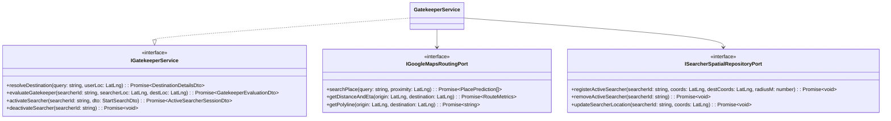

#### 5.3.3 Algorithmic Formulation & Decision Flow

$$\text{GatekeeperStatus} = \begin{cases} \text{UNLOCKED} & \text{if } \text{Distance} \le 3000\text{m} \land \text{ETA} \le 600\text{s} \\ \text{LOCKED} & \text{otherwise} \end{cases}$$

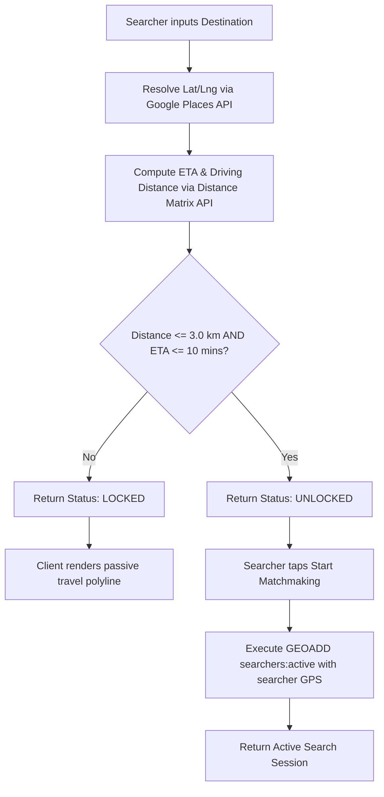

#### 5.3.4 REST API Contracts
| HTTP Verb | Path | Request Body | Response (200 OK) | Error Codes |
| :--- | :--- | :--- | :--- | :--- |
| `POST` | `/api/v1/searcher/destination/evaluate` | `EvaluateDestinationDto` | `GatekeeperEvaluationDto` | `400 Bad Request` |
| `POST` | `/api/v1/searcher/start` | `StartSearchDto` | `ActiveSearchSessionDto` | `403 Gatekeeper Locked` |
| `POST` | `/api/v1/searcher/stop` | None | `{ success: true }` | `401 Unauthorized` |

```typescript
export class EvaluateDestinationDto {
  @IsNotEmpty()
  origin: { latitude: number; longitude: number };

  @IsNotEmpty()
  destination: { latitude: number; longitude: number; placeId?: string; name: string };
}

export interface GatekeeperEvaluationDto {
  isUnlocked: boolean;
  distanceMeters: number;
  durationSeconds: number;
  polyline: string;
  reason?: string;
}
```

#### 5.3.5 Independent Testing Specification
- **Test Double:** `MockGoogleMapsRoutingAdapter` allows programmatic mocking of distance and ETA values.
- **Unit Test Matrix:**
  1. `evaluate_locked_distance`: Origin $4.5\text{km}$ away $\rightarrow$ returns `isUnlocked: false`.
  2. `evaluate_locked_eta`: Distance $2.0\text{km}$ but traffic ETA $14\text{ mins}$ $\rightarrow$ returns `isUnlocked: false`.
  3. `evaluate_unlocked`: Distance $1.8\text{km}$, ETA $5\text{ mins}$ $\rightarrow$ returns `isUnlocked: true`.
  4. `activate_when_locked`: Calling `/start` when gatekeeper is locked throws `GatekeeperLockedException (403)`.

---

### 5.4 Module 4: Leaver & Departure Broadcast Subsystem (`LeaverBroadcastModule`)

#### 5.4.1 Purpose & Bounded Context
Allows departing drivers to broadcast their intention to leave within a 3–5 minute countdown, logging high-accuracy spot coordinates and vehicle descriptors.

#### 5.4.2 Class & Interface Architecture

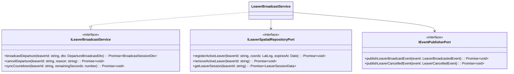

#### 5.4.3 Data Transfer Objects & Schemas
```typescript
import { IsInt, Min, Max, IsNotEmpty, IsOptional, IsString, Length } from 'class-validator';

export class DepartureBroadcastDto {
  @IsNotEmpty()
  coordinates: {
    latitude: number;
    longitude: number;
    accuracy: number;
  };

  @IsInt()
  @Min(180, { message: 'Countdown cannot be less than 3 minutes (180s)' })
  @Max(300, { message: 'Countdown cannot exceed 5 minutes (300s)' })
  countdownSeconds: number;

  @IsNotEmpty()
  @IsString()
  vehicleId: string;

  @IsOptional()
  @IsString()
  @Length(0, 100)
  landmarkNote?: string; // e.g. "Basement 1, Pillar B-12"
}
```

#### 5.4.4 Cancellation & Grace Period Rules
- If Leaver cancels broadcast $> 2\text{ minutes}$ before ETA: No rating impact.
- If Leaver cancels broadcast $< 60\text{ seconds}$ before ETA when matched to a Searcher: Decrement reliability rating by $-0.10$ and trigger instant reroute for Searcher.

#### 5.4.5 Independent Testing Specification
- **Unit Test Matrix:**
  1. `broadcast_valid`: Stores broadcast session in Redis with 300s TTL, publishes `LEAVER_BROADCASTED` event.
  2. `broadcast_invalid_countdown`: Rejects 120s countdown with validation error `(400)`.
  3. `cancel_unmatched`: Successfully purges Redis records and marks session inactive.

---

### 5.5 Module 5: Real-Time Spatial Matchmaker Subsystem (`SpatialMatchmakerModule`)

#### 5.5.1 Purpose & Bounded Context
The core matchmaking engine. Discovers optimal (Leaver, Searcher) pairings in real time, manages the 15-second mutual handshake state machine, and executes fallback routing when no live searcher is present.

#### 5.5.2 Class & Interface Architecture

```mermaid
classDiagram
    class ISpatialMatchmakerService {
        <<interface>>
        +findAndOfferMatch(leaverBroadcast: LeaverBroadcastedEvent): Promise~MatchResultDto~
        +acceptMatch(matchId: string, searcherId: string): Promise~MatchConfirmedDto~
        +declineMatch(matchId: string, searcherId: string): Promise~void~
        +handleHandshakeTimeout(matchId: string): Promise~void~
    }
    class IMatchScoringEngine {
        <<interface>>
        +calculateScore(candidate: SearcherCandidate, leaver: LeaverContext): number
        +rankCandidates(candidates: SearcherCandidate[], leaver: LeaverContext): SearcherCandidate[]
    }
    class IMatchRepositoryPort {
        <<interface>>
        +createMatch(match: Partial~MatchEntity~): Promise~MatchEntity~
        +findById(matchId: string): Promise~MatchEntity~
        +updateStatus(matchId: string, status: MatchStatus, metadata?: any): Promise~void~
    }
    class IDistributedLockPort {
        <<interface>>
        +acquireLock(key: string, ttlMs: number): Promise~LockHandle | null~
        +releaseLock(handle: LockHandle): Promise~void~
    }

    SpatialMatchmakerService ..|> ISpatialMatchmakerService
    SpatialMatchmakerService --> IMatchScoringEngine
    SpatialMatchmakerService --> IMatchRepositoryPort
    SpatialMatchmakerService --> IDistributedLockPort
```

#### 5.5.3 Multi-Factor Match Ranking Formulation

When a Leaver broadcasts from coordinates $\mathbf{x}_L$, the system executes a Redis spatial query:
$$\text{Candidates} = \text{GEORADIUS}(\text{geo:searchers:active}, \mathbf{x}_L, R = 1.0\text{km})$$

For each candidate $i$, the Match Score $S_i \in [0, 1]$ is computed:
$$S_i = w_1 \cdot \left(1 - \frac{|\text{ETA}_i - t_{\text{leave}}|}{\Delta t_{\max}}\right) + w_2 \cdot \left(1 - \frac{d(\mathbf{x}_i, \mathbf{x}_L)}{d_{\max}}\right) + w_3 \cdot \left(\frac{\text{Rating}_i}{5.0}\right)$$
Where default calibrated weights are:
- $w_1 = 0.50$ (ETA synchronization factor, $\Delta t_{\max} = 300\text{s}$)
- $w_2 = 0.35$ (Distance proximity factor, $d_{\max} = 1000\text{m}$)
- $w_3 = 0.15$ (User reliability rating factor)
- Constraint: $w_1 + w_2 + w_3 = 1.00$.

#### 5.5.4 Handshake State Machine

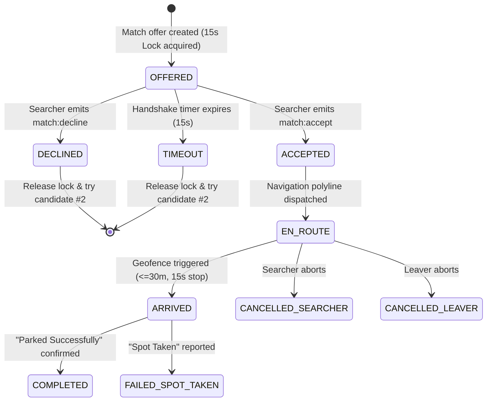

#### 5.5.5 Independent Testing Specification
- **Unit Test Matrix:**
  1. `scoring_engine_highest_eta_sync`: Verifies Candidate with $\Delta \text{ETA} = 10\text{s}$ outranks Candidate with $\Delta \text{ETA} = 120\text{s}$.
  2. `handshake_lock_concurrency`: Concurrent offers on same spot rejected by `acquireLock`.
  3. `handshake_timeout_auto_fallback`: Triggers next candidate evaluation when 15s expires.
  4. `fallback_to_probabilistic_when_empty`: If 0 candidates found, calls `ProbabilisticVacancyModule.persistVacatedSpot()`.

---

### 5.6 Module 6: Probabilistic Vacancy & Decay Subsystem (`ProbabilisticVacancyModule`)

#### 5.6.1 Purpose & Bounded Context
Maintains parking spots vacated by Leavers that had no immediate live match. Applies continuous mathematical exponential decay to compute real-time vacancy probability scores and routes arriving Searchers to the highest-probability spot.

#### 5.6.2 Class & Interface Architecture

```mermaid
classDiagram
    class IProbabilisticVacancyService {
        <<interface>>
        +persistVacatedSpot(dto: CreateVacatedSpotDto): Promise~ProbabilisticSpotDto~
        +calculateDecayedProbability(spotId: string, elapsedMinutes: number): number
        +queryTopCandidateSpots(destCoords: LatLng, radiusMeters: number): Promise~ProbabilisticSpotDto[]~
        +invalidateSpot(spotId: string, reason: string): Promise~void~
        +batchDecayTick(): Promise~number~
    }
    class IProbabilisticSpotRepositoryPort {
        <<interface>>
        +create(spot: Partial~ProbabilisticSpotEntity~): Promise~ProbabilisticSpotEntity~
        +findActiveWithinRadius(coords: LatLng, radiusMeters: number): Promise~ProbabilisticSpotEntity[]~
        +updateBatchProbabilities(updates: Array~{ id: string, p: number }~): Promise~void~
        +expireSpotsBatch(cutoffTime: Date): Promise~number~
        +markOccupied(spotId: string): Promise~void~
    }

    ProbabilisticVacancyService ..|> IProbabilisticVacancyService
    ProbabilisticVacancyService --> IProbabilisticSpotRepositoryPort
```

#### 5.6.3 Mathematical Time-Decay Model Formulation

The real-time vacancy probability $P(t)$ of a spot at elapsed time $t$ (in minutes) is computed as:
$$P(t) = P_0 \cdot e^{-\lambda t} \cdot M_{\text{traffic}}$$
- $P_0 = 0.950$ (Initial baseline confidence score upon leaver vacating).
- $\lambda = 0.150$ (Calibrated decay rate constant).
- $M_{\text{traffic}} \in [0.80, 1.00]$ (Area traffic turnover density modifier).
- **Lifespan Cutoff Conditions:**
  $$\text{Spot Status} = \begin{cases} \text{AVAILABLE} & \text{if } t \le 15\text{ min} \land P(t) \ge 0.150 \\ \text{EXPIRED} & \text{if } t > 15\text{ min} \lor P(t) < 0.150 \end{cases}$$

#### Probability Decay Calibration Table ($M_{\text{traffic}} = 1.0$)
| Elapsed Time $t$ (Minutes) | Formula Value $P_0 \cdot e^{-0.15t}$ | Remaining Probability $P(t)$ | Human-Readable Status UI |
| :--- | :--- | :--- | :--- |
| $t = 0\text{ min}$ | $0.950 \cdot 1.000$ | **$95.0\%$** | "Just Vacated - Very High" |
| $t = 3\text{ min}$ | $0.950 \cdot 0.637$ | **$60.5\%$** | "High Probability" |
| $t = 5\text{ min}$ | $0.950 \cdot 0.472$ | **$44.8\%$** | "Moderate Probability" |
| $t = 8\text{ min}$ | $0.950 \cdot 0.301$ | **$28.6\%$** | "Low Probability" |
| $t = 10\text{ min}$ | $0.950 \cdot 0.223$ | **$21.2\%$** | "Low Probability" |
| $t = 12\text{ min}$ | $0.950 \cdot 0.165$ | **$15.7\%$** | "Expiring Soon" |
| $t > 15\text{ min}$ | Cutoff threshold reached | **$0.0\%$ (EXPIRED)** | Purged from candidate queries |

#### 5.6.4 Spatial Candidate Query (PostGIS SQL)
```sql
SELECT 
    id, 
    latitude, 
    longitude, 
    landmark_note, 
    current_p, 
    vacated_at,
    ST_Distance_Sphere(location_geom, ST_SetSRID(ST_MakePoint($searcherLng, $searcherLat), 4326)) AS distance_meters
FROM probabilistic_spots
WHERE 
    status = 'AVAILABLE' 
    AND ST_DWithin(location_geom, ST_SetSRID(ST_MakePoint($searcherLng, $searcherLat), 4326)::geography, $radiusMeters)
ORDER BY current_p DESC, distance_meters ASC
LIMIT 3;
```

#### 5.6.5 Independent Testing Specification
- **Unit Test Matrix:**
  1. `decay_calculation_exact`: At $t = 5$, $P(t)$ returns $0.448 \pm 0.001$.
  2. `spot_expiration_trigger`: Spot with $t = 16$ or $P(t) = 0.14$ marked `EXPIRED`.
  3. `spatial_candidate_sorting`: Nearest high-probability spot selected first.

---

### 5.7 Module 7: Verification, Handover & Dispute Subsystem (`VerificationAndDisputeModule`)

#### 5.7.1 Purpose & Bounded Context
Verifies physical vehicle handoffs at the destination parking stall through automated GPS geofencing and manual button confirmations, while handling "Spot Taken" exceptions with zero-charge guarantees.

#### 5.7.2 Class & Interface Architecture

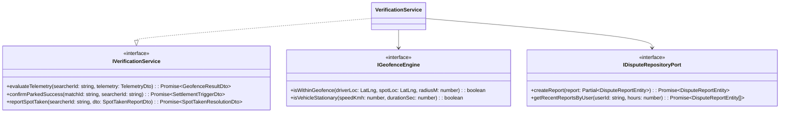

#### 5.7.3 Dual-Verification Algorithm

```typescript
export class GeofenceEngine implements IGeofenceEngine {
  private readonly GEOFENCE_RADIUS_METERS = 30.0;
  private readonly SPEED_THRESHOLD_KMH = 0.5;
  private readonly STATIONARY_DURATION_SEC = 15;

  public isWithinGeofence(driverLoc: LatLng, spotLoc: LatLng): boolean {
    const distanceMeters = this.haversineDistance(driverLoc, spotLoc);
    return distanceMeters <= this.GEOFENCE_RADIUS_METERS;
  }

  public evaluateArrivalCondition(telemetry: DriverTelemetry, spotLoc: LatLng): boolean {
    const inside = this.isWithinGeofence(telemetry.coordinates, spotLoc);
    const stopped = telemetry.speed <= this.SPEED_THRESHOLD_KMH && telemetry.stationaryDuration >= this.STATIONARY_DURATION_SEC;
    return inside && stopped;
  }

  private haversineDistance(c1: LatLng, c2: LatLng): number {
    const R = 6371e3; // Earth radius in meters
    const phi1 = (c1.latitude * Math.PI) / 180;
    const phi2 = (c2.latitude * Math.PI) / 180;
    const deltaPhi = ((c2.latitude - c1.latitude) * Math.PI) / 180;
    const deltaLambda = ((c2.longitude - c1.longitude) * Math.PI) / 180;

    const a = Math.sin(deltaPhi / 2) ** 2 + Math.cos(phi1) * Math.cos(phi2) * Math.sin(deltaLambda / 2) ** 2;
    const c = 2 * Math.atan2(Math.sqrt(a), Math.sqrt(1 - a));
    return R * c;
  }
}
```

#### 5.7.4 "Spot Taken" Exception Handling Matrix
1. Searcher taps **"Spot Taken by Someone Else"**.
2. Verification Module marks Match `FAILED_SPOT_TAKEN`.
3. Financial Ledger sets charge to $\text{RM }0.00$.
4. Target Spot marked `OCCUPIED` in PostGIS.
5. Searcher immediately receives next best candidate spot from `ProbabilisticVacancyModule`.

#### 5.7.5 Independent Testing Specification
- **Unit Test Matrix:**
  1. `geofence_arrival_triggered`: Driver at distance $18\text{m}$, speed $0\text{ km/h}$ for $16\text{s}$ $\rightarrow$ triggers arrival event.
  2. `geofence_arrival_suppressed_if_moving`: Driver at distance $18\text{m}$ but speed $25\text{ km/h}$ $\rightarrow$ no arrival trigger.
  3. `spot_taken_zero_charge`: Confirms zero wallet balance deduction and spot invalidation.

---

### 5.8 Module 8: In-App Wallet & Micro-Transactions Subsystem (`WalletAndLedgerModule`)

#### 5.8.1 Purpose & Bounded Context
Provides double-entry immutable financial ledger management for RM micro-transactions. Handles mock balance operations for Phase 1 MVP and provides abstract payment gateway adapters for Phase 2 (FPX, Touch 'n Go eWallet, DuitNow).

#### 5.8.2 Class & Interface Architecture

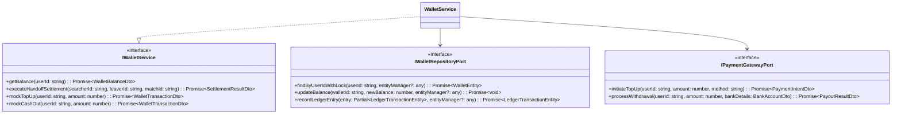

#### 5.8.3 Atomic Financial Settlement Transaction (PostgreSQL Isolation)

```typescript
export async function executeSettlementTransaction(
  searcherId: string,
  leaverId: string,
  matchId: string,
  dbPool: Pool
): Promise<void> {
  const client = await dbPool.connect();
  try {
    await client.query('BEGIN TRANSACTION ISOLATION LEVEL SERIALIZABLE');

    // 1. Lock and retrieve Searcher wallet
    const searcherRes = await client.query(
      'SELECT id, balance FROM user_wallets WHERE user_id = $1 FOR UPDATE',
      [searcherId]
    );
    const searcherWallet = searcherRes.rows[0];
    if (searcherWallet.balance < 0.50) {
      throw new InsufficientWalletBalanceException('Searcher wallet has insufficient funds');
    }

    // 2. Lock and retrieve Leaver wallet
    const leaverRes = await client.query(
      'SELECT id, balance FROM user_wallets WHERE user_id = $1 FOR UPDATE',
      [leaverId]
    );
    const leaverWallet = leaverRes.rows[0];

    // 3. Update balances
    const newSearcherBalance = Number(searcherWallet.balance) - 0.50;
    const newLeaverBalance = Number(leaverWallet.balance) + 0.25;

    await client.query('UPDATE user_wallets SET balance = $1, updated_at = NOW() WHERE id = $2', [
      newSearcherBalance,
      searcherWallet.id,
    ]);

    await client.query('UPDATE user_wallets SET balance = $1, updated_at = NOW() WHERE id = $2', [
      newLeaverBalance,
      leaverWallet.id,
    ]);

    // 4. Double-entry ledger recordings
    const searcherIdempotencyKey = `match:${matchId}:searcher:debit`;
    const leaverIdempotencyKey = `match:${matchId}:leaver:credit`;

    await client.query(
      `INSERT INTO wallet_ledger_transactions (wallet_id, match_id, idempotency_key, transaction_type, amount, balance_after, status)
       VALUES ($1, $2, $3, 'SEARCHER_HANDOFF_FEE', -0.50, $4, 'COMPLETED')`,
      [searcherWallet.id, matchId, searcherIdempotencyKey, newSearcherBalance]
    );

    await client.query(
      `INSERT INTO wallet_ledger_transactions (wallet_id, match_id, idempotency_key, transaction_type, amount, balance_after, status)
       VALUES ($1, $2, $3, 'LEAVER_HANDOFF_REWARD', 0.25, $4, 'COMPLETED')`,
      [leaverWallet.id, matchId, leaverIdempotencyKey, newLeaverBalance]
    );

    // 5. Update match record
    await client.query(
      "UPDATE matches SET status = 'COMPLETED', completed_at = NOW() WHERE id = $1",
      [matchId]
    );

    await client.query('COMMIT');
  } catch (error) {
    await client.query('ROLLBACK');
    throw error;
  } finally {
    client.release();
  }
}
```

#### 5.8.4 Independent Testing Specification
- **Unit Test Matrix:**
  1. `settlement_math_integrity`: Searcher $-\text{RM }0.50$, Leaver $+\text{RM }0.25$, Platform net $+\text{RM }0.25$.
  2. `insufficient_funds_reversal`: Aborts transaction when searcher balance $< \text{RM }0.50$.
  3. `idempotency_duplicate_prevention`: Duplicate settlement attempt with same `matchId` throws unique violation error.

---

### 5.9 Module 9: Real-Time Gateway & WebSocket Subsystem (`RealTimeGatewayModule`)

#### 5.9.1 Purpose & Bounded Context
Maintains persistent WebSocket connections (Socket.io) with mobile clients, performs room management, handles authentication handshakes, and broadcasts telemetry and match notifications.

#### 5.9.2 WebSocket Event Contract Catalog

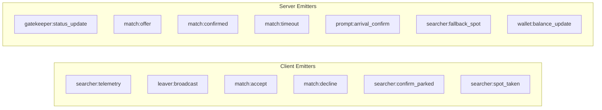

| Event Identifier | Direction | Payload Schema | Description |
| :--- | :--- | :--- | :--- |
| `searcher:telemetry` | C $\rightarrow$ S | `{ lat: number, lng: number, speed: number, heading: number, accuracy: number }` | High-frequency telemetry update (every 3s). |
| `leaver:broadcast` | C $\rightarrow$ S | `{ lat: number, lng: number, countdownSec: number, vehicleId: string, note?: string }` | Leaver departure announcement. |
| `match:offer` | S $\rightarrow$ C | `{ matchId: string, vehicle: VehicleSummary, leaverEtaSec: number, timeoutSec: 15 }` | Match proposition to Searcher. |
| `match:accept` | C $\rightarrow$ S | `{ matchId: string }` | Searcher handshake acceptance. |
| `match:confirmed` | S $\rightarrow$ C | `{ matchId: string, spotCoords: LatLng, polyline: string }` | Confirmed pairing; navigation start. |
| `prompt:arrival_confirm` | S $\rightarrow$ C | `{ matchId: string, spotCoords: LatLng }` | Geofence triggered confirmation UI. |
| `searcher:confirm_parked` | C $\rightarrow$ S | `{ matchId: string }` | Final user parking confirmation. |
| `searcher:spot_taken` | C $\rightarrow$ S | `{ matchId?: string, spotId?: string }` | 3rd-party spot collision report. |
| `wallet:balance_update` | S $\rightarrow$ C | `{ newBalance: number, delta: number, reason: string }` | Real-time balance notification. |

#### 5.9.3 Independent Testing Specification
- **Unit Testing:** Tested using `socket.io-client` against a standalone NestJS test gateway instance with in-memory Redis adapter.

---

### 5.10 Module 10: Asynchronous Task & Decay Scheduler Subsystem (`BackgroundSchedulerModule`)

#### 5.10.1 Purpose & Bounded Context
Orchestrates background cron jobs and BullMQ queue consumers for recurring mathematical decay ticks, expired spot purging, and handshake timeout sweeps.

#### 5.10.2 Job Schedule & Execution Matrix

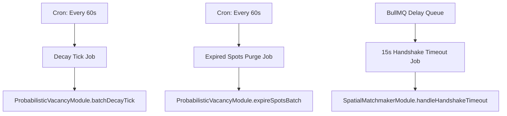

| Job Name | Trigger Frequency | Target Module Method | Action Description |
| :--- | :--- | :--- | :--- |
| `JOB_PROBABILISTIC_DECAY_TICK` | Every 60 seconds (`* * * * *`) | `ProbabilisticVacancyService.batchDecayTick()` | Recalculates $P(t)$ for all `AVAILABLE` spots. |
| `JOB_PURGE_EXPIRED_SPOTS` | Every 60 seconds (`* * * * *`) | `ProbabilisticVacancyService.expireSpotsBatch()` | Marks spots with $t > 15\text{m}$ or $P(t) < 0.15$ as `EXPIRED`. |
| `JOB_MATCH_HANDSHAKE_TIMEOUT` | BullMQ 15s Delayed Job | `SpatialMatchmakerService.handleHandshakeTimeout()` | Cleans up unaccepted match offers after 15s. |

#### 5.10.3 Independent Testing Specification
- **Unit Test Matrix:**
  1. `decay_tick_triggers_service`: Verified via mocked `IProbabilisticVacancyService` spy.
  2. `handshake_timeout_fires_at_15s`: Simulated using Jest fake timers (`jest.advanceTimersByTime(15000)`).

---

## 6. End-to-End Control & Data Flow Scenarios

### 6.1 Scenario 1: Real-Time P2P Matchmaking & Successful Handover

```mermaid
sequenceDiagram
    autonumber
    actor S as Searcher
    actor L as Leaver
    participant WS as Socket.io Gateway (Mod 9)
    participant GK as Gatekeeper (Mod 3)
    participant MM as Matchmaker (Mod 5)
    participant VF as Verification (Mod 7)
    participant WL as Wallet (Mod 8)

    S->>GK: POST /api/v1/searcher/start (Dest: KL Sentral)
    GK-->>S: Status UNLOCKED -> Active Radar Mode
    
    L->>WS: emit("leaver:broadcast", { coords, countdown: 240s })
    WS->>MM: findAndOfferMatch(leaverData)
    MM->>MM: Rank active searchers (Multi-factor score)
    MM->>WS: emitTo(Searcher, "match:offer", { matchId: "M100", countdown: 4min })
    
    S->>WS: emit("match:accept", { matchId: "M100" })
    WS->>MM: acceptMatch("M100", SearcherId)
    MM->>WS: emit("match:confirmed", { spotCoords, polyline })
    
    Note over S, L: Searcher navigates to spot; Leaver departs
    S->>WS: emit("searcher:telemetry", { coords, speed: 0kmh, stationarySec: 16 })
    WS->>VF: evaluateTelemetry(telemetry)
    VF->>WS: emitTo(Searcher, "prompt:arrival_confirm")
    
    S->>WS: emit("searcher:confirm_parked", { matchId: "M100" })
    WS->>VF: confirmParkedSuccess("M100")
    VF->>WL: executeHandoffSettlement(SearcherId, LeaverId, "M100")
    WL->>WL: Atomic DB Ledger (Searcher -0.50, Leaver +0.25, Platform +0.25)
    WL-->>WS: Settlement OK
    WS-->>S: emit("wallet:balance_update", { deducted: 0.50, balance: 19.50 })
    WS-->>L: emit("wallet:balance_update", { credited: 0.25, balance: 20.25 })
```

---

### 6.2 Scenario 2: Probabilistic Fallback & "Spot Taken" Exception Handling

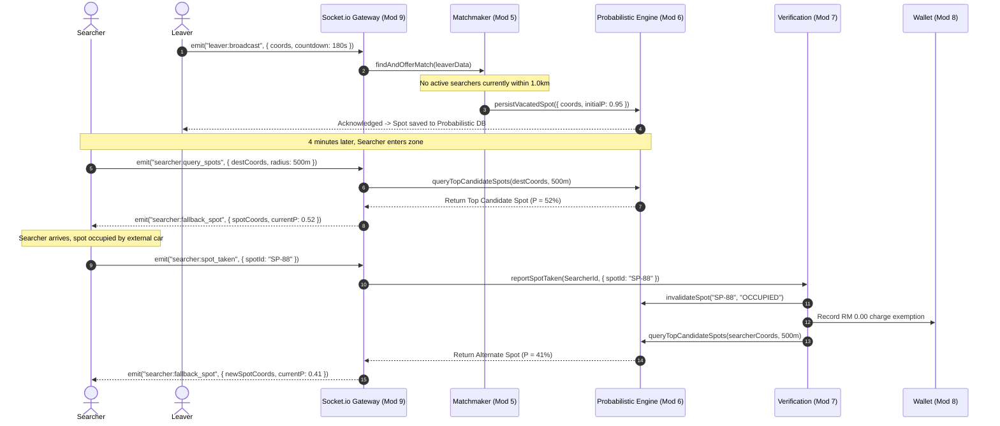

---

## 7. Requirement Traceability Matrix

| PRD Section / Requirement | HLD Module | DDD Subsystem Interface | Unit / Integration Test Specification |
| :--- | :--- | :--- | :--- |
| **FR-1.1: Mobile OTP (+60)** | `AuthAndUserModule` | `IAuthService.requestOtp`, `verifyOtp` | `auth.service.spec.ts` (OTP TTL, Rate Limit) |
| **FR-1.2: Masked Vehicles** | `AuthAndUserModule` | `IVehicleService.addVehicle` (4 digits) | `vehicle.service.spec.ts` (Plate validation) |
| **FR-2.2: Distance Gatekeeper** | `GatekeeperModule` | `IGatekeeperService.evaluateGatekeeper` | `gatekeeper.service.spec.ts` ($\le 10\text{m}, \le 3\text{km}$) |
| **FR-3.1: Leaver Broadcast** | `LeaverBroadcastModule`| `ILeaverBroadcastService.broadcastDeparture`| `leaver.service.spec.ts` (3-5 min countdown) |
| **FR-4.1: Spatial Matchmaking** | `SpatialMatchmakerModule`| `ISpatialMatchmakerService.findAndOfferMatch`| `matchmaker.service.spec.ts` (Scoring weights) |
| **FR-4.2: 15s Handshake Lock** | `SpatialMatchmakerModule`| `IDistributedLockPort.acquireLock` | `matchmaker.lock.spec.ts` (15s TTL mutex) |
| **FR-5.1: Mathematical Decay** | `ProbabilisticVacancyModule`| `IProbabilisticVacancyService.batchDecayTick`| `decay.engine.spec.ts` ($P(t) = P_0 e^{-\lambda t}$) |
| **FR-6.1: Dual Verification** | `VerificationAndDisputeModule`| `IGeofenceEngine.evaluateArrivalCondition` | `geofence.engine.spec.ts` ($30\text{m}, 15\text{s}, 0\text{km/h}$) |
| **FR-6.3: Spot Taken RM 0** | `VerificationAndDisputeModule`| `IVerificationService.reportSpotTaken` | `dispute.service.spec.ts` (RM 0.00 zero-charge) |
| **FR-7.1: Double-Entry Ledger**| `WalletAndLedgerModule` | `IWalletService.executeHandoffSettlement` | `wallet.ledger.spec.ts` (ACID serializable test) |
| **NFR-6.1: Latency & Telemetry**| `RealTimeGatewayModule` | `Socket.io Gateway` (3s GPS stream) | `gateway.e2e.spec.ts` (Socket latency $<200\text{ms}$) |

---

## 8. Executable Standalone Test Suite Templates

To facilitate independent testing, the following test fixtures provide ready-to-run Jest / Vitest unit specifications for the core domain engines:

### 8.1 Match Scoring Engine Unit Test (`match-scoring.spec.ts`)
```typescript
import { describe, it, expect } from 'vitest';

export class MatchScoringEngine {
  calculateScore(searcherEtaSec: number, leaverCountdownSec: number, distanceM: number, rating: number): number {
    const w1 = 0.50, w2 = 0.35, w3 = 0.15;
    const etaDiff = Math.abs(searcherEtaSec - leaverCountdownSec);
    const etaScore = Math.max(0, 1 - etaDiff / 300);
    const distScore = Math.max(0, 1 - distanceM / 1000);
    const ratingScore = Math.min(1, rating / 5.0);
    return w1 * etaScore + w2 * distScore + w3 * ratingScore;
  }
}

describe('MatchScoringEngine', () => {
  const engine = new MatchScoringEngine();

  it('should assign a perfect score (1.0) when ETA, distance, and rating are optimal', () => {
    const score = engine.calculateScore(240, 240, 0, 5.0);
    expect(score).toBeCloseTo(1.0, 4);
  });

  it('should prioritize better ETA alignment over slight distance advantage', () => {
    // Candidate A: 300m away, perfect ETA match (180s vs 180s)
    const scoreA = engine.calculateScore(180, 180, 300, 4.8);
    // Candidate B: 100m away, but 4 min ETA mismatch (420s vs 180s)
    const scoreB = engine.calculateScore(420, 180, 100, 4.8);

    expect(scoreA).toBeGreaterThan(scoreB);
  });
});
```

### 8.2 Probabilistic Decay Engine Unit Test (`decay-engine.spec.ts`)
```typescript
import { describe, it, expect } from 'vitest';

export class DecayEngine {
  calculateProbability(elapsedMinutes: number, initialP = 0.95, lambda = 0.15, trafficMultiplier = 1.0): number {
    if (elapsedMinutes > 15.0) return 0.0;
    const p = initialP * Math.exp(-lambda * elapsedMinutes) * trafficMultiplier;
    return p < 0.15 ? 0.0 : Math.round(p * 1000) / 1000;
  }
}

describe('DecayEngine', () => {
  const engine = new DecayEngine();

  it('should return initial P0 (0.95) at t = 0', () => {
    expect(engine.calculateProbability(0)).toBe(0.95);
  });

  it('should calculate correct exponential decay at t = 5 minutes', () => {
    // 0.95 * exp(-0.15 * 5) = 0.95 * 0.472366 = 0.4487
    expect(engine.calculateProbability(5)).toBeCloseTo(0.449, 2);
  });

  it('should expire and return 0.0 when elapsed time > 15 minutes', () => {
    expect(engine.calculateProbability(15.1)).toBe(0.0);
  });

  it('should drop faster under high traffic multiplier (0.85)', () => {
    const regularP = engine.calculateProbability(5, 0.95, 0.15, 1.0);
    const highTrafficP = engine.calculateProbability(5, 0.95, 0.15, 0.85);
    expect(highTrafficP).toBeLessThan(regularP);
  });
});
```
