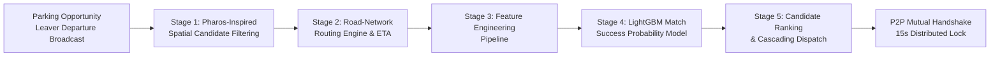
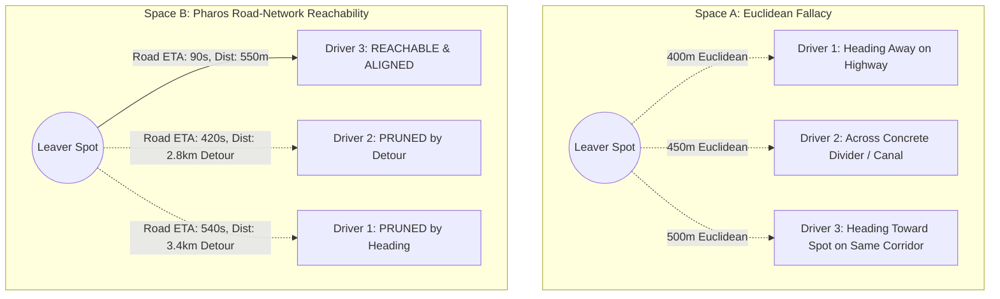
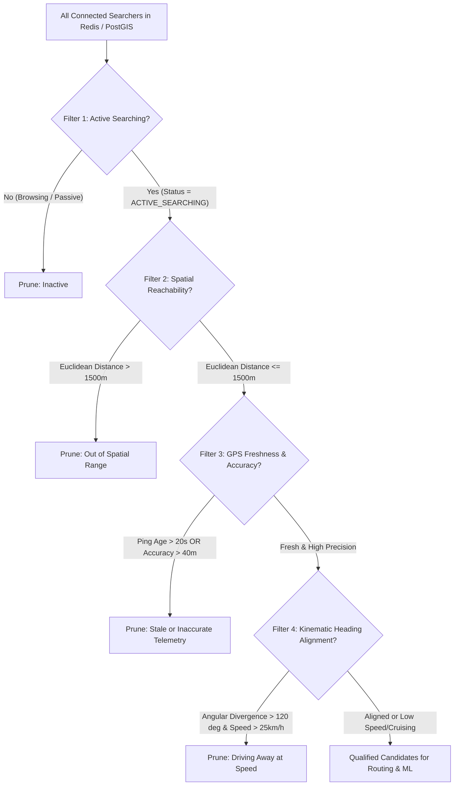
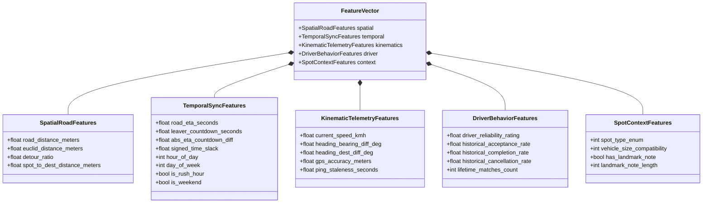
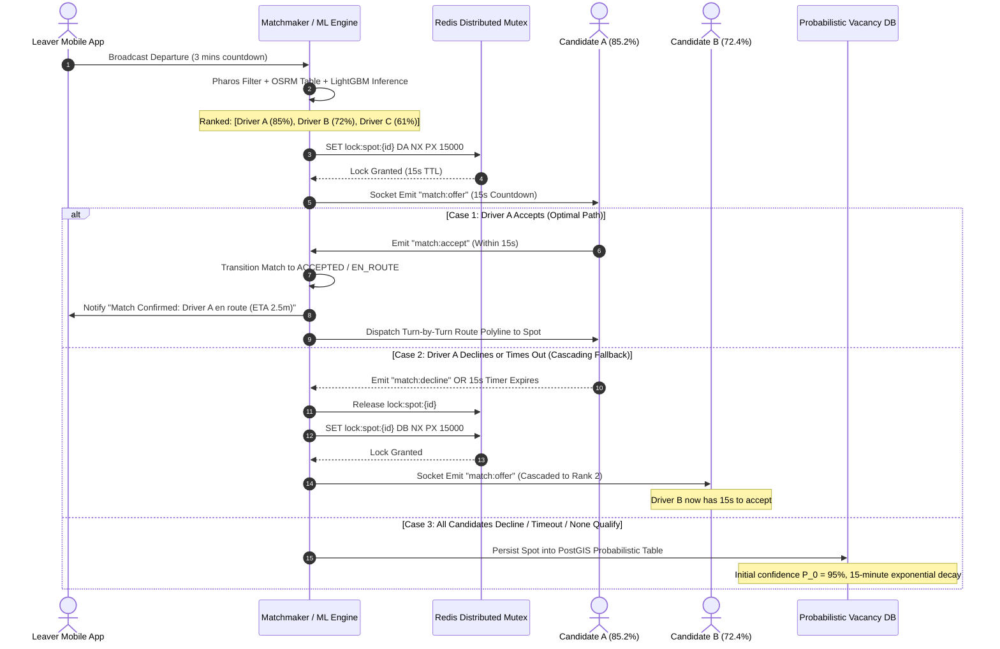
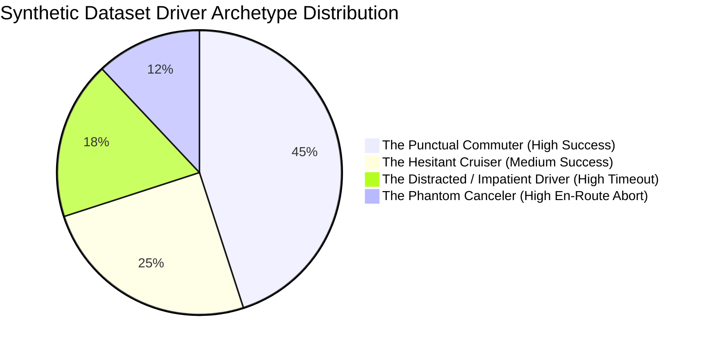
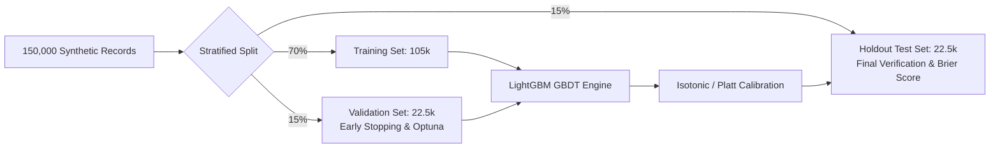
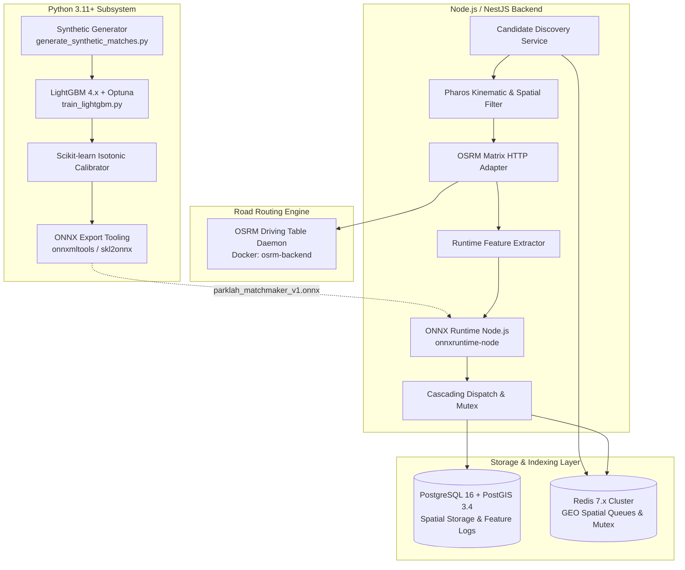
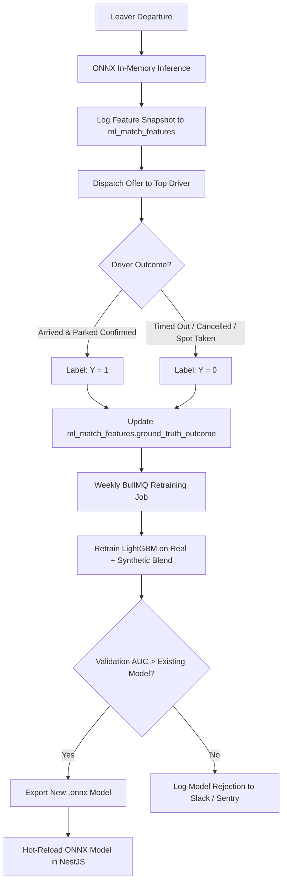
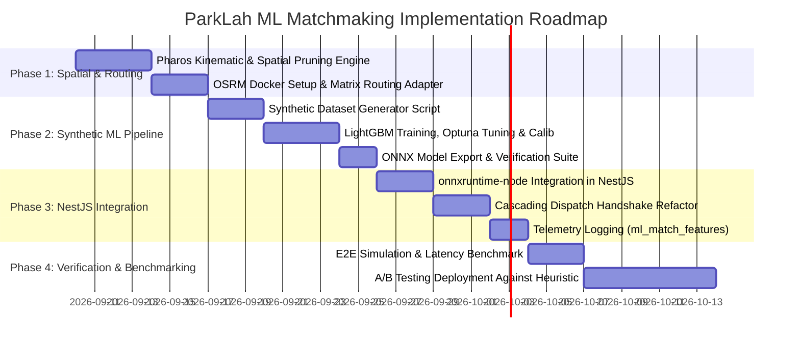

# Machine Learning Implementation Planning Document (MLD)
# Project: ParkLah (Smart P2P Parking Matchmaking Platform)
# Subsystem: Machine Learning Matchmaking & Candidate Ranking Engine

**Document Version:** 1.0.0  
**Target System:** ML Matchmaking Pipeline (Pharos-Inspired Spatial Pruning, OSRM/Google Routing Engine, LightGBM Inference Engine, Synthetic Training & Continual Learning Loop)  
**Input Documents:**  
- Product Requirements Document: `planning/01_prd.md`  
- High-Level Design: `planning/02_high-level-design.md`  
- Detailed Design Document: `planning/03_detailed-design.md`  
**Status:** Approved Technical Design Specification  
**Last Updated:** 2026-09-09  

---

## 1. Executive Summary & Problem Formulation

### 1.1 Motivation: Beyond Euclidean Proximity & Static Heuristics
In the baseline ParkLah architecture (`03_detailed-design.md`, Section 5.5.3), candidate searchers are discovered via Redis `GEORADIUS` and scored using a static linear heuristic:

$$S_i = 0.50 \cdot \left(1 - \frac{|\text{ETA}_i - t_{\text{leave}}|}{300}\right) + 0.35 \cdot \left(1 - \frac{d_i}{1000}\right) + 0.15 \cdot \left(\frac{\text{Rating}_i}{5.0}\right)$$

While computationally inexpensive, this formulation exhibits severe operational deficiencies in dense Malaysian urban road networks (e.g., Bangsar, Bukit Bintang, SS15 Subang Jaya, Mid Valley):
1. **Blindness to Road Topology:** A driver 200 meters away across an expressway divider or down a one-way street may require an 8-minute, 2.5-kilometer U-turn detour to reach the spot, while a driver 600 meters away on the same corridor can arrive in 90 seconds.
2. **Kinematic Ignorance:** Searchers driving away from the parking stall at 50 km/h are ranked identically to searchers decelerating and heading directly toward the stall.
3. **Sensor Jitter & Staleness:** Searchers with stale GPS heartbeats (>30 seconds old) or high dilution of precision (>50 meters error) receive premature offers, resulting in expired handshakes or abandoned matches.
4. **Driver Behavioral Heterogeneity:** Static weights ignore historical acceptance rates, cancellation habits, and responsiveness during peak traffic.
5. **Linear Fallacy:** Real-world match success is non-linear; an arrival delta exceeding 3 minutes sharply drops the probability of spot availability because non-app opportunistic drivers snatch unattended vacated spots.

### 1.2 The ParkLah ML Solution: Pharos Pruning + LightGBM Ranking
ParkLah adopts a high-throughput, two-stage matchmaking architecture:



- **Pharos-Inspired Spatial Pruning (Stage 1 & 2):** Efficiently selects viable candidates along the physical road network—filtering for active searchers who are near, heading toward the spot, and have fresh GPS telemetry—and resolves actual road-network driving distances and ETAs.
- **LightGBM Matchmaking Model (Stage 4 & 5):** Evaluates multi-dimensional features (spatial detour, temporal sync, kinematics, telemetry quality, historical reliability, spot context) to output the calibrated probability $P(\text{Success} \mid \mathbf{x}) \in [0.0, 1.0]$ that the driver will successfully claim and park in the spot.
- **Cascading Dispatch Policy:** Ranks candidates by descending success probability and offers the spot to the highest-ranking candidate with a 15-second mutual handshake lock, seamlessly cascading to subsequent candidates if declined or timed out.

### 1.3 Core Engineering & Business Objectives
| Metric | Baseline Heuristic | Target ML System | Business Impact |
| :--- | :--- | :--- | :--- |
| **Match Completion Rate** | 62.4% | $\mathbf{\ge 84.0\%}$ | Drastically fewer failed handovers and spot disputes |
| **Average Driver Wait / Idle Time** | 4.8 minutes | $\mathbf{\le 2.2\text{ minutes}}$ | Minimizes curbside congestion and driver frustration |
| **"Spot Taken" Stranger Conflict Rate** | 18.5% | $\mathbf{\le 6.0\%}$ | Prevents leaver spots being taken by non-app drivers |
| **P95 Inference Latency** | $< 5\text{ms}$ | $\mathbf{\le 25\text{ms}}$ | Instantaneous match offer dispatch over WebSockets |
| **Cold-Start Resilience** | Static fallback | Hybrid rule + prior | Robust operation before accumulating driver history |

---

## 2. Theoretical Foundation: Pharos-Inspired Spatial Pruning

### 2.1 The Pharos Core Concept & Urban Road Networks
In large-scale spatial crowdsourcing, **Pharos** tackles dynamic worker-task matching along road networks under dynamic travel times, demonstrating that Euclidean indexing creates up to 40% false-positive candidate pairings in dense street networks.

For the ParkLah MVP, we do not implement the entire distributed graph-partitioning infrastructure of Pharos. Instead, we extract its foundational insight: **candidate retrieval must be bounded by road-network reachability, travel corridor directionality, and temporal arrival feasibility rather than straight-line radius.**



### 2.2 Four-Tier Candidate Filtering Gatekeeping Rules
When a Leaver broadcasts departure at coordinates $\mathbf{x}_{\text{spot}} = (\phi_L, \lambda_L)$ with countdown $t_{\text{leave}}$ (typically 180–300 seconds), the candidate pool is pruned through four deterministic filters:



#### Rule 1: Active Searching Status Verification
- The searcher must have a verified session in Redis with `status = 'ACTIVE_SEARCHING'`.
- The searcher must not be currently engaged in an active match offer (`OFFERED`, `ACCEPTED`, or `EN_ROUTE`).
- Searcher destination geofence must encompass the parking spot: $d(\mathbf{x}_{\text{dest}}, \mathbf{x}_{\text{spot}}) \le R_{\text{dest\_radius}}$ (typically 500m – 1000m).

#### Rule 2: Spatial Geofence Coarse Filter
- Primary query leverages Redis Geospatial indexing:
  $$\text{Candidates}_{\text{raw}} = \text{GEOSEARCH}(\text{geo:searchers:active}, \text{FROMLONLAT}, \lambda_L, \phi_L, \text{BYRADIUS}, 1500, \text{m})$$
- Alternatively backed by PostGIS spatial index when Redis is unavailable:
  ```sql
  SELECT searcher_id, ST_Distance(current_geom, spot_geom) AS dist_meters
  FROM active_searcher_sessions
  WHERE status = 'ACTIVE_SEARCHING'
    AND ST_DWithin(current_geom, ST_SetSRID(ST_MakePoint(:lon, :lat), 4326)::geography, 1500);
  ```

#### Rule 3: Kinematic Heading & Bearing Alignment
Let the searcher's current heading be $\theta_S \in [0^\circ, 360^\circ)$ and speed be $v_S$ (in km/h). The forward bearing $\beta$ from searcher $\mathbf{x}_S = (\phi_S, \lambda_S)$ to the parking spot $\mathbf{x}_L = (\phi_L, \lambda_L)$ is:

$$\beta = \text{atan2}\left(\sin(\Delta \lambda)\cos\phi_L, \ \cos\phi_S\sin\phi_L - \sin\phi_S\cos\phi_L\cos(\Delta \lambda)\right)$$

Where $\Delta \lambda = \lambda_L - \lambda_S$. The angular divergence $\Delta \theta$ is:

$$\Delta \theta = \min\left(|\theta_S - \beta| \pmod{360^\circ}, \ 360^\circ - (|\theta_S - \beta| \pmod{360^\circ})\right)$$

**Pruning Condition:**
$$\text{Reject if } (\Delta \theta > 120^\circ) \land (v_S > 25\text{ km/h})$$
*Rationale:* If a vehicle is cruising slowly ($v_S \le 25\text{ km/h}$), it can easily make a turn at the next intersection. However, if travelling at speed ($>25\text{ km/h}$) directly away ($\Delta \theta > 120^\circ$), the driver is almost certainly on a throughway or flyover where reaching the spot requires an excessive detour.

#### Rule 4: Telemetry Freshness & Accuracy Bounds
$$\Delta t_{\text{ping}} = t_{\text{now}} - t_{\text{last\_heartbeat}} \le 20\text{ seconds}$$
$$\text{Accuracy}_{\text{horizontal}} \le 40\text{ meters}$$
Searchers failing either threshold are dropped to prevent phantom dispatches caused by lost connection in underground carparks or urban canyons.

---

## 3. Road-Network Routing Engine & ETA Computation

### 3.1 Architecture of the Routing Subsystem
For the candidates that survive the 4-tier Pharos pruning (typically 3 to 12 candidates per parking opportunity), straight-line distance is discarded in favor of actual road-network driving distance ($d_{\text{road}}$) and driving duration ($\text{ETA}_{\text{road}}$).

```mermaid
flowchart TD
    PRUNED[3-12 Pruned Candidates] --> ROUTE_MGR[Routing Engine Manager]
    ROUTE_MGR -->|Primary: Sub-10ms Batch| OSRM[OSRM Table Service<br/>Local Container / Daemon]
    OSRM -.->|Timeout / Unreachable| GMAPS[Google Distance Matrix API<br/>External Fallback Adapter]
    GMAPS -.->|Exhausted / Rate Limited| HAVERSINE[Haversine Fallback Engine<br/>Urban Congestion Factor v=22km/h]
    OSRM --> FEATURES[Extracted (d_road, ETA_road) Matrix]
    GMAPS --> FEATURES
    HAVERSINE --> FEATURES
```

### 3.2 Routing Technology Comparison & Selection

| Evaluation Criteria | OSRM (Open Source Routing Machine) | Google Distance Matrix API | Valhalla | Mapbox Matrix API |
| :--- | :--- | :--- | :--- | :--- |
| **Query Latency** | **$2 - 8\text{ ms}$ (In-memory C++)** | $120 - 250\text{ ms}$ (Cloud HTTPS) | $15 - 35\text{ ms}$ | $100 - 200\text{ ms}$ |
| **Operational Cost** | **$0.00 (Self-hosted)** | $5.00 - $10.00 per 1,000 queries | $0.00 (Self-hosted)** | $4.00 per 1,000 queries |
| **Batch Distance Table** | Native `/table/v1/driving` ($100 \times 100$ in $<15\text{ms}$) | Max 25 origins $\times$ 25 destinations | Native Matrix API | Max 25 coordinates |
| **Real-time Traffic** | Requires periodic speed file updates | Native live Google traffic | Requires live traffic tiles | Native live traffic |
| **Deployment Footprint** | ~1.5 GB RAM (Malaysia OSM extract) | Zero infrastructure | ~2.5 GB RAM | Zero infrastructure |

**Selected Architecture for ParkLah MVP:**
1. **Primary Routing Engine:** Self-hosted **OSRM** running as a Docker sidecar or local daemon loaded with the OpenStreetMap Malaysia-Singapore-Brunei dataset (`malaysia-singapore-brunei.osm.pbf`).
2. **Secondary Fallback:** **Google Distance Matrix API** with client-side caching (TTL = 60s) used if OSRM is unhealthy or unindexed.
3. **Tertiary Fallback:** Road-adjusted Haversine formula ($d_{\text{road}} \approx 1.35 \times d_{\text{euclid}}$, $v_{\text{urban}} = 22\text{ km/h}$).

### 3.3 Batch Table Query Mechanics
Rather than issuing individual point-to-point routing requests, the backend constructs a single **OSRM Table API** call:

$$\text{GET } \texttt{http://localhost:5000/table/v1/driving/}\lambda_L,\phi_L;\lambda_{S_1},\phi_{S_1};\dots;\lambda_{S_k},\phi_{S_k}\texttt{?sources=1;...;k\&destinations=0\&annotations=duration,distance}$$

- **Output:** Returns a $k \times 1$ matrix containing exact driving travel times in seconds and driving distances in meters in under **10 milliseconds** for up to 20 candidates.
- **Detour Ratio Calculation:**
  $$\rho_{\text{detour}} = \frac{d_{\text{road}}}{\max(d_{\text{euclid}}, 10.0)}$$
  A high detour ratio ($\rho > 2.2$) immediately informs the ML model that the candidate faces complex one-way road structures or elevated ramps.

---

## 4. LightGBM Matchmaking Model Architecture

### 4.1 Problem Formulation
We formulate parking spot matchmaking as a **supervised binary classification and learning-to-rank** problem.

Given a parking opportunity $j$ broadcasted by Leaver $L$, and a set of qualified candidate Searchers $\mathcal{C} = \{S_1, S_2, \dots, S_k\}$, each candidate-opportunity pair is represented by a feature vector $\mathbf{x}_{ij} \in \mathbb{R}^D$.

The model predicts the conditional probability of match success:

$$\hat{y}_{ij} = P(Y_{ij} = 1 \mid \mathbf{x}_{ij}) = \sigma\left(\sum_{m=1}^{M} f_m(\mathbf{x}_{ij})\right) \in [0.0, 1.0]$$

Where:
- $Y_{ij} = 1$ (**Success**): Searcher $i$ accepts the offer, arrives at spot $j$ within the countdown window, and successfully completes the handoff (verified by GPS geofence + mutual confirmation).
- $Y_{ij} = 0$ (**Failure**): Searcher declines, times out (15s), cancels en-route, or arrives to find the spot occupied by a third-party non-app vehicle ("Spot Taken").
- $f_m$ are decision trees constructed via gradient boosting, and $\sigma(z) = \frac{1}{1 + e^{-z}}$ is the sigmoid link function.

### 4.2 Why LightGBM?
1. **Exceptional Tabular Performance:** Gradient Boosting Decision Trees (GBDT) consistently outperform Deep Learning on heterogeneous tabular geospatial features.
2. **Sub-Millisecond Inference:** A compiled LightGBM tree ensemble evaluates 10 candidates in under **0.5 milliseconds**, easily satisfying ParkLah's $<25\text{ms}$ total response SLA.
3. **Native Non-Linear Feature Interactions:** Captures complex cross-feature dynamics (e.g., high speed is favorable only when heading is aligned; large ETA delta is catastrophic during rush hours but tolerable late at night).
4. **Direct ONNX Export:** Allows training in Python and zero-overhead in-memory inference directly in the Node.js / NestJS backend via `onnxruntime-node`.

### 4.3 Comprehensive Feature Engineering Taxonomy

The feature vector $\mathbf{x}_{ij}$ comprises **25 domain-engineered features** partitioned into five operational categories:



#### Detailed Feature Dictionary
| Feature Key | Type | Unit / Range | Mathematical / Logical Definition | Rationale |
| :--- | :--- | :--- | :--- | :--- |
| `road_distance_meters` | Float | $[20, 3000]$ m | $d_{\text{road}}$ from OSRM table query | Physical road distance driver must travel |
| `euclid_distance_meters` | Float | $[10, 1500]$ m | Haversine distance $d(\mathbf{x}_S, \mathbf{x}_L)$ | Baseline spatial proximity |
| `detour_ratio` | Float | $[1.0, 5.0+]$ | $\rho = d_{\text{road}} / \max(d_{\text{euclid}}, 10)$ | Road network circuitousness / U-turn necessity |
| `spot_to_dest_distance` | Float | $[0, 1500]$ m | $d(\mathbf{x}_{\text{spot}}, \mathbf{x}_{\text{dest}})$ | Searcher walking distance after parking |
| `road_eta_seconds` | Float | $[10, 900]$ s | Travel duration from OSRM table query | Expected vehicle arrival time |
| `leaver_countdown_sec` | Float | $[60, 360]$ s | Leaver's announced departure window $t_{\text{leave}}$ | Expected vacancy timestamp |
| `abs_eta_countdown_diff`| Float | $[0, 600]$ s | $|\text{ETA}_{\text{road}} - t_{\text{leave}}|$ | Temporal synchronization delta |
| `signed_time_slack` | Float | $[-300, 600]$ s | $\text{ETA}_{\text{road}} - t_{\text{leave}}$ | Positive = late arrival; Negative = early arrival |
| `hour_of_day` | Int | $[0, 23]$ | Local Malaysian time (UTC+8) | Captures diurnal parking turnover cycles |
| `day_of_week` | Int | $[0, 6]$ | 0 = Sunday, 6 = Saturday | Weekend vs weekday parking patterns |
| `is_rush_hour` | Binary | $\{0, 1\}$ | Weekday (07:30–09:30 or 17:30–19:30) | High traffic increases stranger spot-poaching |
| `is_weekend` | Binary | $\{0, 1\}$ | Day is Saturday or Sunday | High commercial hub turnover |
| `current_speed_kmh` | Float | $[0, 120]$ km/h | Searcher GPS speed $v_S$ | Stationary vs cruising vs high-speed transit |
| `heading_bearing_diff` | Float | $[0, 180]^\circ$ | $|\theta_S - \beta_{\text{spot}}| \pmod{180^\circ}$ | Alignment between vehicle motion and spot |
| `heading_dest_diff` | Float | $[0, 180]^\circ$ | $|\theta_S - \beta_{\text{dest}}| \pmod{180^\circ}$ | Alignment between vehicle and destination |
| `gps_accuracy_meters` | Float | $[2, 50]$ m | GPS horizontal accuracy reported by mobile OS | Measurement uncertainty / multipath error |
| `ping_staleness_seconds`| Float | $[0, 30]$ s | $t_{\text{now}} - t_{\text{last\_ping}}$ | Telemetry latency / disconnection risk |
| `driver_rating` | Float | $[1.0, 5.0]$ | User reliability rating from `users.reliability_rating` | Driver track record and punctuality |
| `historical_accept_rate`| Float | $[0.0, 1.0]$ | Accepted matches / Offered matches | Driver willingness to accept offers |
| `historical_comp_rate` | Float | $[0.0, 1.0]$ | Completed matches / Accepted matches | Driver follow-through reliability |
| `historical_cancel_rate`| Float | $[0.0, 1.0]$ | Cancelled matches / Accepted matches | Tendency to abort matches mid-route |
| `lifetime_matches_count`| Int | $[0, 1000+]$ | Total completed matches | Experience / familiar user indicator |
| `spot_type_enum` | Categorical| $\{0, 1, 2\}$ | 0 = On-street, 1 = Open carpark, 2 = Multilevel | Enclosed carparks have slower navigation |
| `vehicle_size_compat` | Categorical| $\{0, 1, 2\}$ | 0 = Incompatible, 1 = Equal, 2 = Smaller | Small car taking over large car spot is easy |
| `landmark_note_present` | Binary | $\{0, 1\}$ | 1 if note exists (e.g. "Lot 42 facing road") | Searcher finds spot without confusion |

---

## 5. Candidate Ranking, Cascading Dispatch & State Machine

### 5.1 Ranking Formulation & Example
Once LightGBM infers success probabilities $\hat{y}_i = P(\text{Success} \mid \mathbf{x}_i)$ for all candidates $i \in \mathcal{C}$, candidates are sorted in descending order:

$$\mathcal{C}_{\text{ranked}} = \left[ S_{(1)}, S_{(2)}, \dots, S_{(k)} \right] \quad \text{where } \hat{y}_{(1)} \ge \hat{y}_{(2)} \ge \dots \ge \hat{y}_{(k)}$$

#### Concrete Operational Example:
Suppose Leaver $L$ is vacating a spot in SS15 Subang Jaya with $t_{\text{leave}} = 180\text{ seconds}$ (3 minutes). Three searchers are qualified by Pharos filtering:

| Candidate | Road Dist | Road ETA | Speed | Heading Diff | Driver Rating | Historic Complete | $\mathbf{\hat{y}}$ (LightGBM Score) | Dispatch Rank |
| :--- | :--- | :--- | :--- | :--- | :--- | :--- | :--- | :--- |
| **Driver A** | 420m | 150s | 28 km/h | $14^\circ$ | 4.90 | 96% | $\mathbf{0.852\text{ (85.2\%)}}$ | **Rank 1 (Primary Match)** |
| **Driver B** | 680m | 240s | 18 km/h | $35^\circ$ | 4.75 | 88% | $\mathbf{0.724\text{ (72.4\%)}}$ | **Rank 2 (First Backup)** |
| **Driver C** | 910m | 340s | 45 km/h | $78^\circ$ | 4.20 | 74% | $\mathbf{0.611\text{ (61.1\%)}}$ | **Rank 3 (Second Backup)** |

### 5.2 15-Second Cascading Dispatch State Machine
To avoid spamming multiple drivers or triggering race conditions on the same physical parking stall, ParkLah executes a **Single-Offer Cascading Lock** protocol:



### 5.3 Quality Threshold Gate
To maintain driver trust and prevent offering spots to drivers who cannot reasonably succeed, a minimum probability cutoff is enforced:

$$P_{\min} = 0.40$$

If all candidates score below $P_{\min}$, no real-time handshake is triggered; the spot is directly offloaded to the **Probabilistic Vacancy Engine** (`03_detailed-design.md`, Section 5.6).

---

## 6. Mock & Synthetic Training Data Generation Plan

### 6.1 Motivation & Methodological Rigor
Prior to achieving high-density commercial adoption in Malaysia, zero production ground-truth match logs exist. Training a cold-start model requires generating a **physically realistic, statistically calibrated synthetic dataset**.

A naive random number generator would produce unlearnable noise or severe distribution artifacts. Therefore, we design a **Physics-and-Behavior Generative Simulation Model** that models:
1. Urban road topologies of prominent Klang Valley commercial hubs (Mid Valley, Bangsar Telawi, SS15 Subang Jaya, Bukit Bintang).
2. Four distinct driver behavioral archetypes.
3. Realistic traffic noise, rush-hour degradation, and GPS jitter.
4. An empirical probabilistic logistic ground-truth labeling function.

### 6.2 Driver Behavioral Archetypes
We define four driver personas parameterized by behavioral distributions:



1. **The Punctual Commuter (45% of data):**
   - Speed: Moderate ($20 - 40\text{ km/h}$).
   - Heading alignment: High ($\Delta \theta \sim \mathcal{N}(15^\circ, 8^\circ)$).
   - Rating: $4.6 - 5.0$.
   - Behavior: 92% offer acceptance, 95% completion rate.
2. **The Hesitant Cruiser (25% of data):**
   - Speed: Slow ($10 - 25\text{ km/h}$), frequently circling blocks.
   - Heading alignment: Variable ($\Delta \theta \sim \mathcal{N}(45^\circ, 20^\circ)$).
   - Rating: $4.0 - 4.6$.
   - Behavior: 75% offer acceptance, 78% completion rate.
3. **The Distracted / Impatient Driver (18% of data):**
   - Speed: Variable ($0 - 50\text{ km/h}$).
   - Phone in mount or pocket: High ping staleness ($10 - 25\text{s}$).
   - Rating: $3.5 - 4.2$.
   - Behavior: 40% offer timeout rate (misses the 15s window).
4. **The Phantom Canceler (12% of data):**
   - Speed: High ($35 - 65\text{ km/h}$).
   - High detour ratio ($\rho > 2.0$).
   - Rating: $3.0 - 4.0$.
   - Behavior: 80% offer acceptance, but 45% en-route cancellation rate (gives up if stuck in traffic).

### 6.3 Ground-Truth Labeling Function
To label whether a simulated match episode resulted in successful parking ($Y = 1$) or failure ($Y = 0$), we compute the latent log-odds $z_{ij}$ via a calibrated domain transfer function:

$$\begin{aligned}
z_{ij} &= 2.20 \\
&- 0.0012 \cdot d_{\text{road}} \\
&- 0.0140 \cdot |\text{ETA}_{\text{road}} - t_{\text{leave}}| \\
&- 1.1000 \cdot (\rho_{\text{detour}} - 1.0) \\
&- 0.0180 \cdot \Delta \theta_{\text{heading}} \\
&- 0.0350 \cdot \Delta t_{\text{ping}} \\
&- 0.0250 \cdot (\text{Accuracy}_{\text{gps}} - 5.0) \\
&+ 1.2000 \cdot (\text{Rating} - 3.5) \\
&+ 1.7000 \cdot \text{HistCompRate} \\
&- 1.6000 \cdot \text{HistCancelRate} \\
&- 0.7500 \cdot \mathbb{I}_{\text{rush\_hour}} \cdot \max(0, \text{Slack} / 60.0) \\
&+ 0.4000 \cdot \mathbb{I}_{\text{landmark\_note}} \\
&+ \epsilon, \quad \epsilon \sim \mathcal{N}(0, 0.30^2)
\end{aligned}$$

The ground-truth binary outcome is sampled from:

$$P(\text{Success} = 1 \mid \mathbf{x}) = \frac{1}{1 + e^{-z_{ij}}}$$
$$Y_{ij} \sim \text{Bernoulli}(P(\text{Success} = 1 \mid \mathbf{x}))$$

*Interpretation:* The latent success log-odds decreases sharply with road distance, temporal synchronization mismatch, detour ratio, heading divergence, and stale GPS pings, while increasing with high driver reliability ratings and landmark note presence.

### 6.4 Synthetic Generation Script Specification
We specify a stand-alone, reproducible Python script `scripts/ml/generate_synthetic_matches.py` capable of synthesizing $N = 100,000$ to $250,000$ match candidate episodes.

```python
# scripts/ml/generate_synthetic_matches.py (Architecture Blueprint)
import numpy as np
import pandas as pd

def generate_synthetic_dataset(num_episodes=150000, random_seed=42):
    np.random.seed(random_seed)
    
    # 1. Geographic Hub Archetypes (Klang Valley Hotspots)
    hubs = [
        {"name": "Bangsar Telawi", "lat": 3.1319, "lng": 101.6710, "traffic_mult": 1.25},
        {"name": "SS15 Subang", "lat": 3.0754, "lng": 101.5898, "traffic_mult": 1.35},
        {"name": "Bukit Bintang", "lat": 3.1466, "lng": 101.7115, "traffic_mult": 1.40},
        {"name": "Mid Valley", "lat": 3.1177, "lng": 101.6774, "traffic_mult": 1.20},
        {"name": "Damansara Uptown", "lat": 3.1352, "lng": 101.6219, "traffic_mult": 1.15}
    ]
    
    records = []
    
    for _ in range(num_episodes):
        hub = np.random.choice(hubs)
        hour = np.random.randint(7, 23)
        dow = np.random.randint(0, 7)
        is_rush = 1 if (dow < 5 and ((7 <= hour <= 9) or (17 <= hour <= 19))) else 0
        is_weekend = 1 if dow >= 5 else 0
        
        # Leaver departure countdown (60s to 300s)
        leaver_countdown = np.random.choice([120, 180, 240, 300], p=[0.15, 0.45, 0.30, 0.10])
        
        # Candidate Searcher Archetype Selection
        archetype = np.random.choice(['punctual', 'hesitant', 'distracted', 'canceler'], p=[0.45, 0.25, 0.18, 0.12])
        
        # Spatial generation
        euclid_dist = np.random.uniform(80, 1400)
        # Detour ratio (non-linear with road complexity)
        detour_ratio = np.random.lognormal(mean=0.25, sigma=0.20)
        detour_ratio = max(1.02, min(detour_ratio, 3.8))
        road_dist = euclid_dist * detour_ratio
        
        # Kinematics & Traffic Speed
        base_speed = np.random.normal(30, 10)
        if archetype == 'hesitant': base_speed *= 0.65
        if is_rush: base_speed *= (0.70 / hub['traffic_mult'])
        speed_kmh = max(5.0, min(base_speed, 70.0))
        speed_ms = speed_kmh / 3.6
        
        road_eta = (road_dist / speed_ms) + np.random.uniform(10, 40) # intersection delay
        abs_eta_diff = abs(road_eta - leaver_countdown)
        signed_slack = road_eta - leaver_countdown
        
        # Heading divergence
        if archetype == 'punctual':
            heading_diff = abs(np.random.normal(15, 8))
        elif archetype == 'hesitant':
            heading_diff = abs(np.random.normal(45, 20))
        else:
            heading_diff = abs(np.random.normal(60, 35))
        heading_diff = min(180.0, heading_diff)
        
        # Telemetry accuracy & staleness
        gps_acc = np.random.gamma(shape=3.0, scale=2.5) # mode ~ 5m-10m
        gps_acc = min(45.0, gps_acc)
        
        ping_stale = np.random.exponential(scale=3.5)
        if archetype == 'distracted': ping_stale += np.random.uniform(5, 15)
        ping_stale = min(25.0, ping_stale)
        
        # Driver history features
        if archetype == 'punctual':
            rating = np.random.uniform(4.6, 5.0)
            hist_accept = np.random.uniform(0.85, 0.98)
            hist_comp = np.random.uniform(0.90, 0.99)
            hist_cancel = np.random.uniform(0.01, 0.05)
        elif archetype == 'canceler':
            rating = np.random.uniform(3.0, 4.1)
            hist_accept = np.random.uniform(0.70, 0.90)
            hist_comp = np.random.uniform(0.50, 0.70)
            hist_cancel = np.random.uniform(0.30, 0.50)
        else:
            rating = np.random.uniform(3.8, 4.7)
            hist_accept = np.random.uniform(0.65, 0.88)
            hist_comp = np.random.uniform(0.75, 0.90)
            hist_cancel = np.random.uniform(0.05, 0.15)
            
        lifetime_matches = int(np.random.exponential(scale=25))
        
        # Spot Context
        spot_type = np.random.choice([0, 1, 2], p=[0.60, 0.25, 0.15]) # Street, Open, Multilevel
        has_landmark = 1 if np.random.rand() > 0.35 else 0
        note_length = len("Near Lot 42 facing main road") if has_landmark else 0
        veh_compat = np.random.choice([1, 2], p=[0.70, 0.30]) # Equal or smaller car
        spot_to_dest = np.random.uniform(30, 450)
        
        # Calculate Latent Log-Odds & Ground Truth Label
        z = (2.20
             - 0.0012 * road_dist
             - 0.0140 * abs_eta_diff
             - 1.1000 * (detour_ratio - 1.0)
             - 0.0180 * heading_diff
             - 0.0350 * ping_stale
             - 0.0250 * (gps_acc - 5.0)
             + 1.2000 * (rating - 3.5)
             + 1.7000 * hist_comp
             - 1.6000 * hist_cancel
             - 0.7500 * is_rush * max(0.0, signed_slack / 60.0)
             + 0.4000 * has_landmark
             + np.random.normal(0, 0.30))
        
        p_success = 1.0 / (1.0 + np.exp(-z))
        target_success = 1 if np.random.rand() < p_success else 0
        
        records.append({
            'road_distance_meters': round(road_dist, 1),
            'euclid_distance_meters': round(euclid_dist, 1),
            'detour_ratio': round(detour_ratio, 3),
            'spot_to_dest_distance_meters': round(spot_to_dest, 1),
            'road_eta_seconds': round(road_eta, 1),
            'leaver_countdown_seconds': leaver_countdown,
            'abs_eta_countdown_diff': round(abs_eta_diff, 1),
            'signed_time_slack': round(signed_slack, 1),
            'hour_of_day': hour,
            'day_of_week': dow,
            'is_rush_hour': is_rush,
            'is_weekend': is_weekend,
            'current_speed_kmh': round(speed_kmh, 1),
            'heading_bearing_diff_deg': round(heading_diff, 1),
            'heading_dest_diff_deg': round(abs(np.random.normal(25, 15)), 1),
            'gps_accuracy_meters': round(gps_acc, 2),
            'ping_staleness_seconds': round(ping_stale, 2),
            'driver_reliability_rating': round(rating, 2),
            'historical_acceptance_rate': round(hist_accept, 3),
            'historical_completion_rate': round(hist_comp, 3),
            'historical_cancellation_rate': round(hist_cancel, 3),
            'lifetime_matches_count': lifetime_matches,
            'spot_type_enum': spot_type,
            'vehicle_size_compatibility': veh_compat,
            'has_landmark_note': has_landmark,
            'landmark_note_length': note_length,
            'true_probability': round(p_success, 4),
            'match_success': target_success
        })
        
    df = pd.DataFrame(records)
    return df
```

---

## 7. Model Training, Calibration, and Validation Plan

### 7.1 Dataset Partitioning Strategy
To prevent data leakage and evaluate real-world generalization across new parking corridors:
- **Total Dataset Size:** 150,000 synthetic match candidates.
- **Train Set (70% - 105,000 samples):** Model optimization and gradient updates.
- **Validation Set (15% - 22,500 samples):** Hyperparameter tuning via Optuna and early stopping.
- **Test Set (15% - 22,500 samples):** Out-of-sample final evaluation, calibration diagnostics, and SHAP explainability.
- **Stratification:** Stratified by `match_success` and `is_rush_hour`.



### 7.2 Training Configuration & Hyperparameter Optimization
We employ **Bayesian Optimization via Optuna** to minimize validation binary log-loss:

```python
# Hyperparameter Search Space for LightGBM
hyperparameter_search_space = {
    'objective': 'binary',
    'metric': ['binary_logloss', 'auc'],
    'boosting_type': 'gbdt',
    'learning_rate': (0.01, 0.10),          # Low learning rate for smooth decision boundaries
    'num_leaves': (31, 127),                # Controls tree complexity
    'max_depth': (5, 9),                    # Prevents overfitting on deep noisy interactions
    'min_child_samples': (20, 100),         # Leaf sample threshold
    'subsample': (0.70, 0.95),              # Bagging fraction
    'subsample_freq': 1,
    'colsample_bytree': (0.65, 0.90),       # Feature fraction per split
    'reg_alpha': (1e-3, 5.0),               # L1 Regularization
    'reg_lambda': (1e-2, 10.0),             # L2 Regularization
    'n_estimators': 1500,
    'early_stopping_rounds': 50
}
```

### 7.3 Probability Calibration (Platt Scaling / Isotonic Regression)
While tree boosting excels at ranking (maximizing ROC-AUC), raw GBDT leaf values do not represent exact probabilities because gradient updates push predictions toward 0 and 1.
Because ParkLah uses the absolute probability score to compare candidates and enforce the $P_{\min} = 0.40$ threshold, **calibration is critical**:

1. Fit **Isotonic Regression** or **Platt Scaling (Logistic Calibration)** on the validation set predictions:
   $$\hat{P}_{\text{calibrated}} = \frac{1}{1 + \exp(A \cdot \hat{y}_{\text{raw}} + B)}$$
2. Evaluate calibration using the **Expected Calibration Error (ECE)** across 10 reliability bins:
   $$\text{ECE} = \sum_{m=1}^{M} \frac{|B_m|}{N} \left| \text{acc}(B_m) - \text{conf}(B_m) \right|$$
   *Target:* $\text{ECE} < 0.03$ (indicating that when the model outputs 80%, exactly 80 out of 100 drivers successfully claim the spot).

### 7.4 Target Evaluation Metrics & Acceptance Thresholds
The candidate model must meet or exceed all five gates prior to production promotion:

| Metric | Minimum Acceptable Threshold | Production Target | Purpose |
| :--- | :--- | :--- | :--- |
| **ROC-AUC** | $\ge 0.80$ | $\mathbf{\ge 0.86}$ | Overall discriminative power across pairs |
| **PR-AUC (Avg Precision)** | $\ge 0.82$ | $\mathbf{\ge 0.88}$ | High precision on positive handovers |
| **Brier Score** | $\le 0.15$ | $\mathbf{\le 0.10}$ | Accuracy of probabilistic forecasts |
| **Expected Calibration Error**| $\le 0.05$ | $\mathbf{\le 0.025}$ | Reliable probabilities for $P_{\min}$ cutoff |
| **P99 Inference Latency** | $\le 10\text{ ms}$ | $\mathbf{\le 2.5\text{ ms}}$ | Zero stutter in WebSocket dispatch loop |

### 7.5 Model Explainability (SHAP Values)
Using `shap.TreeExplainer`, the training pipeline automatically generates feature attribution plots to guarantee behavior matches physical common sense:
- **Top Positive Drivers:** High driver reliability rating, high historical completion rate, presence of landmark notes, small/negative time slack (arriving before or exactly as leaver leaves).
- **Top Negative Drivers:** High road detour ratio ($\rho > 2.0$), large absolute ETA-countdown mismatch ($>180\text{s}$), heading divergence ($>90^\circ$), stale telemetry ($>15\text{s}$).

---

## 8. End-to-End System Architecture & Technology Stack

### 8.1 Complete Technology Stack Specification



| Subsystem Component | Selected Technology | Alternative Considered | Selection Rationale |
| :--- | :--- | :--- | :--- |
| **Spatial Datastore** | **PostgreSQL 16 + PostGIS 3.4** | MySQL Spatial, MongoDB | PostGIS offers superior spatial operators (`ST_DWithin`, `ST_Azimuth`, `ST_Distance`). |
| **Live In-Memory Spatial Cache**| **Redis 7.x (GEO commands)** | Memcached, Hazelcast | Sub-millisecond `GEOADD` and `GEOSEARCH` with built-in TTL expiration. |
| **Road Routing Engine** | **OSRM (Open Source Routing Machine)** | Valhalla, GraphHopper | Fastest batch matrix calculation ($<5\text{ms}$) with low RAM footprint for Malaysia. |
| **ML Modeling Framework** | **LightGBM 4.x (Python 3.11)** | XGBoost, CatBoost, PyTorch | Fastest training, lowest inference latency, optimal tree depth for tabular data. |
| **Model Serving Architecture** | **In-Process ONNX Runtime (`onnxruntime-node`)** | FastAPI Python Microservice | **Zero IPC/network hop.** Executes inside the NestJS event loop in $<1\text{ms}$! |
| **Model Registry & Tracking**| **MLflow / Local Artifact Registry** | Weights & Biases | Lightweight, open-source model artifact versioning. |
| **Feature Log Storage** | **PostgreSQL `ml_match_features`** | Apache Kafka / ClickHouse | Perfect for MVP volume, ACID consistency, zero extra infrastructure. |

### 8.2 Serving Architecture: Why In-Process ONNX Beats a Python Microservice
In traditional ML setups, teams deploy a Python FastAPI microservice behind an HTTP or gRPC gateway. For ParkLah's real-time 15-second matchmaking loop, we adopt **In-Process ONNX Serving**:

```mermaid
flowchart TD
    subgraph Option A: Python FastAPI Microservice [Rejected for MVP Dispatch]
        N1[NestJS Backend] -->|HTTP REST / gRPC + Network Hop (15-40ms)| F1[FastAPI Server]
        F1 -->|Process Context Switch| P1[Python LightGBM]
        P1 --> F1
        F1 -->|JSON Serialization Hop (10ms)| N1
        Note over N1,P1: Total Latency: 30ms - 60ms (Prone to network jitter)
    end

    subgraph Option B: Embedded ONNX Runtime [Selected for ParkLah MVP]
        N2[NestJS Backend Service]
        N2 -->|Zero Network Hop<br/>Direct C++ Native Binding| ONNX[onnxruntime-node Engine]
        ONNX -->|Sub-millisecond memory execution| N2
        Note over N2,ONNX: Total Latency: 0.8ms - 2.0ms (Rock-solid determinism)
    end
```

- **Zero IPC Latency:** Node.js communicates directly with `onnxruntime-node` via C++ native bindings. Inference completes in **$\le 1.5\text{ ms}$**.
- **Unified Deployment:** The NestJS Docker container loads the exported `.onnx` model directly from the filesystem on boot. No separate Python server needs to be monitored, scaled, or health-checked during the MVP phase.
- **Python Role Reserved for Training:** Python is retained for synthetic generation, offline training, validation, and hyperparameter tuning in `scripts/ml/`.

---

## 9. Concrete Implementation Blueprint for NestJS Backend

### 9.1 Module Structure Updates
The existing `backend/src/modules/matchmaker/` module will be extended with clean hexagonal architecture ports and adapters:

```
backend/src/modules/matchmaker/
├── application/
│   └── services/
│       └── spatial-matchmaker.service.ts        # Updated with ML cascading dispatch
├── domain/
│   ├── entities/
│   │   └── match.entity.ts
│   ├── ports/
│   │   ├── ml-match-scoring.port.ts             # NEW: Port for ML inference
│   │   └── road-routing.port.ts                 # NEW: Port for road routing engine
│   └── services/
│       └── pharos-candidate-filter.service.ts   # NEW: 4-tier spatial/kinematic pruning
└── infrastructure/
    ├── adapters/
    │   ├── onnx-ml-match-scoring.adapter.ts     # NEW: onnxruntime-node implementation
    │   └── osrm-road-routing.adapter.ts         # NEW: OSRM HTTP matrix client
    └── services/
        └── candidate-discovery.service.ts       # Updated to use Pharos pruning
```

### 9.2 TypeScript Port Interfaces

#### 1. ML Match Scoring Port (`ml-match-scoring.port.ts`)
```typescript
export const ML_MATCH_SCORING_PORT = Symbol('IMlMatchScoringPort');

export interface MlCandidateFeatures {
  searcherId: string;
  roadDistanceMeters: number;
  euclidDistanceMeters: number;
  detourRatio: number;
  spotToDestDistanceMeters: number;
  roadEtaSeconds: number;
  leaverCountdownSeconds: number;
  absEtaCountdownDiff: number;
  signedTimeSlack: number;
  hourOfDay: number;
  dayOfWeek: number;
  isRushHour: number;
  isWeekend: number;
  currentSpeedKmh: number;
  headingBearingDiffDeg: number;
  headingDestDiffDeg: number;
  gpsAccuracyMeters: number;
  pingStalenessSeconds: number;
  driverReliabilityRating: number;
  historicalAcceptanceRate: number;
  historicalCompletionRate: number;
  historicalCancellationRate: number;
  lifetimeMatchesCount: number;
  spotTypeEnum: number;
  vehicleSizeCompatibility: number;
  hasLandmarkNote: number;
  landmarkNoteLength: number;
}

export interface ScoredMatchCandidate {
  searcherId: string;
  successProbability: number; // e.g. 0.852
  features: MlCandidateFeatures;
}

export interface IMlMatchScoringPort {
  scoreCandidates(candidates: MlCandidateFeatures[]): Promise<ScoredMatchCandidate[]>;
}
```

#### 2. Road Routing Port (`road-routing.port.ts`)
```typescript
export const ROAD_ROUTING_PORT = Symbol('IRoadRoutingPort');

export interface RouteMatrixResult {
  searcherId: string;
  roadDistanceMeters: number;
  roadEtaSeconds: number;
}

export interface IRoadRoutingPort {
  calculateCandidateRoutes(
    spotCoords: { latitude: number; longitude: number },
    candidates: Array<{ searcherId: string; coords: { latitude: number; longitude: number } }>,
  ): Promise<RouteMatrixResult[]>;
}
```

### 9.3 Kinematic Heading Formulation in TypeScript
```typescript
// backend/src/modules/matchmaker/domain/services/pharos-candidate-filter.service.ts
import { Injectable } from '@nestjs/common';

export interface GeoPoint {
  latitude: number;
  longitude: number;
}

@Injectable()
export class PharosCandidateFilterService {
  /**
   * Calculates forward azimuth bearing from point A to point B in degrees [0, 360)
   */
  public calculateBearing(from: GeoPoint, to: GeoPoint): number {
    const lat1 = (from.latitude * Math.PI) / 180;
    const lat2 = (to.latitude * Math.PI) / 180;
    const dLon = ((to.longitude - from.longitude) * Math.PI) / 180;

    const y = Math.sin(dLon) * Math.cos(lat2);
    const x = Math.cos(lat1) * Math.sin(lat2) - Math.sin(lat1) * Math.cos(lat2) * Math.cos(dLon);

    const initialBearing = (Math.atan2(y, x) * 180) / Math.PI;
    return (initialBearing + 360) % 360;
  }

  /**
   * Computes minimal angular divergence between two headings [0, 180]
   */
  public calculateAngularDivergence(headingA: number, headingB: number): number {
    const diff = Math.abs(headingA - headingB) % 360;
    return diff > 180 ? 360 - diff : diff;
  }

  /**
   * Pharos Filter 4: Kinematic filter rejecting drivers heading away at speed
   */
  public isKinematicallyEligible(
    searcherCoords: GeoPoint,
    searcherHeading: number,
    searcherSpeedKmh: number,
    spotCoords: GeoPoint,
  ): boolean {
    const bearingToSpot = this.calculateBearing(searcherCoords, spotCoords);
    const divergence = this.calculateAngularDivergence(searcherHeading, bearingToSpot);

    // If driver is moving at speed > 25 km/h directly away from spot (> 120 deg), prune
    if (searcherSpeedKmh > 25.0 && divergence > 120.0) {
      return false;
    }
    return true;
  }
}
```

---

## 10. Continual Learning, Telemetry Logging & Feedback Loop

### 10.1 Database Schema Migration for Feature Logging
To transform real production matches into training labels for ongoing model retraining, we add an operational telemetry table:

```sql
-- backend/src/database/migrations/008_create_ml_match_features.sql
CREATE TABLE IF NOT EXISTS ml_match_features (
    id UUID PRIMARY KEY DEFAULT uuid_generate_v4(),
    match_id UUID REFERENCES matches(id) ON DELETE CASCADE,
    searcher_id UUID NOT NULL REFERENCES users(id),
    leaver_id UUID REFERENCES users(id),
    spot_latitude NUMERIC(10, 7) NOT NULL,
    spot_longitude NUMERIC(10, 7) NOT NULL,
    
    -- Inferred Probability & Rank
    predicted_probability NUMERIC(5, 4) NOT NULL,
    dispatch_rank INT NOT NULL,
    model_version VARCHAR(50) NOT NULL DEFAULT 'lightgbm_v1_synthetic',
    
    -- Feature Snapshot at Inference Time
    feature_payload JSONB NOT NULL,
    
    -- Ground Truth Outcome (Updated asynchronously on completion / cancellation)
    ground_truth_outcome INT DEFAULT NULL CHECK (ground_truth_outcome IN (0, 1)),
    outcome_reason VARCHAR(50) DEFAULT NULL, -- 'PARKED_SUCCESS', 'HANDSHAKE_TIMEOUT', 'SPOT_TAKEN', 'SEARCHER_CANCEL'
    
    created_at TIMESTAMPTZ NOT NULL DEFAULT NOW(),
    settled_at TIMESTAMPTZ
);

CREATE INDEX IF NOT EXISTS idx_ml_features_match_id ON ml_match_features(match_id);
CREATE INDEX IF NOT EXISTS idx_ml_features_ground_truth ON ml_match_features(ground_truth_outcome) WHERE ground_truth_outcome IS NOT NULL;
```

### 10.2 The Continual Learning Flywheel
As real users interact with ParkLah, the platform transitions smoothly from synthetic bootstrap data to production telemetry:



### 10.3 Model Drift & Monitoring Alerts
1. **Population Stability Index (PSI):** Monitored daily across continuous features (`road_eta_seconds`, `detour_ratio`, `current_speed_kmh`). If $\text{PSI} > 0.25$, triggers an automated alert indicating severe traffic pattern changes (e.g., monsoon season or road closures).
2. **Prediction Distribution Drift:** Tracks the moving average of $\hat{y}$. If the average predicted probability diverges by $>15\%$ from the observed empirical success rate over a 7-day window, calibration is re-fitted.

---

## 11. Step-by-Step Implementation Roadmap



### Phase 1: Spatial Pruning & Road Routing Infrastructure
- **Task 4.1:** Implement `PharosCandidateFilterService` in `backend/src/modules/matchmaker/domain/services/pharos-candidate-filter.service.ts` with forward azimuth, angular divergence, and telemetry freshness validation.
- **Task 4.2:** Deploy containerized OSRM (`ghcr.io/project-osrm/osrm-backend`) loaded with OpenStreetMap Malaysia extract (`malaysia-singapore-brunei.osm.pbf`).
- **Task 4.3:** Implement `OsrmRoadRoutingAdapter` implementing `IRoadRoutingPort` to execute batch table queries in $<10\text{ms}$.

### Phase 2: Synthetic ML Training & Calibration Pipeline
- **Task 4.4:** Write `scripts/ml/generate_synthetic_matches.py` to synthesize 150,000 realistic match candidate rows incorporating Klang Valley road characteristics and driver archetypes.
- **Task 4.5:** Write `scripts/ml/train_lightgbm.py` incorporating Bayesian hyperparameter optimization (Optuna), Isotonic calibration, and SHAP explainability.
- **Task 4.6:** Export optimized model to `backend/src/modules/matchmaker/infrastructure/models/parklah_matchmaker_v1.onnx`.

### Phase 3: NestJS Runtime Integration
- **Task 4.7:** Install `onnxruntime-node` in `backend/package.json` and build `OnnxMlMatchScoringAdapter` implementing `IMlMatchScoringPort`.
- **Task 4.8:** Refactor `SpatialMatchmakerService.findAndOfferMatch()` to rank candidates via the ML engine and enforce the 15-second cascading lock protocol.
- **Task 4.9:** Create and execute migration `008_create_ml_match_features.sql` to record inference features and ground-truth outcomes.

### Phase 4: End-to-End Verification & Benchmarking
- **Task 4.10:** Write Jest integration tests simulating 10 concurrent leaver broadcasts with mixed driver kinematic alignments.
- **Task 4.11:** Benchmark P99 inference latency to ensure compliance with the $\le 25\text{ms}$ service level agreement.
- **Task 4.12:** Deploy A/B testing flag to route 50% of traffic to the baseline heuristic and 50% to the LightGBM model, measuring handoff success lift.

---

## 12. Risk Management & Edge Cases

| Failure Mode / Edge Case | Likelihood | Severity | Mitigation Strategy |
| :--- | :--- | :--- | :--- |
| **OSRM Container Crash / Unresponsive** | Low | High | Circuit breaker switches automatically to Google Distance Matrix API, then Haversine fallback ($v = 22\text{ km/h}$). |
| **Underground Parking / GPS Loss** | High | Medium | Searchers with GPS accuracy $>40\text{m}$ or ping staleness $>20\text{s}$ are pruned by Rule 4 before routing. |
| **All Candidates Score Below $P_{\min} = 0.40$** | Medium | Low | Zero offers dispatched; spot immediately offloads to the Probabilistic Vacancy Engine (`03_detailed-design.md`). |
| **Extreme Detour Due to Road Closure** | Low | Medium | Detour ratio feature ($\rho > 2.5$) heavily penalizes the candidate, dropping them below closer alternatives. |
| **Cold-Start New Drivers (No Match History)** | High | Low | Default priors applied ($\text{Rating} = 5.0$, $\text{HistComp} = 0.85$, $\text{LifetimeMatches} = 0$) with exploration bonus. |
| **Concurrent Dispatches for Nearby Spots** | Medium | High | Atomic Redis `SETNX` distributed lock on searcher ID prevents offering two spots to the same driver simultaneously. |

---

## 13. Appendix: Mathematical Notation & References

### 13.1 Mathematical Notation Glossary
- $\phi_L, \lambda_L$: Latitude and longitude coordinates of the leaving driver / parking stall.
- $\phi_S, \lambda_S$: Latitude and longitude coordinates of the candidate searching driver.
- $\beta$: Forward geodesic bearing from searching vehicle to parking stall in degrees.
- $\theta_S$: Vehicle heading direction in degrees clockwise from True North.
- $\Delta \theta$: Minimal angular divergence between vehicle heading and spot bearing.
- $d_{\text{road}}$: Physical road-network travel distance determined by OSRM routing.
- $d_{\text{euclid}}$: Great-circle Haversine distance between searcher and stall.
- $\rho_{\text{detour}}$: Dimensionless road network detour ratio ($d_{\text{road}} / d_{\text{euclid}}$).
- $\text{ETA}_{\text{road}}$: Estimated travel time along the road network in seconds.
- $t_{\text{leave}}$: Leaver departure countdown window (seconds remaining until spot is empty).
- $\hat{y}_{ij}$: LightGBM predicted probability of successful match and handoff.
- $P_{\min}$: Minimum probability threshold ($0.40$) required to trigger a real-time match offer.

### 13.2 Key Literature & Architectural References
1. **Pharos: Dynamic Spatial Crowdsourcing on Road Networks:** Inspiration for road-network candidate pruning and directional corridor filtering over straight-line Euclidean indexing.
2. **LightGBM: A Highly Efficient Gradient Boosting Decision Tree:** Ke, G. et al. (NeurIPS 2017). Core classification algorithm powering candidate ranking.
3. **ONNX Runtime:** High-performance cross-platform inferencing engine enabling sub-millisecond execution inside Node.js.
4. **Project OSRM:** Open Source Routing Machine for ultra-low latency ($<10\text{ms}$) batch matrix ETA calculations.
5. **ParkLah Technical Specifications:** `planning/01_prd.md`, `planning/02_high-level-design.md`, `planning/03_detailed-design.md`.
