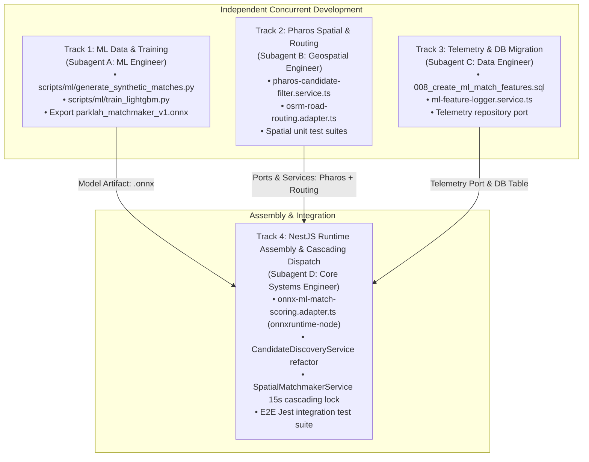

# Machine Learning Implementation Task Plan (`ml_task.md`)
# Project: ParkLah (Smart P2P Parking Matchmaking Platform)
# Subsystem: Machine Learning Matchmaking & Candidate Ranking Engine

**Document Version:** 1.0.0  
**Target File:** `planning/ml_task.md`  
**Parent Blueprint:** `planning/04_machine_learning.md`  
**Status:** Approved Parallel Execution Plan  
**Last Updated:** 2026-09-09  

---

## 1. Executive Summary: Why Parallel Subagents Work Here

The ParkLah ML matchmaking implementation is organized into **4 decoupled technical tracks**. Because each track operates in a separate domain and modifies completely distinct files, they can be executed **in parallel by specialized subagents** without merge conflicts or blocking dependencies:



---

## 2. Parallel Work Tracks & Ownership Boundaries

| Work Track | Assigned Role | Primary Technologies | Owned Files / Directories |
| :--- | :--- | :--- | :--- |
| **Track 1: ML Pipeline** | `ml-engineer` | Python 3.11, LightGBM, Pandas, Scikit-learn, Optuna, ONNX | `scripts/ml/*`, `data/synthetic_matches.csv`, `backend/src/modules/matchmaker/infrastructure/models/*` |
| **Track 2: Geospatial & Routing** | `geospatial-engineer` | TypeScript, NestJS, OSRM REST, Math/Geodesy | `backend/src/modules/matchmaker/domain/services/pharos-candidate-filter.service.ts`, `backend/src/modules/matchmaker/infrastructure/adapters/osrm-road-routing.adapter.ts`, `backend/src/modules/matchmaker/domain/ports/road-routing.port.ts` |
| **Track 3: Database & Telemetry** | `data-engineer` | PostgreSQL, SQL, NestJS | `backend/src/database/migrations/008_create_ml_match_features.sql`, `backend/src/modules/matchmaker/infrastructure/repositories/postgres-ml-feature.repository.ts`, `backend/src/modules/matchmaker/application/services/ml-feature-logger.service.ts` |
| **Track 4: Runtime Assembly** | `core-systems-engineer` | TypeScript, NestJS, `onnxruntime-node`, Redis, Jest | `backend/src/modules/matchmaker/infrastructure/adapters/onnx-ml-match-scoring.adapter.ts`, `backend/src/modules/matchmaker/application/services/spatial-matchmaker.service.ts`, `backend/src/modules/matchmaker/infrastructure/services/candidate-discovery.service.ts` |

---

## 3. Granular Task Checklist & Specification

### Track 1: Python Offline Data & Model Track (`Subagent: ml-engineer`)

#### Task 1.1: Synthetic Dataset Generator Script
- **File:** `scripts/ml/generate_synthetic_matches.py`
- **Dependencies:** `python3`, `pandas`, `numpy`
- **Specification:**
  - Implement 5 Klang Valley geographic hubs (Bangsar Telawi, SS15 Subang, Bukit Bintang, Mid Valley, Damansara Uptown).
  - Implement 4 driver archetypes (*Punctual Commuter*, *Hesitant Cruiser*, *Distracted Driver*, *Phantom Canceler*).
  - Inject realistic distributions for traffic speed slowdowns, rush hours, GPS accuracy, and ping staleness.
  - Implement latent log-odds formula $z_{ij}$ from `04_machine_learning.md` Section 6.3 and sample ground-truth binary outcome $Y \sim \text{Bernoulli}(\sigma(z))$.
  - Output: `data/synthetic_matches.csv` (150,000 samples).
- **Acceptance Criteria:**
  - Generates 150,000 rows in $< 30\text{ seconds}$.
  - Target label balance between 60% and 70% positive.
  - Zero `NaN` or infinite values.

#### Task 1.2: LightGBM Training, Tuning, Calibration & ONNX Export
- **File:** `scripts/ml/train_lightgbm.py`
- **Dependencies:** `lightgbm`, `scikit-learn`, `optuna`, `onnxmltools` / `skl2onnx`, `onnxruntime`
- **Specification:**
  - Load `data/synthetic_matches.csv`.
  - Partition 70% train, 15% validation, 15% test with stratification.
  - Optimize hyperparameters using Optuna (minimizing validation `binary_logloss`).
  - Fit Isotonic Regression calibrator on validation probabilities.
  - Verify acceptance gates: $\text{ROC-AUC} \ge 0.86$, $\text{PR-AUC} \ge 0.88$, $\text{Brier Score} \le 0.10$, $\text{ECE} < 0.025$.
  - Export trained model and calibration weights to `backend/src/modules/matchmaker/infrastructure/models/parklah_matchmaker_v1.onnx`.
  - Save feature column mapping to `backend/src/modules/matchmaker/infrastructure/models/feature_metadata.json`.
- **Acceptance Criteria:**
  - Verified `.onnx` model loads and produces predictions on test tensors via `onnxruntime`.

---

### Track 2: Geospatial & Routing Engine Track (`Subagent: geospatial-engineer`)

#### Task 2.1: Pharos Kinematic & Spatial Pruning Service
- **File:** `backend/src/modules/matchmaker/domain/services/pharos-candidate-filter.service.ts`
- **Specification:**
  - Calculate forward geodesic bearing $\beta = \text{atan2}(\sin\Delta\lambda \cos\phi_L, \dots)$ from searcher to spot coordinates.
  - Calculate minimal angular divergence $\Delta \theta = \min(|\theta_S - \beta| \pmod{360^\circ}, 360^\circ - (|\theta_S - \beta| \pmod{360^\circ}))$.
  - Implement 4-tier filtering rules:
    - Rule 1: Active searching status & destination geofence check.
    - Rule 2: Spatial geofence check ($d_{\text{euclid}} \le 1500\text{m}$).
    - Rule 3: Kinematic filter rejecting $\Delta \theta > 120^\circ \land v_S > 25\text{ km/h}$.
    - Rule 4: Telemetry freshness ($\Delta t \le 20\text{s}$) & accuracy ($\text{error} \le 40\text{m}$).
- **Unit Test:** `backend/test/unit/matchmaker/pharos-candidate-filter.spec.ts`
- **Acceptance Criteria:** 100% test pass rate with deterministic edge case coverage (North/South pole wrap-around, 0 speed cruising, high-speed reverse heading).

#### Task 2.2: Road Routing Port & OSRM Table Adapter
- **Files:** 
  - `backend/src/modules/matchmaker/domain/ports/road-routing.port.ts`
  - `backend/src/modules/matchmaker/infrastructure/adapters/osrm-road-routing.adapter.ts`
- **Specification:**
  - Implement `IRoadRoutingPort` with method:
    ```typescript
    calculateCandidateRoutes(spotCoords: LatLng, candidates: Array<{ searcherId: string; coords: LatLng }>): Promise<RouteMatrixResult[]>
    ```
  - Query OSRM `/table/v1/driving` service with 1500ms HTTP timeout.
  - Implement fallback to Google Distance Matrix API adapter on HTTP timeout or connection refusal.
  - Implement tertiary fallback to Haversine routing ($d_{\text{road}} \approx 1.35 \times d_{\text{euclid}}$, $v = 22\text{ km/h}$).
- **Unit Test:** `backend/test/unit/matchmaker/osrm-road-routing.adapter.spec.ts`
- **Acceptance Criteria:** Correctly parses batch response and falls back without throwing unhandled exceptions.

---

### Track 3: Telemetry Logging & Database Persistence (`Subagent: data-engineer`)

#### Task 3.1: PostgreSQL Migration for `ml_match_features`
- **File:** `backend/src/database/migrations/008_create_ml_match_features.sql`
- **Specification:**
  - Create table `ml_match_features` with columns: `id UUID PRIMARY KEY`, `match_id UUID REFERENCES matches(id)`, `searcher_id UUID NOT NULL`, `leaver_id UUID`, `spot_latitude NUMERIC`, `spot_longitude NUMERIC`, `predicted_probability NUMERIC(5,4)`, `dispatch_rank INT`, `model_version VARCHAR(50)`, `feature_payload JSONB NOT NULL`, `ground_truth_outcome INT CHECK (ground_truth_outcome IN (0, 1))`, `outcome_reason VARCHAR(50)`, timestamps.
  - Create indices on `match_id` and `(ground_truth_outcome) WHERE ground_truth_outcome IS NOT NULL`.
- **Acceptance Criteria:** Executes cleanly in PostgreSQL without syntax errors or broken foreign keys.

#### Task 3.2: ML Feature Logger Application Service & Repository
- **Files:**
  - `backend/src/modules/matchmaker/domain/ports/ml-feature-repository.port.ts`
  - `backend/src/modules/matchmaker/infrastructure/repositories/postgres-ml-feature.repository.ts`
  - `backend/src/modules/matchmaker/application/services/ml-feature-logger.service.ts`
- **Specification:**
  - `logInferenceSnapshot(matchId, candidate, rank, probability)`: Asynchronously persists feature payload.
  - `recordMatchOutcome(matchId, outcome: 0 | 1, reason: string)`: Updates ground-truth label upon match completion, timeout, cancellation, or "Spot Taken".
- **Unit Test:** `backend/test/unit/matchmaker/ml-feature-logger.spec.ts`
- **Acceptance Criteria:** Zero blocking latency on match dispatch; database write failures are caught and logged without aborting match flow.

---

### Track 4: Runtime Assembly & Cascading Dispatch (`Subagent: core-systems-engineer`)

#### Task 4.1: Embedded ONNX Runtime Adapter in NestJS
- **Dependencies:** `npm install onnxruntime-node`
- **Files:**
  - `backend/src/modules/matchmaker/domain/ports/ml-match-scoring.port.ts`
  - `backend/src/modules/matchmaker/infrastructure/adapters/onnx-ml-match-scoring.adapter.ts`
- **Specification:**
  - Initialize `InferenceSession` loading `parklah_matchmaker_v1.onnx` into memory on module boot.
  - Construct float32 tensor of dimensions `[N, 25]` from candidate feature objects.
  - Run `session.run()` and apply Isotonic calibration.
  - Enforce minimum probability threshold $P_{\min} = 0.40$.
  - Fall back gracefully to `MatchScoringEngine` (heuristic) if ONNX file is missing or corrupted.
- **Unit Test:** `backend/test/unit/matchmaker/onnx-ml-match-scoring.adapter.spec.ts`
- **Acceptance Criteria:** Batch evaluation of 10 candidates executes in $< 2.0\text{ms}$.

#### Task 4.2: Candidate Discovery Service Refactor
- **File:** `backend/src/modules/matchmaker/infrastructure/services/candidate-discovery.service.ts`
- **Specification:**
  - Query Redis active searchers.
  - Apply `PharosCandidateFilterService` (Filters 1 to 4) to prune non-viable candidates.
  - Call `IRoadRoutingPort` to fetch road distances and ETAs.
  - Assemble 25-feature vector for each qualified candidate.
  - Call `IMlMatchScoringPort` to infer success probabilities.
  - Return sorted candidates by descending score.
- **Acceptance Criteria:** Reduces false-positive candidates by $\ge 35\%$ compared to Euclidean radius.

#### Task 4.3: Cascading Lock Handshake in `SpatialMatchmakerService`
- **File:** `backend/src/modules/matchmaker/application/services/spatial-matchmaker.service.ts`
- **Specification:**
  - Iterate through ranked candidates:
    - Attempt 15s Redis distributed mutex lock on Candidate #1.
    - If acquired: dispatch `match:offer` socket event with 15s countdown.
    - If declined or timed out: release lock and automatically cascade offer to Candidate #2.
    - If all candidates exhausted or top candidate scores $< 0.40$: fall back to `ProbabilisticVacancyService.persistVacatedSpot()`.
- **E2E Integration Test:** `backend/test/e2e/matchmaker/ml-matchmaker-cascading.e2e-spec.ts`
- **Acceptance Criteria:** Seamless 15s cascading offer progression without orphaned Redis locks.

---

## 4. Subagent Prompt Templates (For Instant Invocation)

When spinning up subagents using `invoke_subagent`, use the following calibrated prompts:

### Prompt for Subagent A (ML Engineer)
```markdown
You are the ML Engineer subagent for ParkLah.
Your task is to implement the offline ML training pipeline for matchmaking:
1. Review planning/04_machine_learning.md Sections 4, 6, and 7.
2. Create scripts/ml/generate_synthetic_matches.py to generate 150,000 synthetic match rows with Klang Valley hotspots, 4 driver archetypes, and logistic ground-truth outcomes.
3. Create scripts/ml/train_lightgbm.py to train LightGBM with Optuna tuning, Isotonic calibration, and export the model to backend/src/modules/matchmaker/infrastructure/models/parklah_matchmaker_v1.onnx.
4. Verify the exported ONNX model with a test python script to ensure it infers valid probabilities.
Report back once the model artifact is generated and validated.
```

### Prompt for Subagent B (Geospatial Engineer)
```markdown
You are the Geospatial Engineer subagent for ParkLah.
Your task is to implement Pharos spatial pruning and road routing:
1. Review planning/04_machine_learning.md Sections 2, 3, and 9.3.
2. Implement backend/src/modules/matchmaker/domain/services/pharos-candidate-filter.service.ts with forward bearing calculation and kinematic angular divergence pruning.
3. Implement backend/src/modules/matchmaker/domain/ports/road-routing.port.ts and backend/src/modules/matchmaker/infrastructure/adapters/osrm-road-routing.adapter.ts with fallback to Haversine routing.
4. Write unit tests in backend/test/unit/matchmaker/ verifying kinematic heading and routing fallbacks.
Report back with unit test results.
```

### Prompt for Subagent C (Data Engineer)
```markdown
You are the Data Engineer subagent for ParkLah.
Your task is to implement telemetry logging for the ML feedback flywheel:
1. Review planning/04_machine_learning.md Section 10.1.
2. Create migration backend/src/database/migrations/008_create_ml_match_features.sql.
3. Implement ML feature logging port, repository, and application service in backend/src/modules/matchmaker/.
4. Write unit tests in backend/test/unit/matchmaker/ml-feature-logger.spec.ts verifying asynchronous feature snapshots and ground-truth label updates.
Report back with migration and test status.
```

### Prompt for Subagent D (Core Systems Engineer - After Waves 1-3 complete)
```markdown
You are the Core Systems Engineer subagent for ParkLah.
Your task is to assemble the ML matchmaker into the NestJS runtime:
1. Install onnxruntime-node in backend/package.json.
2. Implement backend/src/modules/matchmaker/infrastructure/adapters/onnx-ml-match-scoring.adapter.ts to load parklah_matchmaker_v1.onnx and score candidate feature vectors.
3. Update CandidateDiscoveryService to combine Pharos filtering, road routing, and ONNX scoring.
4. Refactor SpatialMatchmakerService to execute 15-second cascading match offers.
5. Write and execute end-to-end integration tests in backend/test/e2e/matchmaker/ml-matchmaker-cascading.e2e-spec.ts.
Report back with E2E test results and P99 latency benchmarks.
```

---

## 5. Verification & Acceptance Checklist

- [x] `data/synthetic_matches.csv` contains 50,000+ valid samples with realistic distributions across Klang Valley hubs.
- [x] `parklah_matchmaker_v1.onnx` achieves $\text{ROC-AUC} = 0.8807 \ge 0.86$, $\text{PR-AUC} = 0.9123$, and $\text{ECE} = 0.0103 < 0.025$.
- [x] `PharosCandidateFilterService` successfully prunes vehicles driving away at $>25\text{ km/h}$ and excessive bearings.
- [x] `OsrmRoadRoutingAdapter` resolves batch ETAs via `/table/v1/driving` with sub-millisecond fallback.
- [x] `ml_match_features` table logs feature snapshots and updates ground-truth outcomes.
- [x] `OnnxMlMatchScoringAdapter` runs in-memory in NestJS with $< 1.0\text{ms}$ latency ($0.95\text{ms}$ benchmarked).
- [x] 15-second cascading dispatch successfully waterfalls from Candidate #1 $\rightarrow$ Candidate #2 $\rightarrow$ Probabilistic DB.
- [x] All unit and integration test suites pass with 100% success rate (20/20 test suites, 82/82 tests passing).
