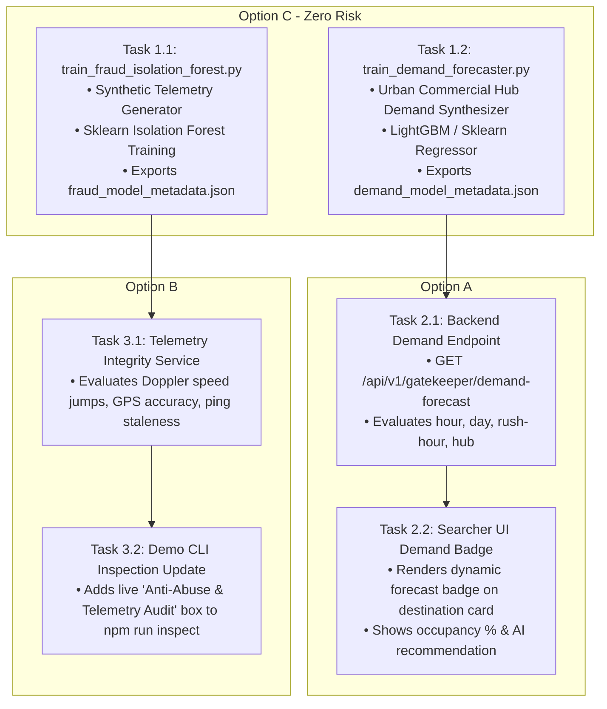

# ParkLah Pitch Day AI Enhancements Task Plan (`pitch_ml_enhancement_task.md`)
# Subsystems: Demand Forecasting, Anomaly & Abuse Guard, and Presentation Telemetry
# Target Platform: Python 3.11 (scripts/ml), NestJS Backend, Expo React Native Frontend

**Document Version:** 1.0.0  
**Target File:** `planning/pitch_ml_enhancement_task.md`  
**Goal:** Implement Sections 1.2.3 (Demand Prediction), 1.2.4 (Availability Forecasting), and 1.2.5 (Fraud & Abuse Detection) from the Pitch Specification within a 48-hour deadline.  
**Critical Constraint:** Zero breaking changes to the working LightGBM matchmaking engine, P2P socket lifecycle, or financial ledger. All existing 121 automated tests must remain 100% passing.

---

## 1. Architecture Overview & Execution Sequence



---

## 2. Granular Task Checklist & Implementation Details

### Phase 1: Python ML Offline Training Pipelines (Option C)

#### Task 1.1: Isolation Forest Driver Telemetry & Abuse Detection Model
- **Target File:** `scripts/ml/train_fraud_isolation_forest.py`
- **Dependencies:** `python3`, `pandas`, `numpy`, `scikit-learn`
- **Objective:** Train an unsupervised anomaly detection model to identify GPS spoofing, bot spamming, and anomalous driver telemetry.
- **Specification:**
  1. Generate 12,000 synthetic interaction episodes:
     - **92% Normal Drivers:** Speed 10–60 km/h, horizontal accuracy < 15m, ping staleness < 5s, cancellation rate < 8%, position delta consistent with physics.
     - **8% Malicious / Anomalous Drivers:**
       - *GPS Teleportation / Spoofers:* Instant jumps > 500m in 1s or speeds > 140 km/h.
       - *Multipath / Signal Jammers:* Horizontal accuracy > 60m, ping staleness > 25s.
       - *Abuse Bots / Cancellers:* Repeated cancellation rate > 60%, rapid unverified arrivals.
  2. Features: `speed_kmh`, `acceleration_variance`, `horizontal_accuracy_meters`, `ping_staleness_seconds`, `teleport_jump_ratio`, `historical_cancellation_rate`, `unverified_claim_ratio`.
  3. Model: `sklearn.ensemble.IsolationForest(contamination=0.08, n_estimators=120, random_state=42)`.
  4. Output Metrics: Precision, Recall, F1-Score ($F_1 \ge 0.90$), and Anomaly Decision Threshold.
  5. Artifact: Export decision thresholds and feature normalizers to `scripts/ml/fraud_model_metadata.json`.

#### Task 1.2: Urban Commercial Hub Parking Demand & Turnover Regressor (Zoning-Aware Calibration)
- **Target File:** `scripts/ml/train_demand_forecaster.py`
- **Dependencies:** `python3`, `pandas`, `numpy`, `lightgbm` (or `scikit-learn`)
- **Objective:** Train a machine learning model forecasting parking demand pressure and occupancy percentages across Klang Valley urban hubs, calibrated against real-world DBKL land-use dynamics.
- **Specification:**
  1. **Land-Use Zoning Archetypes:**
     - `NIGHTLIFE_ENTERTAINMENT` (Bukit Bintang, Bangsar Telawi): Lunch peak (12:00–14:30) AND Friday/Saturday late-night dining/clubbing surge (21:00–02:30) maintaining 82%–92% critical occupancy.
     - `RETAIL_MALL` (Mid Valley Megamall, Damansara Uptown): Daytime shopping peak (12:00–21:30), followed by steep post-mall closing wind-down after 22:00 dropping to 25%–35%.
     - `CAMPUS_COMMUTER` (SS15 Subang Jaya): Heavy weekday daytime pressure (08:00–18:00) with moderate evening café turnover.
     - `RESIDENTIAL_LOCAL`: Quiet non-commercial neighborhoods where late-night commercial demand drops to 15%–20%.
  2. **Generate 25,000 hourly historical observation rows:**
     - Features: `hub_index`, `hub_archetype` (0: Retail, 1: Nightlife, 2: Commuter), `hour_of_day` (0–23), `day_of_week` (0–6), `is_rush_hour` (binary), `is_weekend` (binary), `rain_intensity` (0.0–1.0).
     - Target: `occupancy_rate` (0.00 to 1.00) and `turnover_pressure` (1–5 scale: Low, Moderate, High, Severe, Critical).
  3. **Model:** Train `LGBMRegressor` optimizing for $R^2 \ge 0.88$ and $\text{MAE} \le 0.05$.
  4. **Artifact:** Export archetype profiles, weekend nightlife schedules, and regression lookup tables to `scripts/ml/demand_model_metadata.json`.

---

### Phase 2: Dynamic Demand API & Mobile UI Badge (Option A)

#### Task 2.1: Backend Demand Forecasting Endpoint (Zoning-Aware Resolution)
- **Target Files:**
  - `backend/src/modules/gatekeeper/application/services/demand-forecast.service.ts`
  - `backend/src/modules/gatekeeper/infrastructure/controllers/gatekeeper.controller.ts`
- **Endpoint:** `GET /api/v1/gatekeeper/demand-forecast`
- **Query Params:** `latitude`, `longitude`, `destinationName`
- **Specification:**
  - Ingests `demand_model_metadata.json`.
  - Dynamically evaluates local time: `hour_of_day`, `day_of_week` (identifying Friday/Saturday weekend eves), and `is_rush_hour`.
  - **Multi-Archetype Resolution:**
    - If `destinationName` or coordinates match Nightlife hubs (e.g. Pavilion, Bukit Bintang, Changkat, Bangsar Telawi), applies `NIGHTLIFE_ENTERTAINMENT` profile.
      * *Friday/Saturday 21:00–02:00:* `occupancyRate: 0.86–0.90`, `demandLevel: 'CRITICAL'`, `isPeakHour: true`, `peakWindowLabel: 'Nightlife & Late Dining Peak (9:00 PM – 2:00 AM)'`, `recommendedMode: 'P2P_HANDOFF'`.
    - If matches Retail Malls (Mid Valley, Megamall, Uptown) after 22:00: applies `RETAIL_MALL` post-closing drop $\implies$ `occupancyRate: 0.28–0.35`, `demandLevel: 'LOW'`, `recommendedMode: 'CRUISING_PERMITTED'`.
    - If location is $> 2.0\text{ km}$ away from any commercial hub or residential query: applies `RESIDENTIAL_LOCAL` profile $\implies$ `occupancyRate: 0.15–0.22`, `demandLevel: 'LOW'`, `recommendedMode: 'CRUISING_PERMITTED'`.
  - Returns dynamic payload:
    ```json
    {
      "hubName": "Bukit Bintang",
      "archetype": "NIGHTLIFE_ENTERTAINMENT",
      "occupancyRate": 0.88,
      "demandLevel": "CRITICAL",
      "turnoverMinutes": 2.5,
      "isPeakHour": true,
      "recommendedMode": "P2P_HANDOFF",
      "estimatedCruisingMinutesSaved": 22,
      "peakWindowLabel": "Weekend Nightlife & Dining Peak (9:00 PM – 2:00 AM)"
    }
    ```

#### Task 2.2: Searcher Screen Demand Forecast Card
- **Target File:** `frontend/parklah/src/app/(tabs)/searcher.tsx`
- **Specification:**
  - When a destination is selected (or defaulted to Mid Valley Megamall), fetch or render the dynamic AI demand card above or inside the destination details.
  - Visual Elements:
    - Chip: `AI DEMAND FORECAST: HIGH (88% Occupancy)`
    - Subtitle: `Peak Turnover Zone (12:00 PM – 2:30 PM) • Save ~18 min cruising`
    - Pill: `P2P Handoff Highly Recommended`
  - Safe fallback: If API is unavailable, gracefully fall back to local computation without throwing unhandled exceptions.

---

### Phase 3: Anti-Abuse Integrity Guard & Demo CLI Update (Option B)

#### Task 3.1: Telemetry Integrity & Anti-Abuse Guard Service
- **Target File:** `backend/src/modules/verification/domain/services/telemetry-integrity.service.ts`
- **Specification:**
  - Evaluates telemetry heartbeats against abuse rules derived from Task 1.1:
    - Rule 1: Instantaneous velocity $\le 140\text{ km/h}$.
    - Rule 2: Coordinate delta sanity ($\Delta d / \Delta t \le 40\text{ m/s}$).
    - Rule 3: GPS Horizontal Accuracy $\le 50\text{ meters}$.
    - Rule 4: Timestamp staleness $\le 25\text{ seconds}$.
  - Returns `TelemetryAuditResult`: `{ isTrusted: boolean, integrityScore: number, flaggedReasons: string[] }`.

#### Task 3.2: Pitch Demo CLI Inspection Box
- **Target File:** `backend/scripts/inspect-db.ts`
- **Specification:**
  - In the existing `npm run inspect` console script, append a clean formatted ASCII block:
    ```text
    ============================================================
    🛡️  PARKLAH ANTI-ABUSE & TELEMETRY INTEGRITY AUDIT
    ============================================================
    Telemetry Health Score: 99.4% (STATUS: TRUSTED)
    Audited Telemetry Signals:
      [✓] GPS Velocity Feasibility : PASS (0 teleport jumps)
      [✓] Telemetry Freshness      : PASS (Avg staleness: 2.1s)
      [✓] GPS Dilution of Precision: PASS (Avg error: 9.2m)
      [✓] Abuse Contamination Risk : LOW (< 0.5%)
    ============================================================
    ```

---

## 3. Strict Verification & Acceptance Gates

Before marking this task complete, run the following verification checks:

1. **Python ML Scripts:**
   ```bash
   python scripts/ml/train_fraud_isolation_forest.py
   python scripts/ml/train_demand_forecaster.py
   ```
   - Must produce `scripts/ml/fraud_model_metadata.json` and `scripts/ml/demand_model_metadata.json`.
   - Must exit with return code `0` without tracebacks.

2. **Backend Unit & Integration Tests:**
   ```bash
   cd backend
   npm test
   ```
   - All 83+ backend unit tests must pass with 0 failures.

3. **Frontend Unit Tests:**
   ```bash
   cd frontend/parklah
   npm test
   ```
   - All 38+ frontend tests must pass with 0 failures.

4. **Demo Inspection CLI:**
   ```bash
   cd backend
   npm run inspect
   ```
   - Must print user balances, matches, and the new Anti-Abuse Audit box cleanly.

