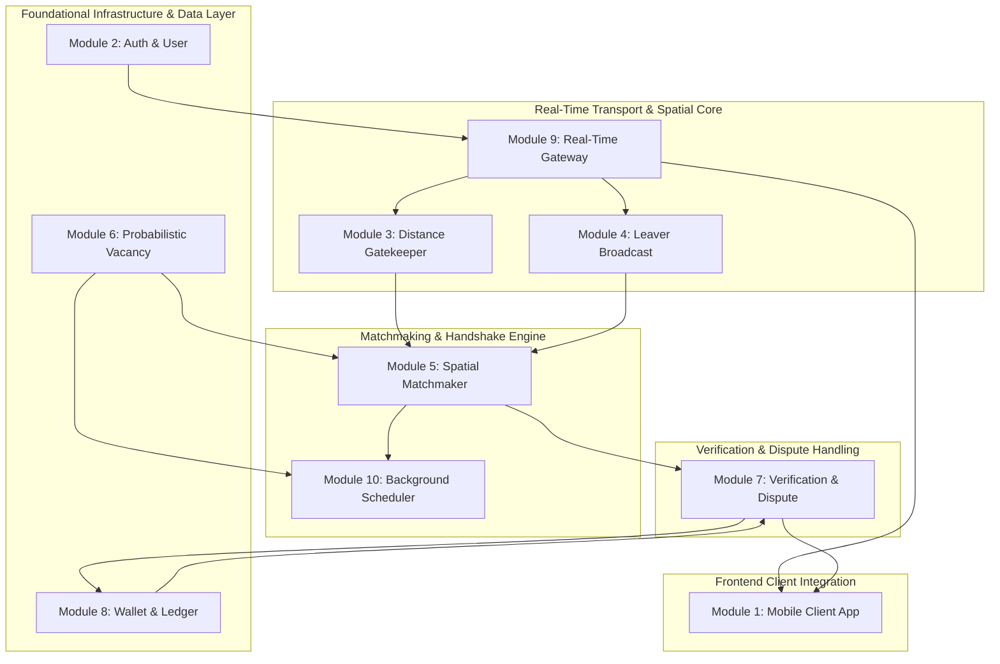

# ParkLah Engineering Progress & Module Task Master Tracker

**Project:** ParkLah (Smart P2P Parking Matchmaking Platform)  
**Status:** In Progress / Planning & Execution  
**Last Updated:** 2026-08-30  
**Source Specifications:**  
- PRD: [`backend/planning/01_prd.md`](file:///Users/Admin/Documents/GitHub/ParkLah/backend/planning/01_prd.md)  
- High-Level Design: [`backend/planning/02_high-level-design.md`](file:///Users/Admin/Documents/GitHub/ParkLah/backend/planning/02_high-level-design.md)  
- Detailed Design: [`backend/planning/03_detailed-design.md`](file:///Users/Admin/Documents/GitHub/ParkLah/backend/planning/03_detailed-design.md)  

---

## 1. High-Level Module Completion Checklist

- [x] **Module 1: Mobile Client Application Subsystem** (`client-app`) — [Task Checklist](file:///Users/Admin/Documents/GitHub/ParkLah/planning/task/client-app.md)
- [x] **Module 2: Authentication & User Management Subsystem** (`auth-and-user`) — [Task Checklist](file:///Users/Admin/Documents/GitHub/ParkLah/planning/task/auth-and-user.md)
- [x] **Module 3: Searcher & Distance Gatekeeper Subsystem** (`gatekeeper`) — [Task Checklist](file:///Users/Admin/Documents/GitHub/ParkLah/planning/task/gatekeeper.md)
- [x] **Module 4: Leaver & Departure Broadcast Subsystem** (`leaver-broadcast`) — [Task Checklist](file:///Users/Admin/Documents/GitHub/ParkLah/planning/task/leaver-broadcast.md)
- [x] **Module 5: Real-Time Spatial Matchmaker Subsystem** (`spatial-matchmaker`) — [Task Checklist](file:///Users/Admin/Documents/GitHub/ParkLah/planning/task/spatial-matchmaker.md)
- [x] **Module 6: Probabilistic Vacancy & Decay Subsystem** (`probabilistic-vacancy`) — [Task Checklist](file:///Users/Admin/Documents/GitHub/ParkLah/planning/task/probabilistic-vacancy.md)
- [x] **Module 7: Verification, Handover & Dispute Subsystem** (`verification-and-dispute`) — [Task Checklist](file:///Users/Admin/Documents/GitHub/ParkLah/planning/task/verification-and-dispute.md)
- [x] **Module 8: In-App Wallet & Micro-Transactions Subsystem** (`wallet-and-ledger`) — [Task Checklist](file:///Users/Admin/Documents/GitHub/ParkLah/planning/task/wallet-and-ledger.md)
- [x] **Module 9: Real-Time Gateway & WebSocket Subsystem** (`real-time-gateway`) — [Task Checklist](file:///Users/Admin/Documents/GitHub/ParkLah/planning/task/real-time-gateway.md)
- [x] **Module 10: Asynchronous Task & Decay Scheduler Subsystem** (`background-scheduler`) — [Task Checklist](file:///Users/Admin/Documents/GitHub/ParkLah/planning/task/background-scheduler.md)

---

## 2. Module Breakdown & Granular Task Summary Table

| # | Module Name | Task File | Subtasks Count | Completed | Status | Primary Responsibilities & Scope |
| :-: | :--- | :--- | :-: | :-: | :-: | :--- |
| **01** | **Mobile Client Application** | [`client-app.md`](file:///Users/Admin/Documents/GitHub/ParkLah/planning/task/client-app.md) | 14 | 14 | `Completed` | React Native Expo app, adaptive GPS tracking (3s), map & radar UI, Zustand state stores, Waze/Google Maps external deep link, simulated wallet UI. |
| **02** | **Authentication & User Management** | [`auth-and-user.md`](file:///Users/Admin/Documents/GitHub/ParkLah/planning/task/auth-and-user.md) | 12 | 12 | `Completed` | Malaysian SMS OTP (`+60`), JWT lifecycle, vehicle profile management with 4-digit plate suffix masking, user reliability ratings. |
| **03** | **Searcher & Distance Gatekeeper** | [`gatekeeper.md`](file:///Users/Admin/Documents/GitHub/ParkLah/planning/task/gatekeeper.md) | 9 | 9 | `Completed` | Google Places destination search, Distance Matrix ETA/distance evaluation ($\le 10\text{min}, \le 3.0\text{km}$), Redis spatial index registration (`geo:searchers:active`). |
| **04** | **Leaver & Departure Broadcast** | [`leaver-broadcast.md`](file:///Users/Admin/Documents/GitHub/ParkLah/planning/task/leaver-broadcast.md) | 7 | 7 | `Completed` | 3–5 min countdown departure broadcast, GPS coordinate capture, landmark note chips, cancellation grace period logic, Redis Pub/Sub events. |
| **05** | **Real-Time Spatial Matchmaker** | [`spatial-matchmaker.md`](file:///Users/Admin/Documents/GitHub/ParkLah/planning/task/spatial-matchmaker.md) | 9 | 9 | `Completed` | Geospatial pairing, multi-factor ranking scoring engine ($w_1=0.50, w_2=0.35, w_3=0.15$), 15s distributed mutex lock, handshake state machine, probabilistic fallback. |
| **06** | **Probabilistic Vacancy & Decay** | [`probabilistic-vacancy.md`](file:///Users/Admin/Documents/GitHub/ParkLah/planning/task/probabilistic-vacancy.md) | 8 | 8 | `Completed` | PostgreSQL PostGIS spatial storage (`location_geom`), exponential time-decay engine ($P(t) = P_0 e^{-\lambda t} M_{\text{traffic}}$), 15m expiration, 500m candidate lookup. |
| **07** | **Verification, Handover & Dispute** | [`verification-and-dispute.md`](file:///Users/Admin/Documents/GitHub/ParkLah/planning/task/verification-and-dispute.md) | 8 | 8 | `Completed` | Dual verification ($\le 30\text{m}$ geofence + 15s stationary stop + manual button), settlement trigger, "Spot Taken" RM 0.00 exemption and candidate reroute. |
| **08** | **In-App Wallet & Micro-Transactions** | [`wallet-and-ledger.md`](file:///Users/Admin/Documents/GitHub/ParkLah/planning/task/wallet-and-ledger.md) | 10 | 10 | `Completed` | Double-entry financial ledger, ACID serializable transaction (Searcher debit $-\text{RM }0.50$, Leaver credit $+\text{RM }0.25$, Platform $+\text{RM }0.25$), mock top-up/cash-out. |
| **09** | **Real-Time Gateway & WebSocket** | [`real-time-gateway.md`](file:///Users/Admin/Documents/GitHub/ParkLah/planning/task/real-time-gateway.md) | 8 | 8 | `Completed` | Socket.io server with `@socket.io/redis-adapter`, JWT socket authentication, room management (`user:{id}`, `match:{id}`), 3s telemetry ingestion and event broadcasting. |
| **10** | **Asynchronous Task & Decay Scheduler** | [`background-scheduler.md`](file:///Users/Admin/Documents/GitHub/ParkLah/planning/task/background-scheduler.md) | 6 | 6 | `Completed` | 60s recurring mathematical decay cron, 60s expired spot purge cron, BullMQ 15s delayed match handshake timeout queue. |
| **Total** | **All 10 Modules** | **10 Task Files** | **91** | **91** | **100% Completed** | **Comprehensive end-to-end P2P parking platform implementation.** |

---

## 3. Recommended Implementation Dependency Sequence

1. **Stage 1 — Core Data Models & Financial Ledger:** Implement Module 2 (`auth-and-user`), Module 8 (`wallet-and-ledger`), and Module 6 (`probabilistic-vacancy`) database tables, migrations, repositories, and unit tests.
2. **Stage 2 — Spatial Indexing & Real-Time Gateway:** Implement Module 9 (`real-time-gateway`), Module 3 (`gatekeeper`), and Module 4 (`leaver-broadcast`) Redis spatial repositories and socket handlers.
3. **Stage 3 — Matchmaking & Scheduler:** Implement Module 5 (`spatial-matchmaker`) scoring engine, mutex locks, and Module 10 (`background-scheduler`) BullMQ decay & timeout workers.
4. **Stage 4 — Handover Verification:** Implement Module 7 (`verification-and-dispute`) geofencing engine, arrival confirmation, and "Spot Taken" exception handler.
5. **Stage 5 — Mobile Client Application:** Connect Module 1 (`client-app`) React Native Expo UI, Zustand stores, maps, radar overlays, and socket events to the backend services.
